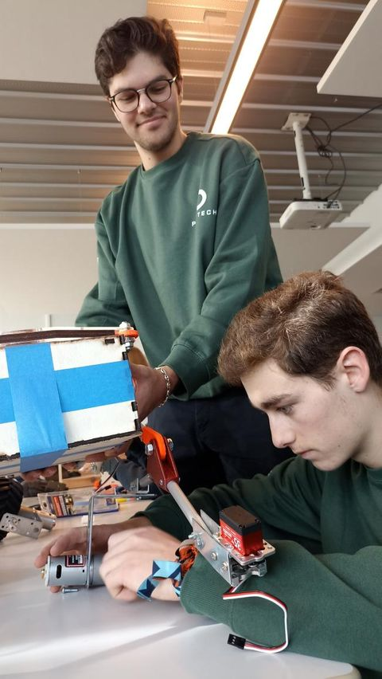

# E-GAIA, the autonomous gardener

This repository contains our third-year university autonomous robot project.  
We write **weekly reports** detailing our progress on the projects.  
*(you can find them [here](Reports))*

 

>## INTRODUCTION
>
>For more  than  a  decade,  climate  change  has  been  a  major issue  which  has  greatly  disrupted  the  world  we  live  in. Aware  of  the  risks  nature  is  facing,  our  team  decided  to  help preserve  the  wildlife  at  our  own  scale.  For  our  third-year project, we chose to create the E-Gaïa robot which could plant in arid zones after a fire or in desertic areas.
>
>Despite  being  an  unconventional  approach,  an  autonomous robot could assist in finding adequate locations, planting suitable seeds, and taking care of irrigation. We hope that this self-sufficient robot could help regenerating vegetation and by doing so, safeguarding the ecosystem.  
> ...

You can check out the initial [*research report*](/Documentation/ResearchReport-Bibliography.pdf) and the [*short article*](/Documentation/EGAIA-article.pdf).

|||
|:---:|:---:|

 

***By [Jaime Alba](https://github.com/jaimealbapastor) and [Brice Mabille](https://github.com/Brice-Mabille)***
