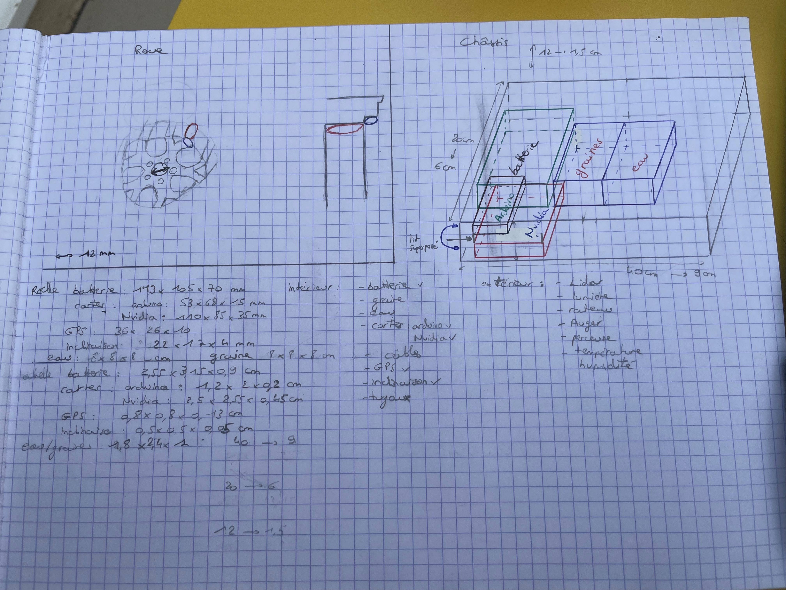

## Rapports de séance Brice Mabille

- 14/10/2022 : Setup du projet GitHub partagé

#Séance 1:

During the first Robot project session, I modelized the wheel rims on paper using the webpage listed below:

https://fr.aliexpress.com/item/1005003016412115.html?spm=a2g0o.detail.1000014.3.604b5c0fD9ggY6&gps-id=pcDetailBottomMoreOtherSeller&scm=1007.40050.281175.0&scm_id=1007.40050.281175.0&scm-url=1007.40050.281175.0&pvid=50650cad-270e-4ee3-aac4-3c989d96d2c3&_t=gps-id:pcDetailBottomMoreOtherSeller,scm-url:1007.40050.281175.0,pvid:50650cad-270e-4ee3-aac4-3c989d96d2c3,tpp_buckets:668%232846%238107%231934&pdp_ext_f=%7B%22sku_id%22%3A%2212000023244123415%22%2C%22sceneId%22%3A%2230050%22%7D&pdp_npi=2%40dis%21EUR%2150.1%2123.54%21%21%21%21%21%40211b5e2c16650610999532435ee219%2112000023244123415%21rec

However, I noticed that the wheels were not the priority, so I decided to set the wheels modelization aside and began to modelize the e-Gaa frame. I designed it on paper and measured all the components we need inside the frame. 
In addition, I create a sketch of the component space at scale in my notebook.

Jaime and I met the Electronician Teacher. He began reading our Research Report, and we discussed the Auger's excessive size, the motor utilized to power it, and the rake's application. For example, we wondered how we could pack the ground after we sowed the seed. 
The less oxygen the plant has, the better is for her evolution. 

I believe that the frame paper modelization will be assigned as homework for the next session. 
During the following session, I will model the frame using Fusion360 and concentrate on the wheels.

