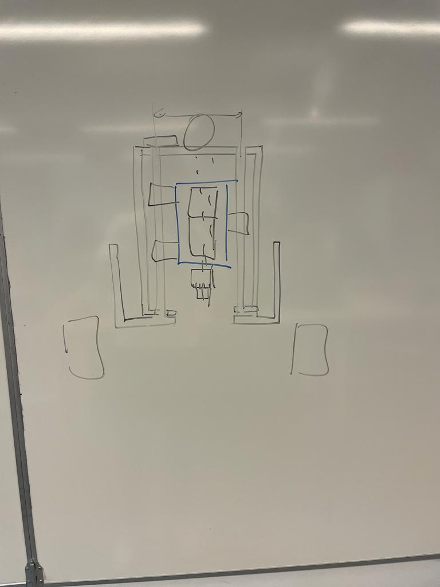
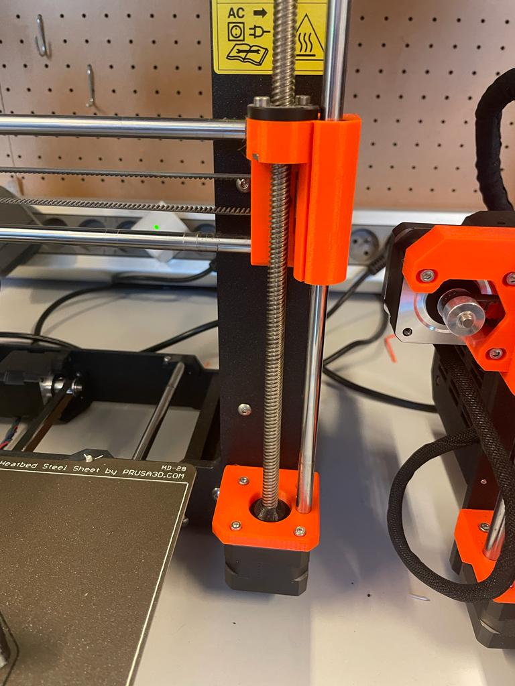
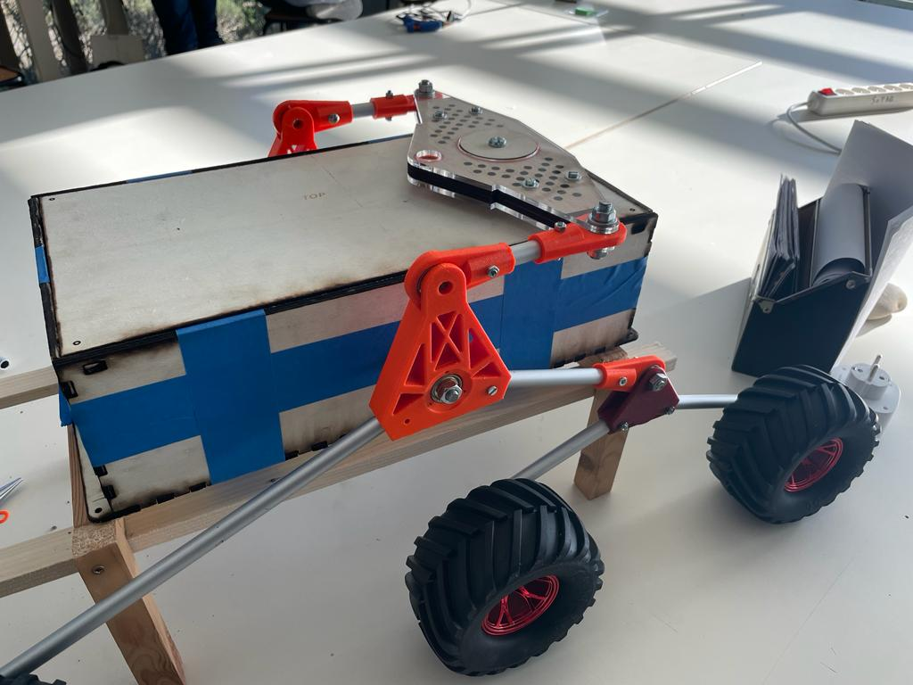
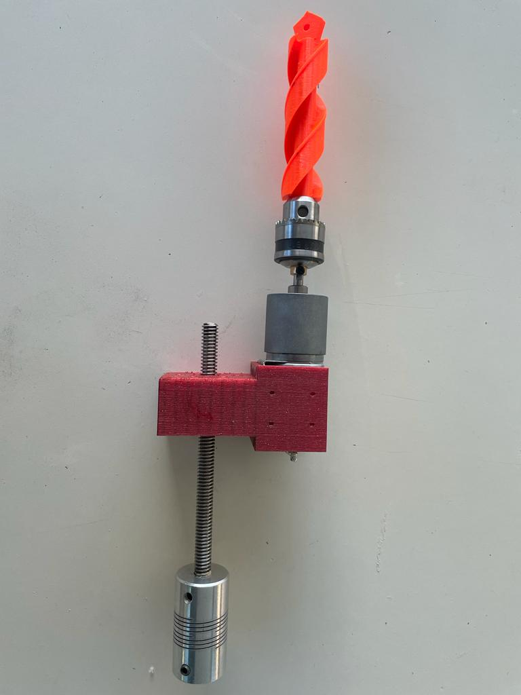

## Rapports de séance Brice Mabille

- 16/01/2023 : Setup du projet GitHub partagé

# Séance 10

First, I spent a half-hour talking with Mr. Peter about whether it would be possible to mount the drill mechanism in the frame.

I altered my mind and used a different drilling method: I choose to use the same 3D printer system with the nozzle translation.

I used an endless screw, two linear bearings, and a U-shape model to give the motor greater support.

The goal is to efficiently and nicely range the drill in the frame. The initial rack and gear I constructed weren't strong enough to lift the Auger and the motor.

Next, Jaime and I prepared the oral.

Following the oral, Mr. Lebreton and Mr. Masson gave us an explanation of why we needed to move quickly when using the moving system with the differential and wheels.

I concentrated on it and adjusted my efforts accordingly. We collaborate during the entire lesson to quickly complete the system.

I spent a lot of time with Mr. Juan when we had to thread the extremities of a metal stem in order to attach the joint.

It was incredibly challenging to complete; our first attempt was unsuccessful since the thread was too fine and snapped.

We tried again, and this time we were successful.

After that, I printed the U for the new drilling system while working on the wheels during the impression process.

I had time to attach some stems made of aluminum to joints. The most sophisticated mobility system is seen here.

I constructed the drilling system using the linear bearings and the screw when the 3D print was complete.

The drilling system appears to be good, and I now need to install the guidance stem, position the stepper at the edge, and construct a box for the drilling system to connect it to the frame.

We anticipate that the movement mechanism will be finished for the following session, at which point we can start working on the electronics to put all the parts to work.
