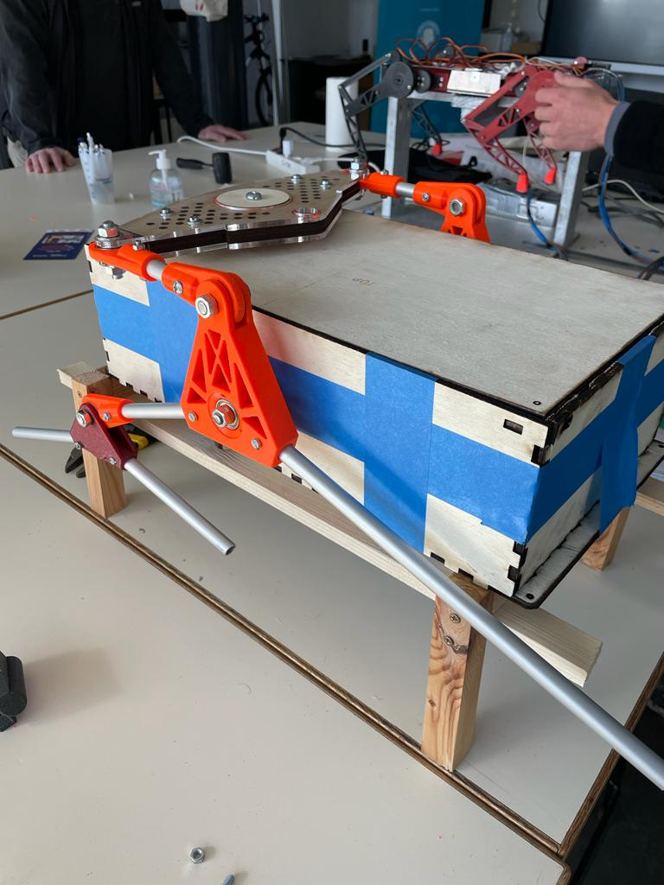
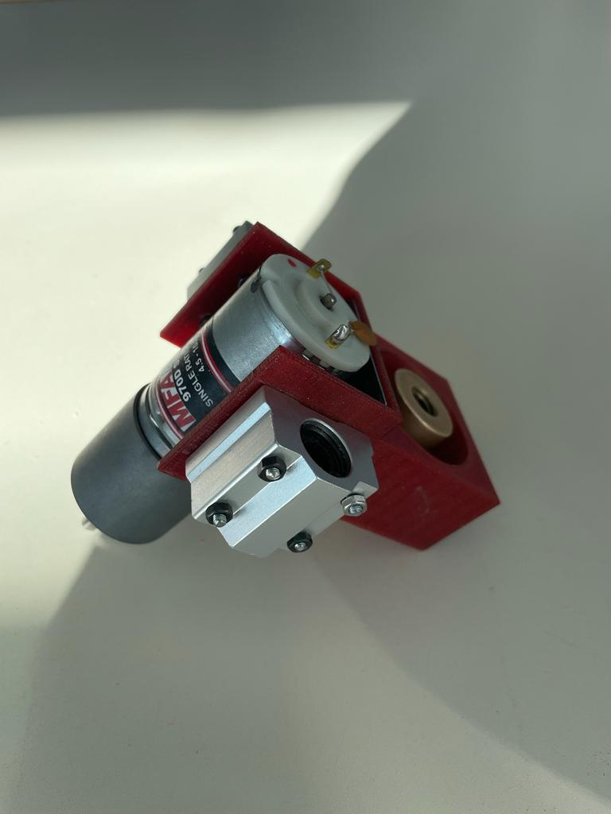

## Rapports de séance Brice Mabille

- 30/01/2023 : Setup du projet GitHub partagé

# Séance 11

I proceeded to develop the movement system in this session.

I needed a lot of time because it was challenging to combine all the parts, particularly the pipe joints.

I had to dig a flawless hole with the drill column.

I had to post treat the joints to ensure a good connection between all the parts, and after that, everything worked as it should.

I had already built one size of the movement by that point, so I needed to build the second size.

Without the other component of the mobility mechanism, the robot cannot advance.

As a result, the other task took me less time, which was great because the two sizes are closely related. 

Here is a picture of the movement system.

Now Jaime and I must connect the suspension to the wheels.

However, it is challenging since we need to construct a system that includes the wheels and a servomotor.

The robot should be on wheels in the following session, at which point we may start working on the electronic components that will allow it to move.

In contrast, I took my time developing the drilling system. I actually completed it, as evidenced by the image below.

I linked the linear bearings, the DC motor to the U. It worked well. 

The connection between the stepper motor and the endless screw is one component that I had not considered.

I therefore created a little component to link the two.

I need to print it and test it out for the upcoming session.

I have to construct the enclosure so that the drill can fit inside of it.

