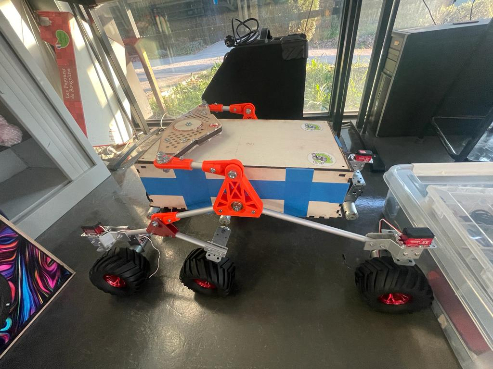
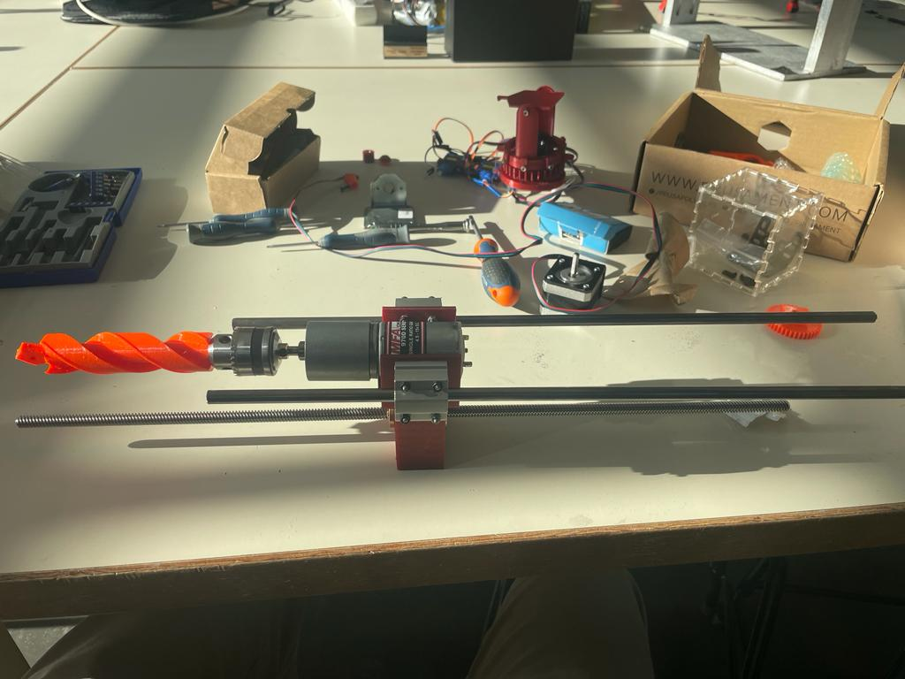
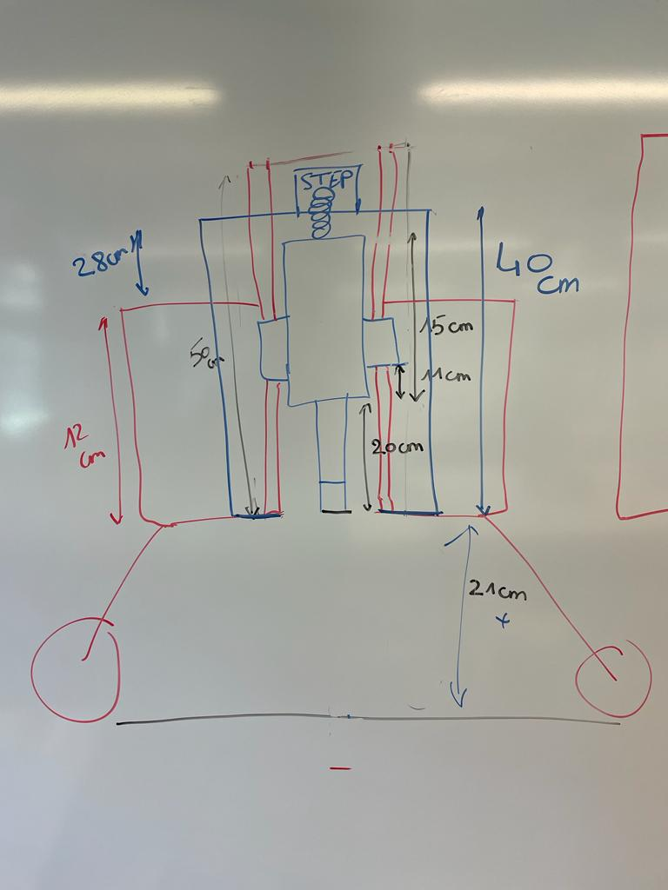

## Rapports de séance Brice Mabille

- 06/01/2023 : Setup du projet GitHub partagé

# Séance 12

In the beginning of this session, I focus on the movement system and capture the following photo:

Jaime and I are proud of this improvement but not unsatisfied because there are imperfections. 

Additionally, we want to create the frame out of aluminum.

Second, I worked on the drill, completing all mechanical components other than the connection between the stepper and the endless screw.

I'm working on it, and I'll use a 3D printer to print it. 

Unfortunately, I had an issue with the drill, I mistakenly believed it to be long enough to dig a hole in the ground, but it wasn't.

I therefore devised a plan to investigate how I could modify the drill to dig deeper.

I took the all dimension. Proceeding of the scheme to make it real was a hard part of thinking. 

I took time to think of a well solution without changing the all system but at this time I concluded that I could change the Auger size. 

Then, I doubled it, and I printed it. With this system, I could dig a 10 centimeters depth hole.

Now, I had to build a wood box for the drill to fit it inside the frame.

I had to make the electronic part to try if the Auger doesn't break with the soil.

For the next session, I will work on the movement system to fix the imperfection parts, I will work with Mr.Masson for the alimentation and I will build the wood box.

