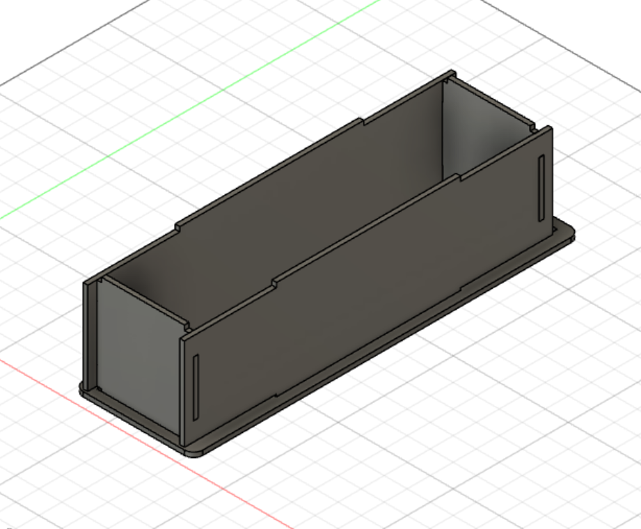
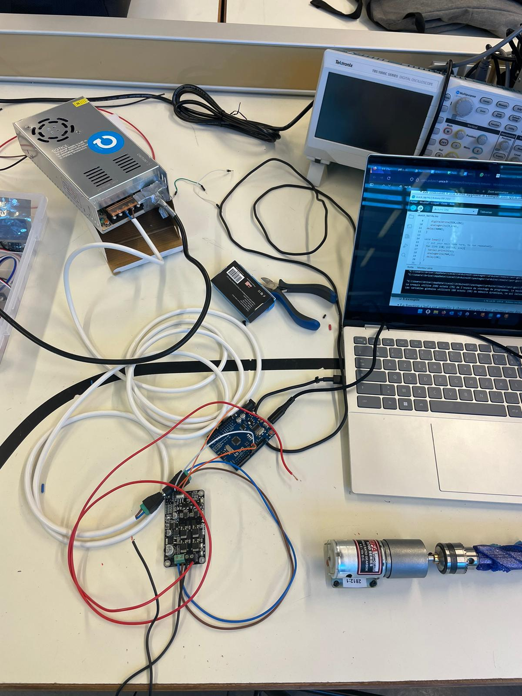

## Rapports de séance Brice Mabille

- 14/02/2023 : Setup du projet GitHub partagé

# Séance 13

First of all, I modelized the link between the stepper and the endless screw.

I printed it and tested it.

However I saw that there was a flaw in the printing, making it not look well.

So I altered the modelization, and it is now prepared for printing. 


Second, I created a model of the wood box that will house the drilling system.

That took some time, but because Tanguy had previously completed a box like this one, it appeared simpler.

To use the laser cutter, I must duplicate the sketch I created on Fusion into Inkscape.



After this, the session was a pure electronic session. And I was pleased beginning this part.

Making motors work was the aim, then.

First, Mr Masson helped me with the alimentation.

He explained to me how it works and He warned me that the terminal + have to be with the + on the drivers of the motors and conversely with the terminal -.

That seemed logical but important to be remember because we saw with others the problem with the cables.

If I change the terminal, it will "explode".

After this, I connect the driver, a motor DC and the arduino to test the functionement.

I developed a C++ program and ran it.

But I met a problem, the motor didn't move at all.

So I looked on the code and changed lines of the code but the problem wasn't resolve.

````shell
int dir = 8;
int pwm = 9;

void setup() {
  pinMode(dir, OUTPUT);
  pinMode(pwm, OUTPUT);
  digitalWrite(pwm, LOW);
  digitalWrite(dir, LOW);
  Serial.begin(9600);
  delay(5000);
}

void loop() {

  for (int i =0; i < 255; i++){
    Serial.println(i);
    analogWrite(pwm, i);
    delay(20);
  }
}
````

I thought the portable alimentation was the problem because it was a new one so I changed it with the other alimentation on the desk. It wasn't the problem...

At this point, I decided to call Mr Masson, He tested it and explained to me that it was the first time I tried to make the motor in function and the axe of the motor was block.

So Mr Masson opened the motor, turned the axe, tested the electronics and finally, the motor moved.



The session was not efficient in electronics because of the problem but I ll call it like an electronic initiation.

For the next session, I will work on electronics and finish the drilling system.
