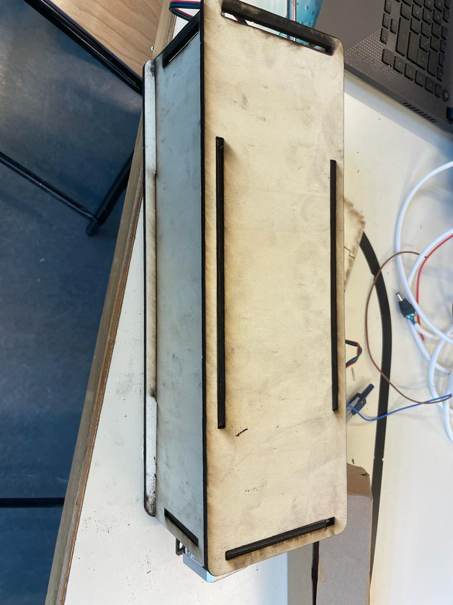

## Rapports de séance Brice Mabille

- 27/03/2023 : Setup du projet GitHub partagé

# Séance 14

During this session, I printed the link between the stepper and the endless screw.
I built the box for the drilling system with the Laser Machine.
I tested the stepper in electronics.
I started link the box with the drill.
And I begun the Arduino Code for the functionement of the drill. It is on Github in the DRILL file.

  

