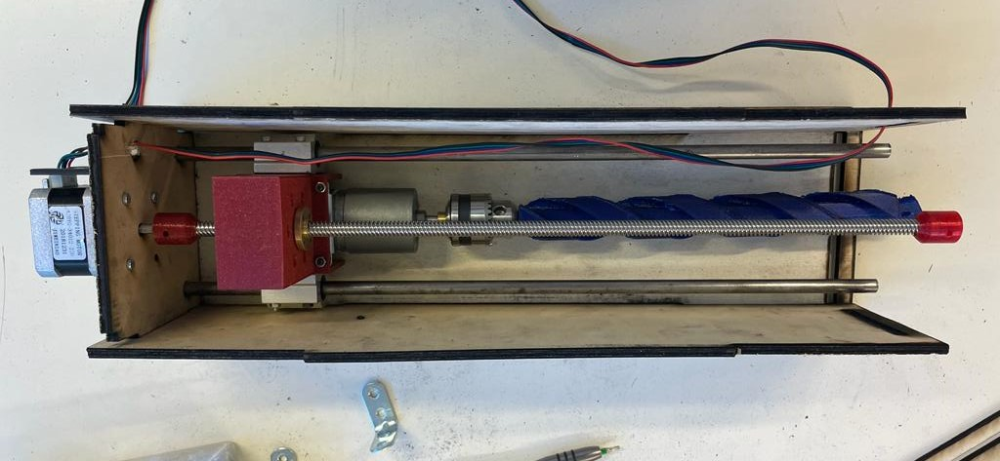

## Rapports de séance Brice Mabille

- 07/03/2023 : Setup du projet GitHub partagé

# Séance 15

During this session, I focused on the Drilling system and it advanced well.

Firstly I re-built one size of the box and I thought about put some holes to link the stepper and enter the electronics inside the box.

After this, I joined the box's sides.

I printed the link again for the extremity of the endless screw to put in the frame and allows a better set of the screw.

Then, I cutted the stems to have the right size in the box.

I set some squares to put in the frame and allows a nice fixation.

 

Next session, I will cut a hole in the frame to join the drilling system in the robot.

And I will link the drilling system into the frame.