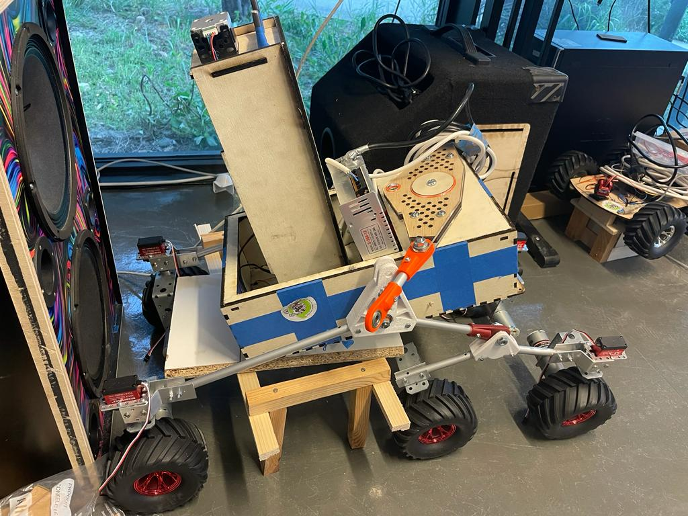

## Rapports de séance Brice Mabille

- 13/03/2023 : Setup du projet GitHub partagé

# Séance 16

I spent the most of this session inserting the drilling mechanism into the robot's frame.

In order to cut a hole at the Laser machine, I first had to dismantle the frame from the suspension.

It allows the drill to move and dig the soil.

To further secure the sides, I added more squares to the frame.

Likewise, I carried out the drilling system.

And I put both parts together.

In the end, I re-made the suspension in the frame.

The advanced robot is shown in the picture below.

For the next session, I will think about the electronics with Jaime because he did the electronics for the movement of the robot and we have to adapt his electronics to mine.

