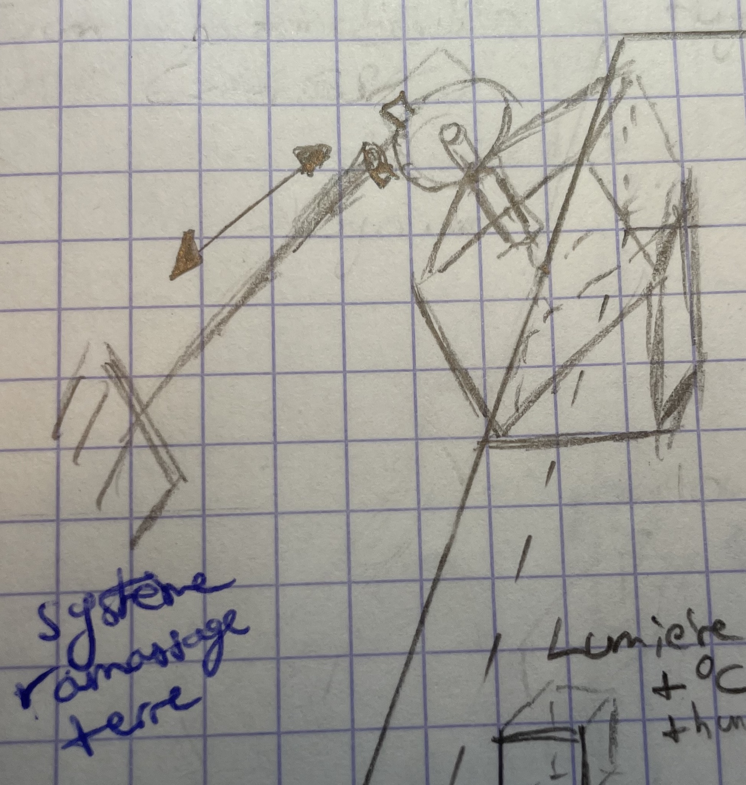
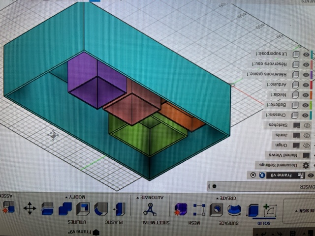
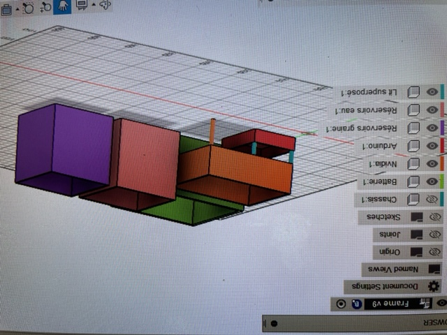

## Rapports de séance Brice Mabille

- 18/10/2022 : Setup du projet GitHub partagé

# Séance 2:

During this second session, Jaime and I ordered the materials for the robot from Mr.Masson.  
We went over the motor selection again.  
We debated whether to use a reductor motor or an encoder reductor motor. Finally, we chose the reductor motor since Mr.Masson advised us to take a camera and gather data in order to calculate a time and distance gap in order to determine the robot's speed.
As a result, the DC motor selected is:  

[lien](https://www.gotronic.fr/art-motoreducteur-mfa-970d7501-12415.htm)

We realized that the Auger we chose was too large, so we opted to make it with a 3D impression machine.

In addition, I worked on the paper modelization of the frame and completed the interior and outside of the frame.  

There was a lot of thought into the robot system.  
The drilling system proved tough to envision and integrate into the frame.

So I created a model of the drilling system's first attempt:

I thought about a motor which is below a first gear. This gear is linked to another gear but a special one.
It was special because it is an adaptater of a nut. Inside the nut, we can find the Auger.

However, this approach is insufficient because many components will be in the void, making it impossible to keep the system balanced.

With this issue, I considered alternative drilling mechanism, although it will be positioned inside the frame. On paper, I modeled it as follows:

On this image, we can observe a DC motor connected to the Auger and the mandril. It will ensure the Auger's rotating movement.  
A gear system and a Stepper motor will also be used to ensure the translation movement to store the Auger in the frame.

This drilling mechanism will dig a hole and then, after seed distribution, will compact the dirt while leaving a minimum of oxygen for seed evolution.

This drilling mechanism, in my opinion, is adequate and makes it easy to address mechanical concerns.  

I was also thinking of the rake method, which allows us to bury the seed:

I considered a rake connected to a Stepper motor positioned on an angled design. The system will allow for a translation movement to store the rake up the frame.  

Finally, I started modeling the frame in Fusion360 using the components space.

I chose to construct like a "bunk bed" to house the Nvidia and Arduino chips:

This solution has two advantages: the Nvidia chip heat will be better vented because it is higher, and the space required is less.  

The outside fusion modelization of the frame will continue in the following session.  
During the next session, Jaime and I decided to build the frame made of wood.
