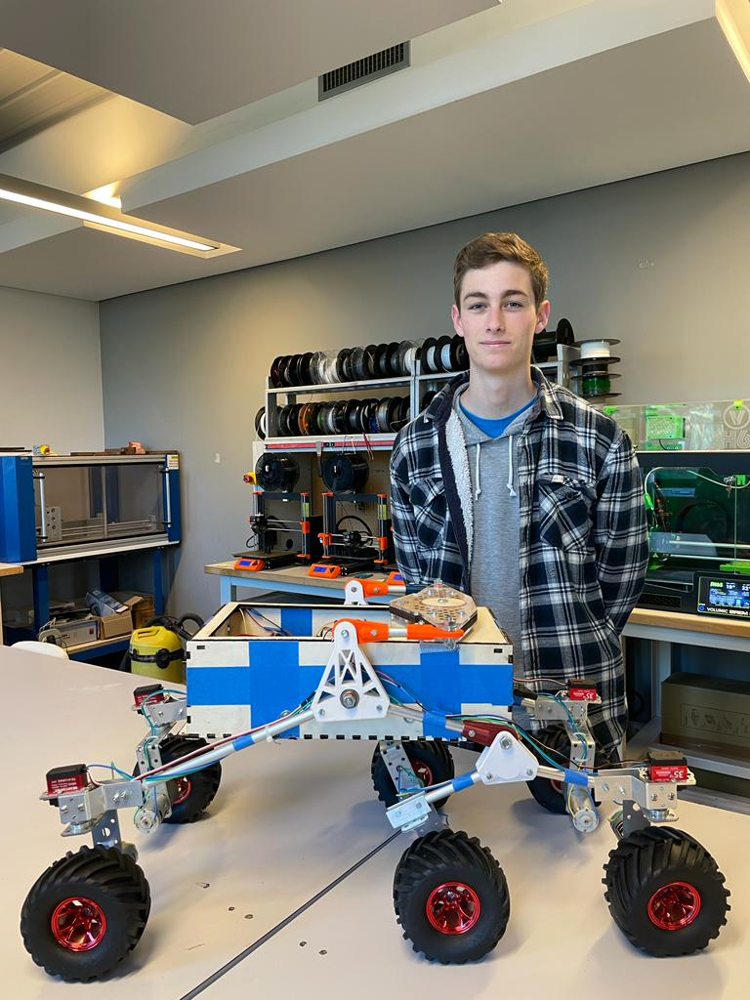

## Rapports de séance Brice Mabille

- 11/04/2023 : Setup du projet GitHub partagé

# Séance 20

During this session, I worked on the electronics of the robot.

Indeed, I wanted to make the servo motors in function so I asked for the converter and I received some which could help me to test it.

But those converter are not the final one, there were just the testing converter to see if the the servos can do what they have to do.

It took me a lot of time because I wanted to make 2 servos in parallel. 

Actually it worked well.

To go further, I changed the offset of the servos with Jaime to allow the robot moving in rotation and changing his direction. 

We arrived to do it to 2 servos. 

I changed the code of the servos because the precedent didn't work.

It is registered in the code "Servo".

For the next session, I will finish the servos functioning, and I will adapt the electronics in the frame because there are too much cables so it is not ideal.
