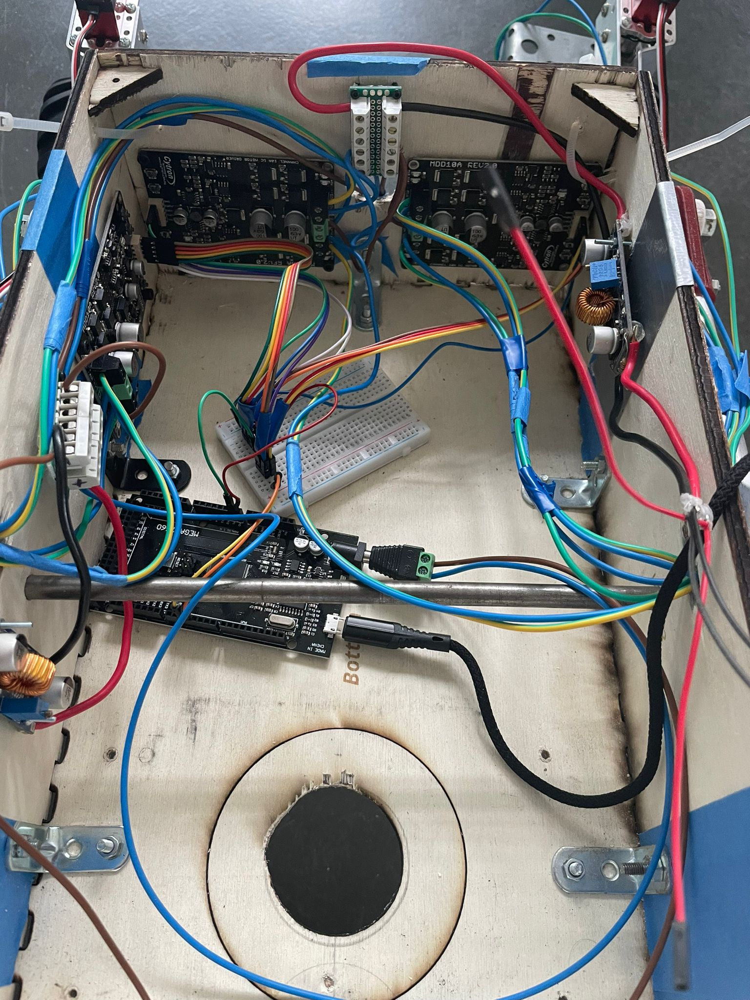
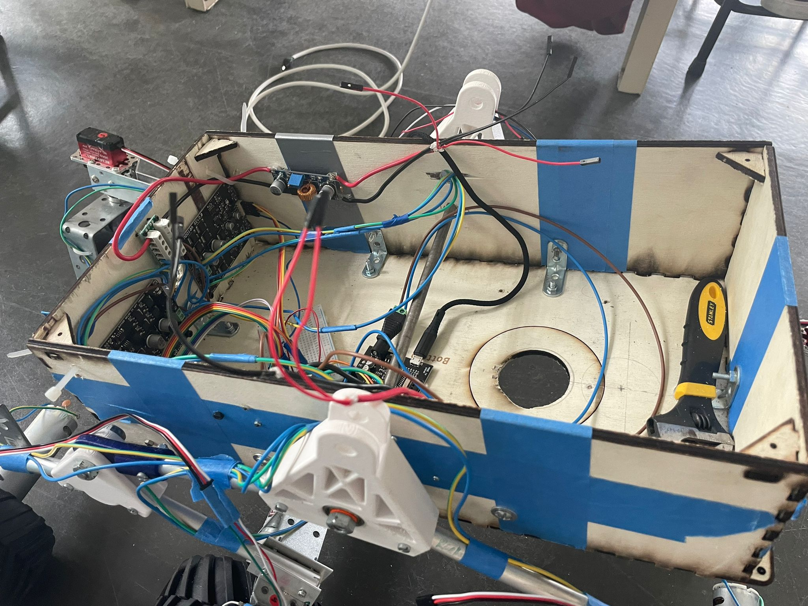

## Rapports de séance Brice Mabille

- 25/04/2023 : Setup du projet GitHub partagé

# Séance 21

During this session, I wanted to re-think about the electronics of the robot because the frame was (encombrer) and we couldn't see well the electronics inside.

So I made it clearer. I firstly thought about the drivers and I fixed them on the side of the frame.
With a lot of issues I definitely success. 

It took a large part of the session, finding the right screws and fix them. 

Finally, I linked the motors to the drivers.

I'm not so sure about the change of the orientation direction which will not be finish before the oral because I didn't receive the converter to link the servos.

For the next session, I will link the drill to the frame and make it works with the electronics to present the robot at the oral.

