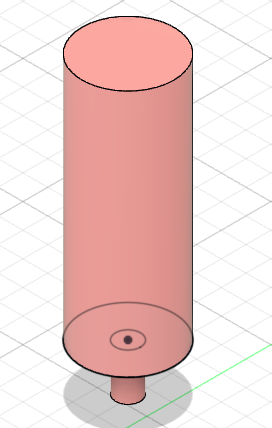
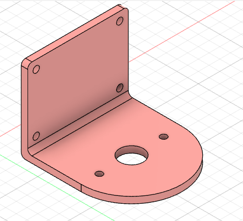
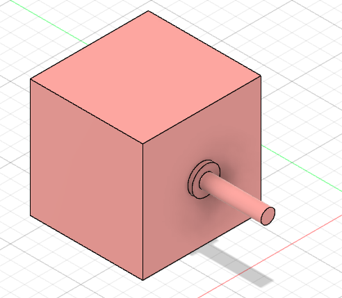
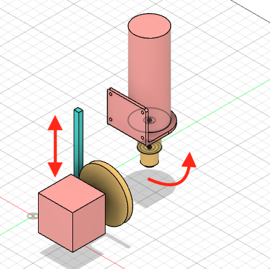

## Rapports de séance Brice Mabille

- 28/10/2022 : Setup du projet GitHub partagé

# Séance 3:

I started modeling the drilling system for our robot between the second and third sessions. And I carried on with it during the third session.

The drilling system consists of one DC motor, which I represented by a cylindric form and on which I used the rotation joint:

I modeled the motor support and mandrel in order to mount them on the DC motor. These components allow the drilling mechanism to rotate:

Then I concentrated on the translation movement to move the drilling mechanism within or outside the frame. So I created a stepper motor and gear system to simulate this movement:

Jaime and I also discussed the potential of building the frame out of wood. We pondered which wood planks to use and how to construct it.

We first considered engraving the dimensions on the Laser cut machine. We intended to utilize the circular saw engine since the wood was too thick to cut on the machine.

But this wasn't working well, so we switched to a thinner wood board.

Then we discovered a website that allows us to make a box with notches to help with box design.

[lien](https://www.festi.info/boxes.py/)

We also chose to design the box below so that we could open it whenever we wanted:

I created an SVG file with the appropriate dimensions for our frame and changed it in Inkscape to convert it for the Laser cut machine.

I also divided the file into three files because the frame dimensions were too large for a single wood board.

Unfortunately, I was unable to turn on the Laser cut machine because Mr.Lebreton had reserved it throughout the session.

The modeling of the drilling system will continue in the following session. I'm going to improve it and model the Auger.

I'll construct the wood structure during the following session. 
Finally, I'll run the Auger modelization via the 3D engine.
