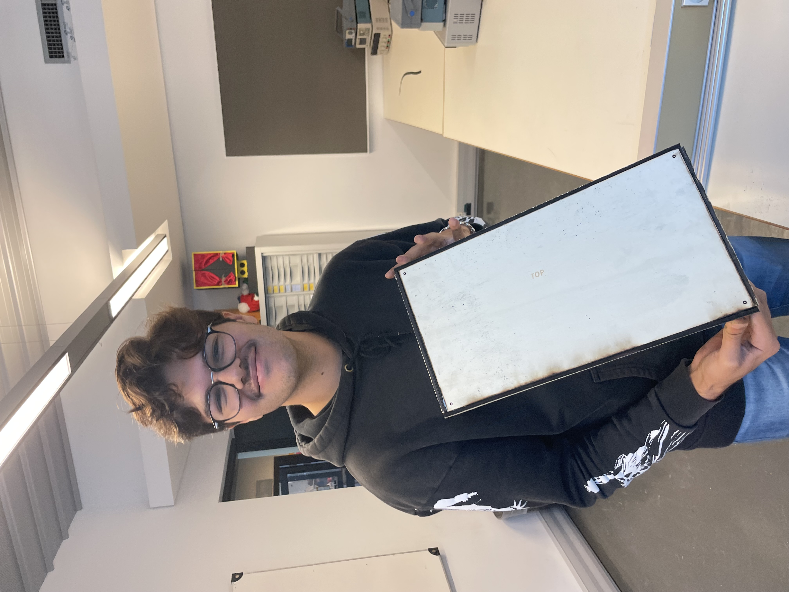
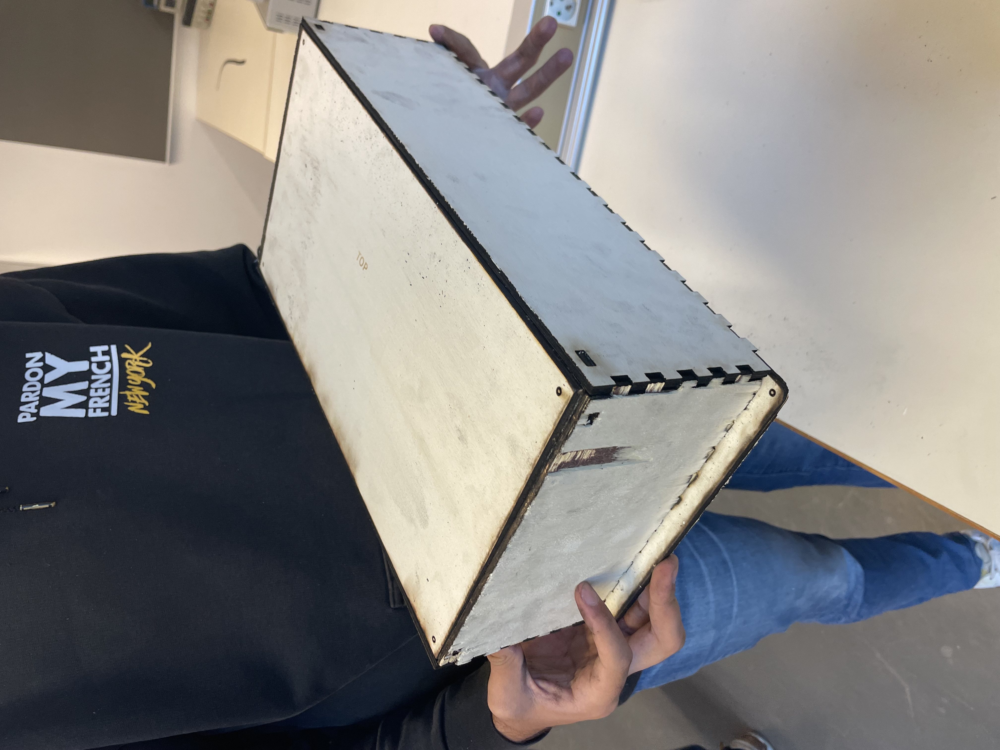

## Rapports de séance Brice Mabille

- 15/11/2022 : Setup du projet GitHub partagé

# Séance 4:

I constructed the wood frame for the E-Gaa during this session.
I had to start by creating the frame from the previous session because I had changed computers and the shared files were not there on the new one.

It just took a little while, and I was at the laser cutting station in the FabLab.

I started with the arrangement: Wood; Basla, but I noticed that the wood wasn't cut according to those specifications, so I made a second cut.
I therefore had to use tools to posttreat the first board.
I bring a flat screwdriver, a hammer, and a cutter to remove the board from the wood.. It took a lot of time...

The second board: I modified the Laser machine's configuration, but the problem reappears; the colors weren't properly configured.
The color black is typically associated with engraving, but in this instance it was associated with cutting.

So I changed the board, I adjusted the colors and the type of wood: "Bois, contreplaqué 5mm". 
It didn't work so I took the tools again.

Finally, I adapt the configuration for the third board. 
I changed the laser speed, I changed the laser power, I virtually recorded on the machine that the board was 8 mm thickness. 

This board required a lengthy cutting process, taking 20 minutes per board. However, the board was perfect.

I did the same for the other boards.
Sometimes I needed to posttreatment the board again with the tools.

But I actually did it!

I am proud having finish this frame. Here are some images Jaime captured of the frame I created.

