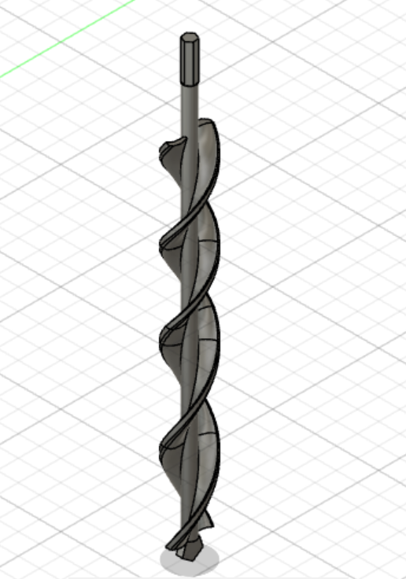
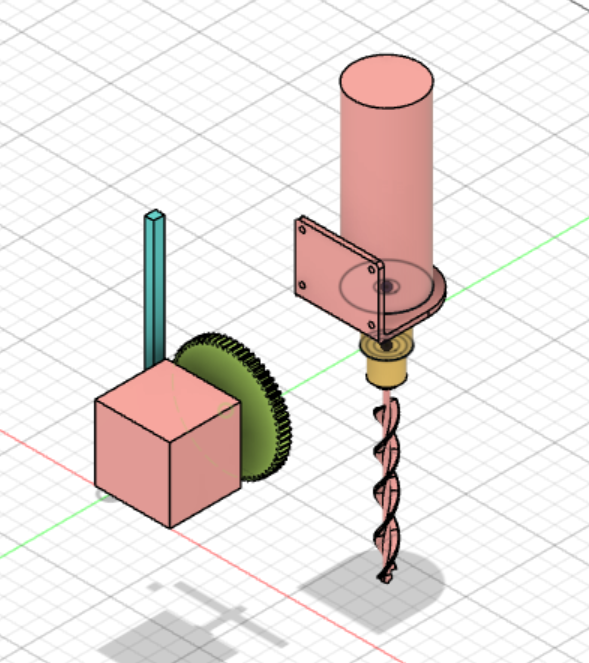

## Rapports de séance Brice Mabille

- 25/11/2022 : Setup du projet GitHub partagé

# Séance 5:

I made the decision to model the Auger for the drilling system during this session.

Indeed, we discovered that the Auger we purchased is too long and too hefty. 

This charge cannot be supported by the robot with the motor connected.

I started out by modeling the stem and the ends of the auger. 

It enabled the Auger to be connected to the mandrel and after that, I tried to modelize the helicoidal part of the Auger. 

However, I didn't consider how difficult it would be.
After my initial attempt failed, I looked up how to modelize a drill bit online in the following manner:

https://th.bing.com/th/id/OIP.w46qVQwIMw7wj89Czfmf9QHaHa?pid=ImgDet&rs=1

I actually found this video: 

https://www.bing.com/videos/search?q=fusion+helicoidale&docid=608022783860026475&mid=D3970C3CB47E5C9C30A1D3970C3CB47E5C9C30A1&view=detail&FORM=VIRE

On Fusion360, I performed the exact same modelization.
But I changed the sketches because I didn't require this kind of drill.

After spending a half-hour experimenting with different sketches, I was able to model the drill using the proper parameters.

Furthermore, I made the decision to change the drill's dimensions because I believe the one we purchased is too long.

Here is how I modeled the Auger and connected it to the other parts of the drilling system:

I did the slicing on PrusaSlicer.
So I wa,ted to print the Auger on the 3D printer but other group modelizations were launched.

In the last thirty minutes, I made the decision to consider the drilling system's translation movement. I also discovered another video to model the rack for the gear system.

https://www.youtube.com/watch?v=Ra-Pl3K_eLQ

I will complete this modeling over the weekend, and on Tuesday, the Auger and Gear systems will be printed on the same plate by the 3D printer.
