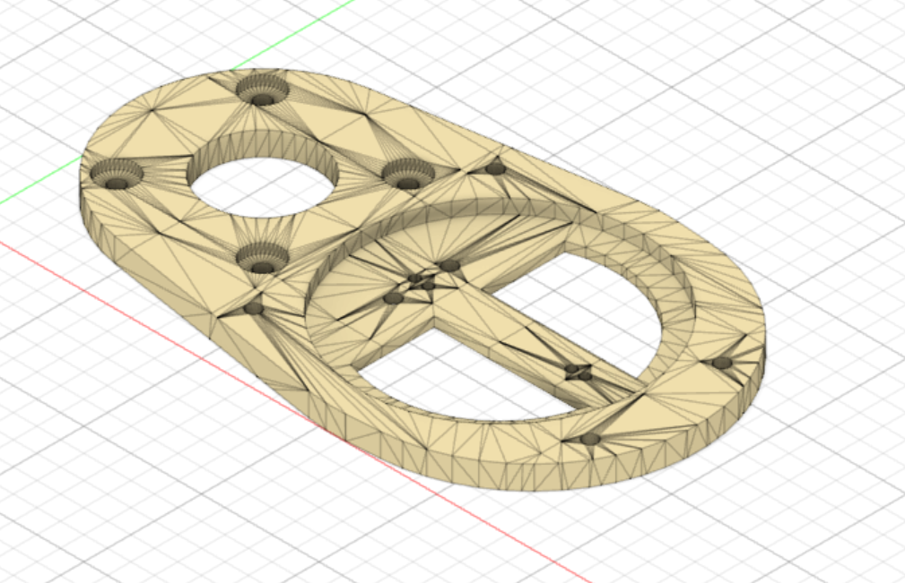
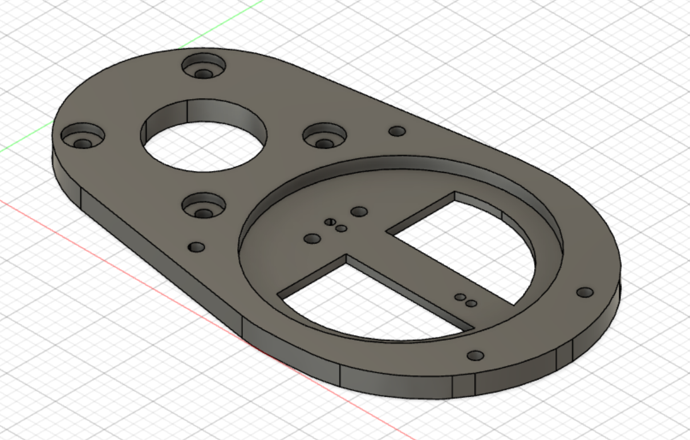
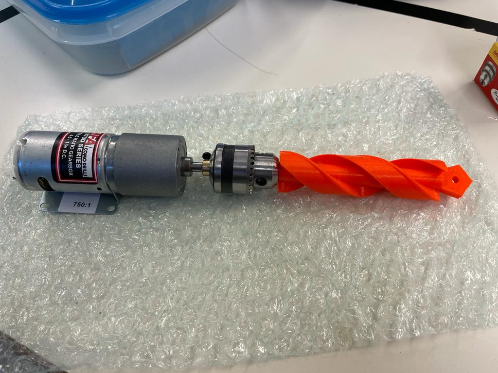

## Rapports de séance Brice Mabille

- 09/12/2022 : Setup du projet GitHub partagé

# Séance 7:

During this session, I firstly checked if the LIDAR system works well with the real LIDAR. 

But I didn't expect the LIDAR was too long for the system I printed. At least, It will help me to re-create the LIDAR system because I will have a model and a structure.

So I begun to modelize the new LIDAR system, I thought I only needed to do a dilation but it will not work because the parts connected to the motors don't have to be change. 

I think I will lengthen the base and the rings of the system and for the rest I could do a dilation.

It took a lot of time because I didn't know how to change a mesh in a solid I could modify.

Next, Jaime and I decided to take a Linkedin picture to show the advance of our robot.

Secondly, I took the Auger and the Gear system, I connected them to the motors and I discovered that the all system looks good.

I'm just not sure with the reliability of the rack with the motor DC.

I thought of an idea with Jaime, making the rack on a side and an object I don't remember the name which maintain the rack with the motor and the gear.

I finished the session cutting the seed stock on plexiglas and the goodies with the LASER machine.