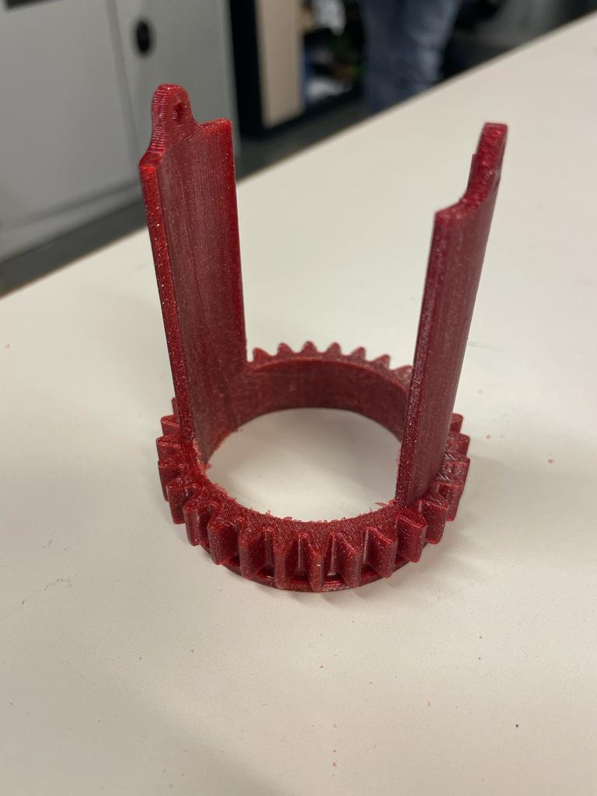
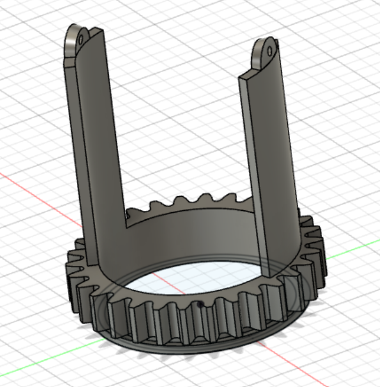
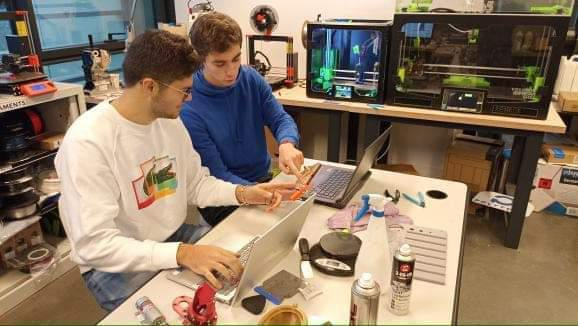
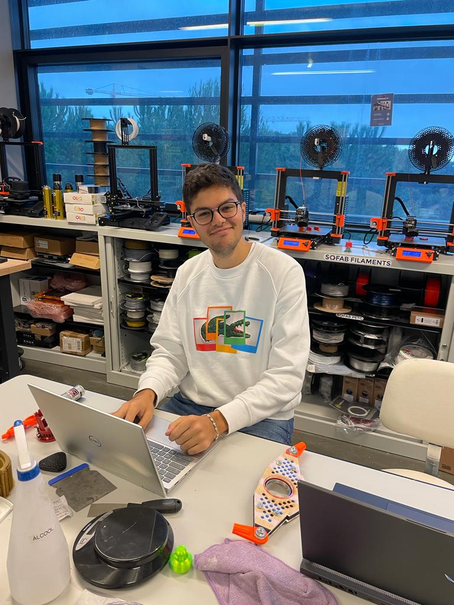

## Rapports de séance Brice Mabille

- 14/12/2022 : Setup du projet GitHub partagé

# Séance 8

This session, I focused primarily on the Lidar system.

Since it didn't have the proper dimensions for the Lidar, I did try to modify it.

There are various issues with the redesign that I have. In fact, I am unable to alter meshes in Fusion 360.

I thus looked online for a solution, but the only one was to modelize everything again from scratch.

So, using my model, I collected the dimensions.

And after much patience, I was able to complete this sketch on Fusion 360 on December 16.

This modelization is currently printed on the device, and I will be able to retrieve it on December 19.

Second, I created the Seed stock for the seed distribution.

The next step to finish this stock is to build a flapper to guarantee a regular distribution.

Moreover, Jaime and I decided to take pictures of us.

For the next session, I will be concentrate on the priority of the Robot, the moving. So I will be with Jaime making parts of the moving system.