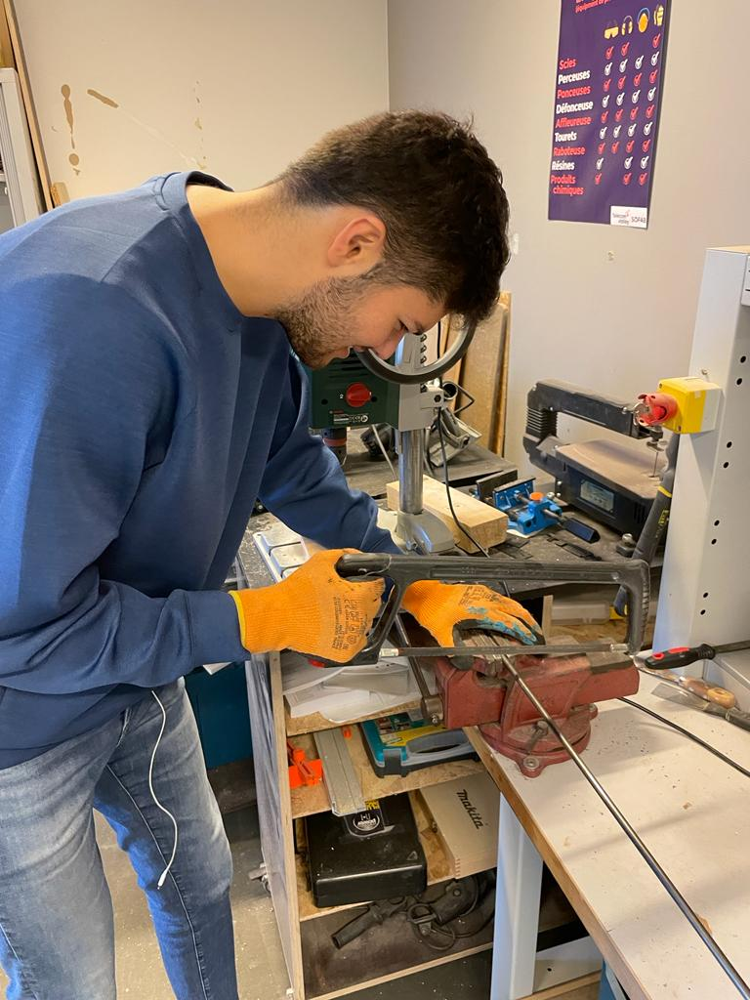
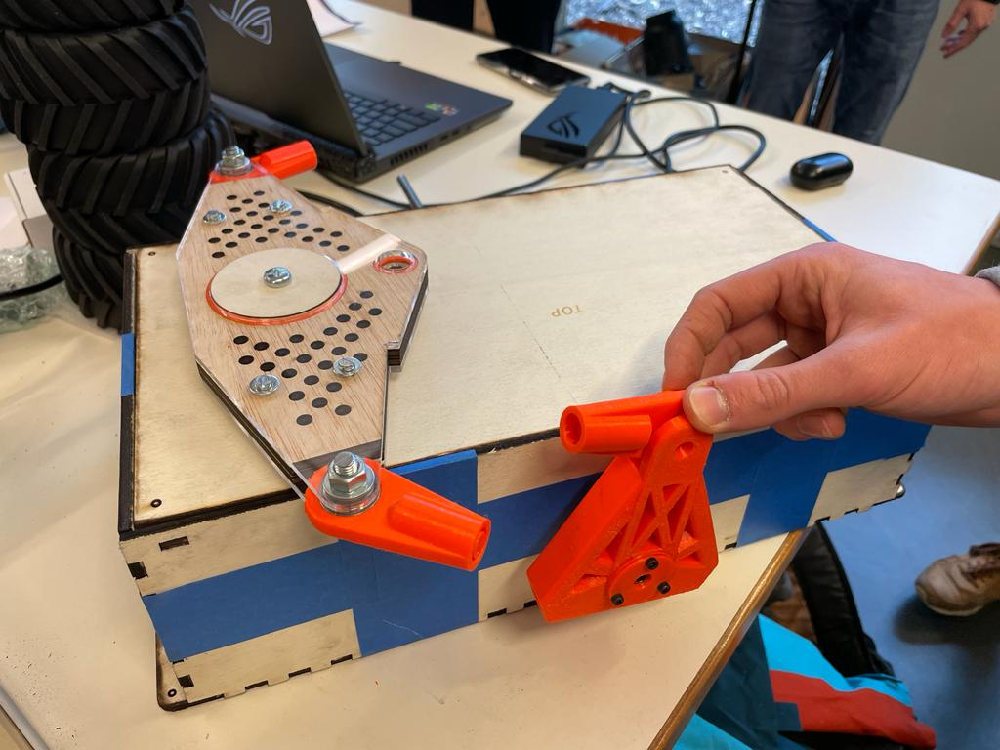

## Rapports de séance Brice Mabille

- 16/12/2022 : Setup du projet GitHub partagé

# Séance 9

During this session, I figured out that the first need of our robot is to move on the floor.

I noticed that the Robot is not moving but Jaime and I have a functioning demonstration of our Robot on January.

And it is accurate that a robot moving is valorizing.

So I decided to take part in it helping Jaime and make things to advance the project.

First, I took the initiative of making holes in the Frame to link the differential and the pivot in it.

Talking about the differential, I built the system to assembly the differential on the top of the frame.

I needed to build circles on Inkscape, print them with the laser machine and adjust the dimension with the sand machine.

It was difficult to adjust the dimension because the wood circles have to adhere the rolling.

Moreover, I sew a metallic pipe. 
This pipe has to be in the frame at the middle to join the pivot. 

It will take a, important part in the moving system.

Finally, Jaime and I discussed on the frame. Because this one is not solid enough o support the all things. 

We think that we will have to change it but right now we have to test the Robot and the actual frame could be great to test the moving machine. 

We would like to make it in aluminum for the future one.

For the next session, I will continue the moving system.

