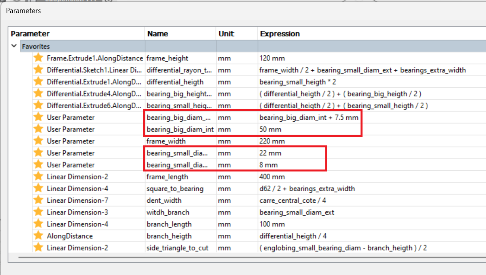
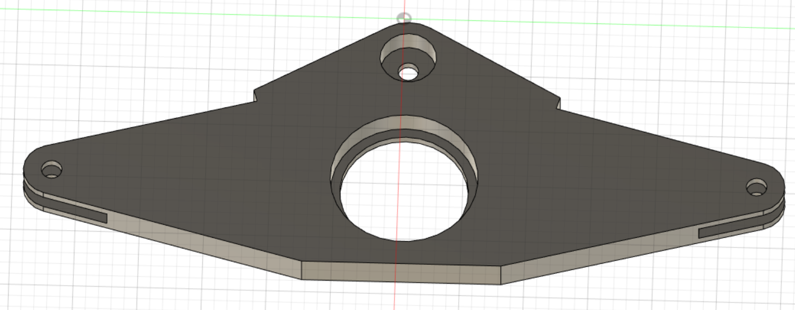
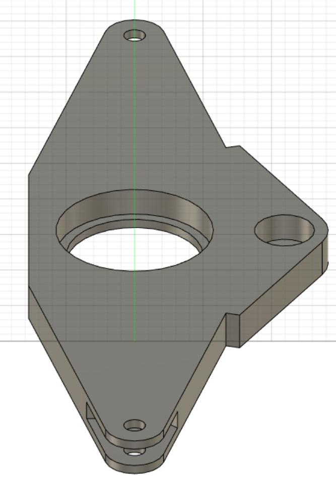
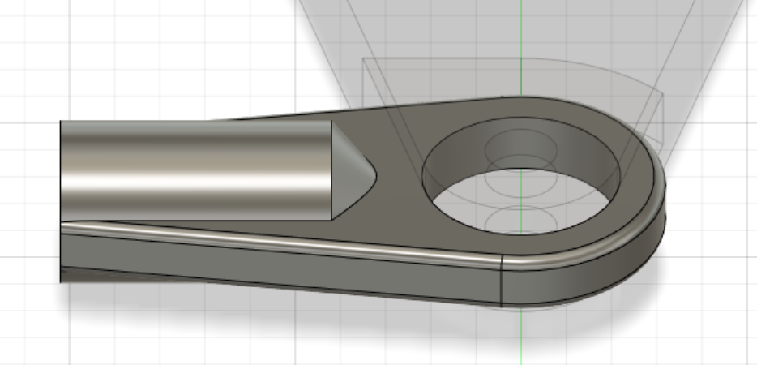
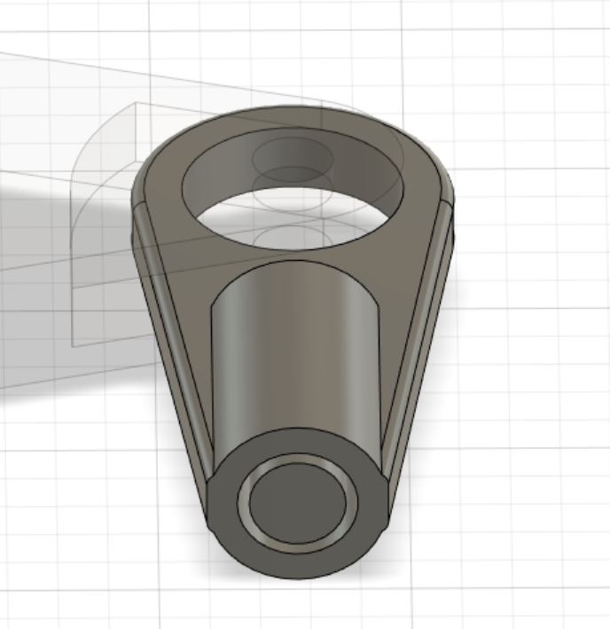
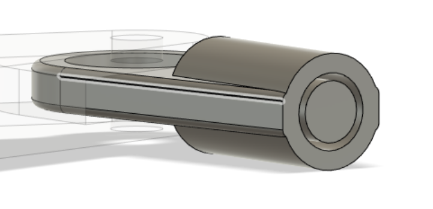

***[<< previous session](Session03.md) | [next session >>](Session05.md)***

# Session 4

During this session I received the pipes and bearings for the differential.  
Here are the specifications:

|Pipes||
|:---:|:---:|
|External diameter|12 mm|
|Width|1 mm|

|Small Bearings|[Amazon.fr](https://www.amazon.fr/Roulements-Bearings-Skateboard-Longboard-Waveboard/dp/B07S3SZZST/ref=sr_1_5?__mk_fr_FR=%C3%85M%C3%85%C5%BD%C3%95%C3%91&crid=H1CHQHQ7HU0B&keywords=roulement+%C3%A0+billes+8mm&qid=1668499121&qu=eyJxc2MiOiIyLjQ4IiwicXNhIjoiMS4zNiIsInFzcCI6IjEuMTUifQ%3D%3D&sprefix=roulement+%C3%A0+billes+8mm%2Caps%2C164&sr=8-5)|
|:---:|:---:|
|External diameter|22 mm|
|Internal diameter|8 mm|
|Height|7 mm|

|Big Bearing||
|:---:|:---:|
|External diameter|57.5 mm|
|Internal diameter|50 mm|
|Height|7 mm|

Having the specifications of these two components, I updated the variables of the differential.

I also made some little modifications to fit the bearings.

Plus, in order to optimize the [piece S2](./session3.md/#piece-s2-suspension-2), I remodeled it using the pipes.

## Fabrication

In order to 3D-print the differential, I sliced the 3D model and exported the G-code.  
However, after a quick discussion with M.Masson, we decided that making it out of wood would be preferable in case we needed to make minor changes to the piece.  

To make it out of wood, I'll laser-cut multiple layers and glue them all together. As a result, the differential will be both rigid and light.  
So I began by exporting the Fusion360 sketch to create the svg file, but the exported file is not optimized for editing in Inkscape.  

As a result, my next session will be devoted to:  

1. Recreate the sketch so that it can be exported and edited as an svg file.  
2. 3D-print the piece S2

---
Note  
[*S'inscrire au GDR*](https://www.gdr-robotique.org/inscription/)

***[<< previous session](Session03.md) | [next session >>](Session05.md)***
