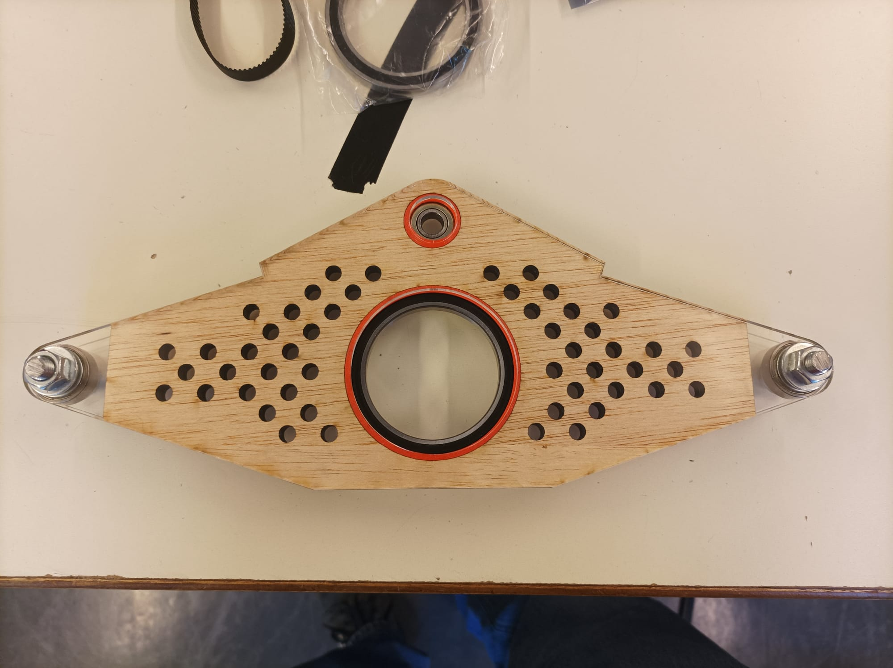
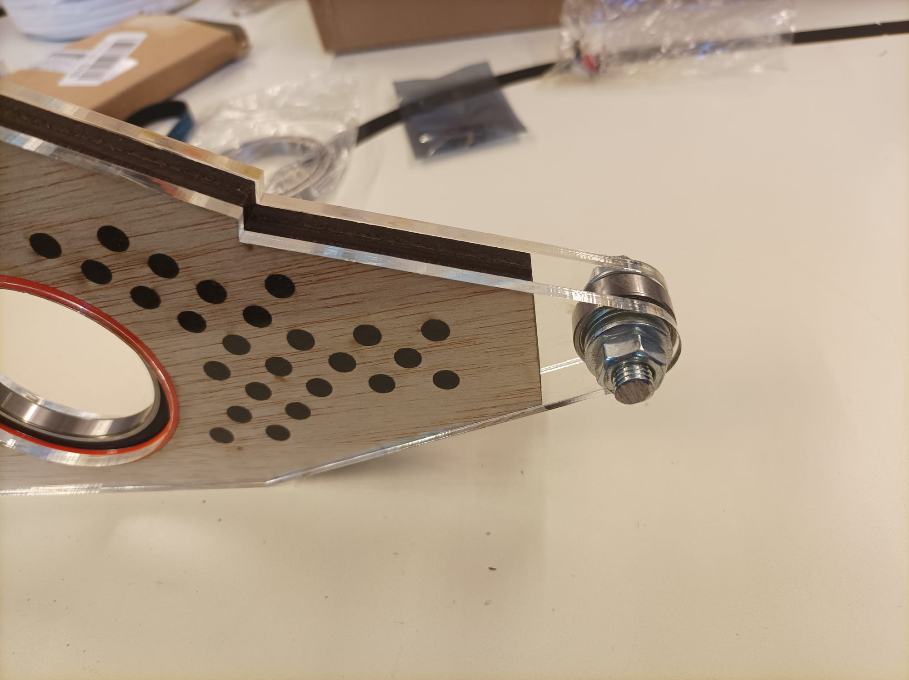
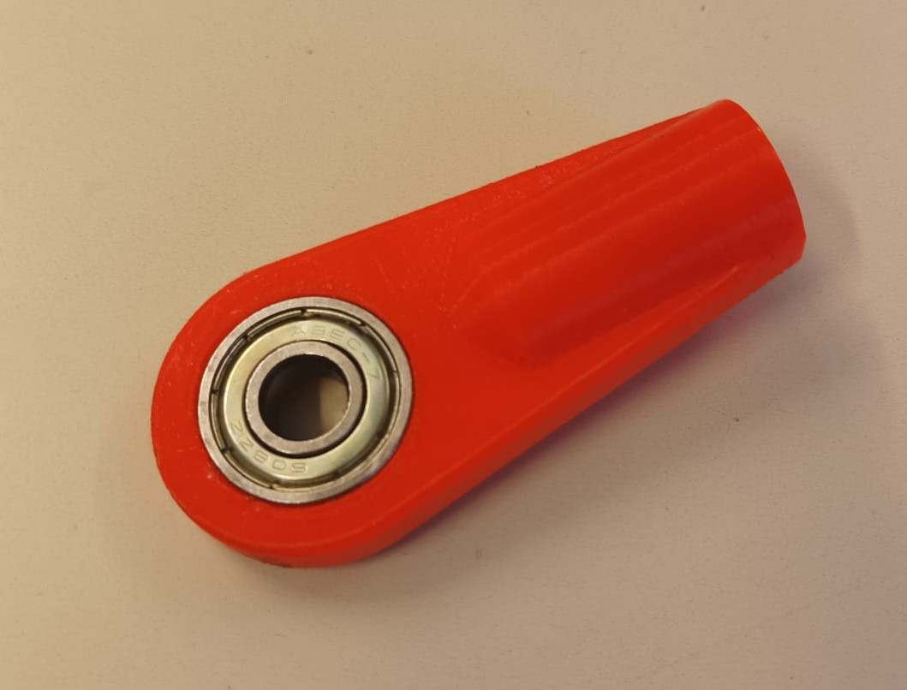
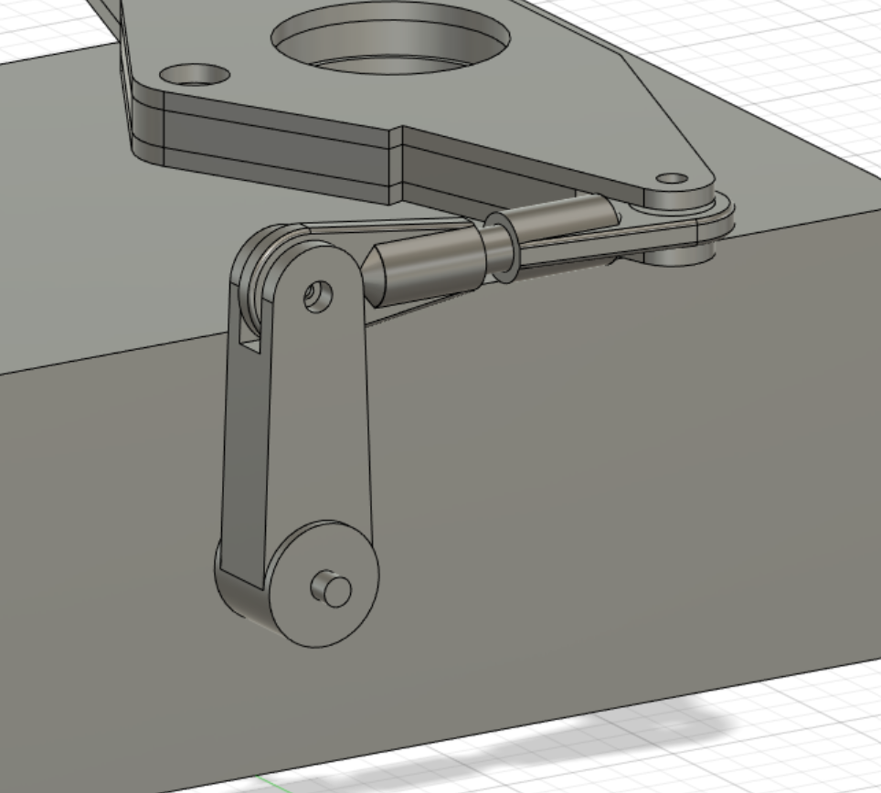
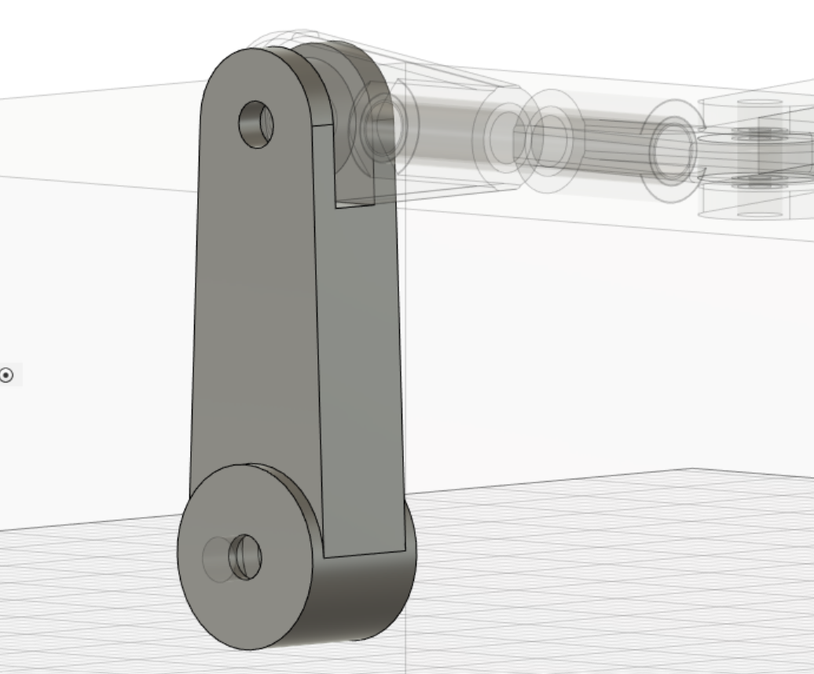
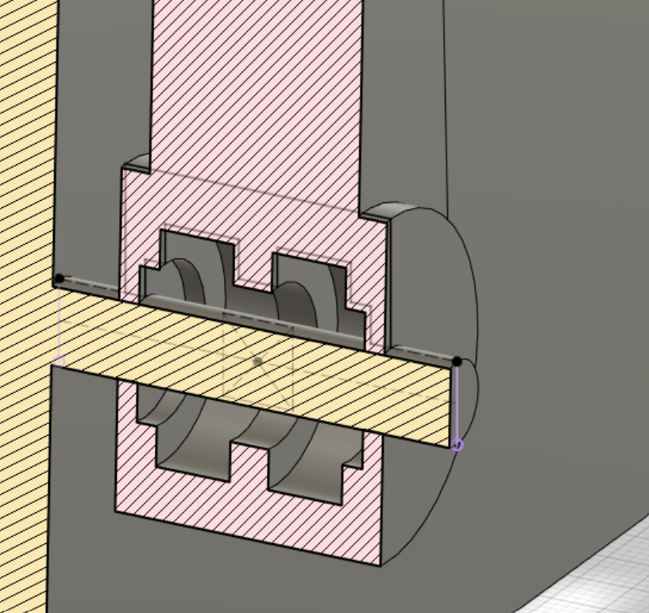
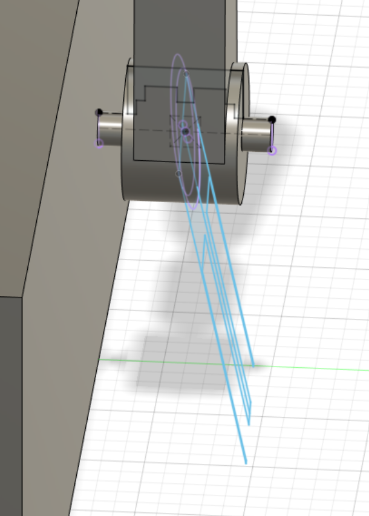

# Session 6

## Differential production

I created the initial version of the differential during the brief session we had with M. Masson at the FabLab. But because of a measurement error, I had to start over throughout this session.

I started by cutting the inner layers of the differential, which are made out of wood, with the laser cutter. These two 5mm layers, which make up a total of 10mm, encircle the middle bearings and attenuate minor vibrations.

Then, the rigidity of the differential will then be handled by the plexiglass outer layers.

The bearings can rotate without encountering any resistance through 3D printed rings that separate the bearings in the wood layer from the plexiglass.

Finally, I sawed a threaded tube that holds the bearing and layers of plexiglass together. Rings are also mounted to the bearings to reduce friction with the plexiglass layers.

The tube joint below will be supported by the bearings on the extremities.  
Nevertheless, the printed version's diameter was too small for our tube. Therefore, I've started a 3D impression for a different version that hopefully meets the requirements.

|||
|:---:|:---:|

## Main pivot

I've started modelling the main pivot in order to add wheels as soon as possible.

|||
|:---:|:---:|

This piece wont be using metal tubes since the distance is pretty short. However, in the case where the robot was made bigger, I would redesign the main pivot.

Inside the piece will be located two bearings as such:

However, I'm still considering whether to put them inside or make them visible so that we may remove them whenever we want.  

Finally, I am facing difficulties extruding the other tube joints. I'm trying to make them angled like the mars rover, but if it takes too long, I might just make them straight.

