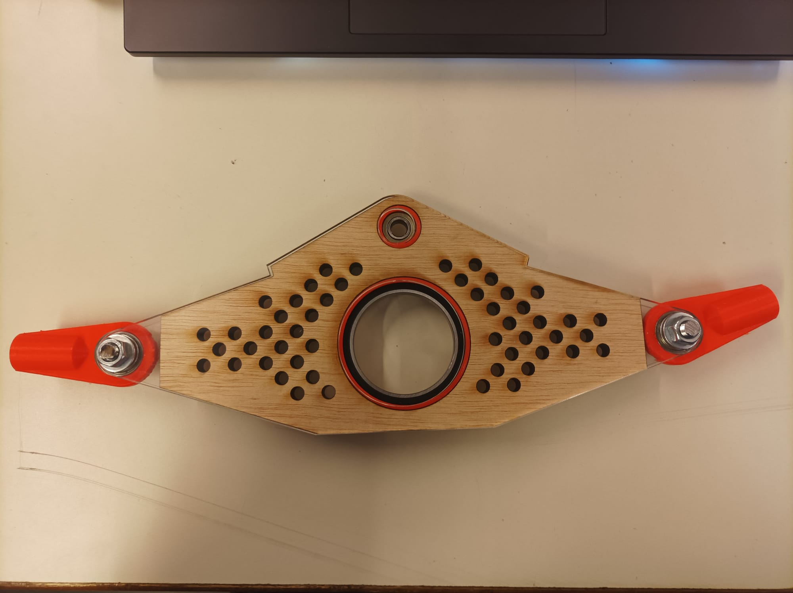
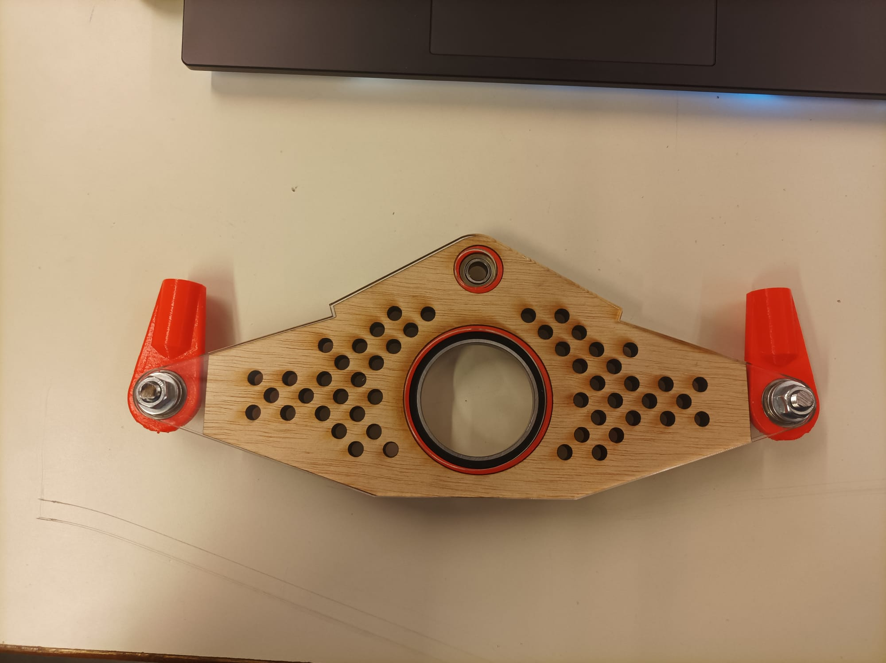
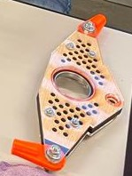
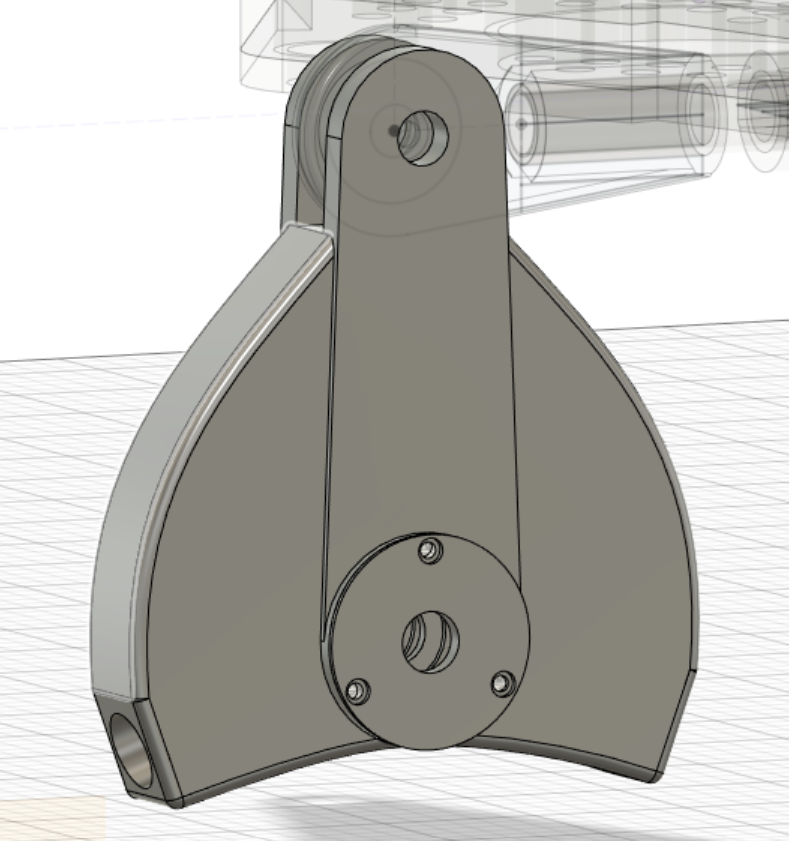
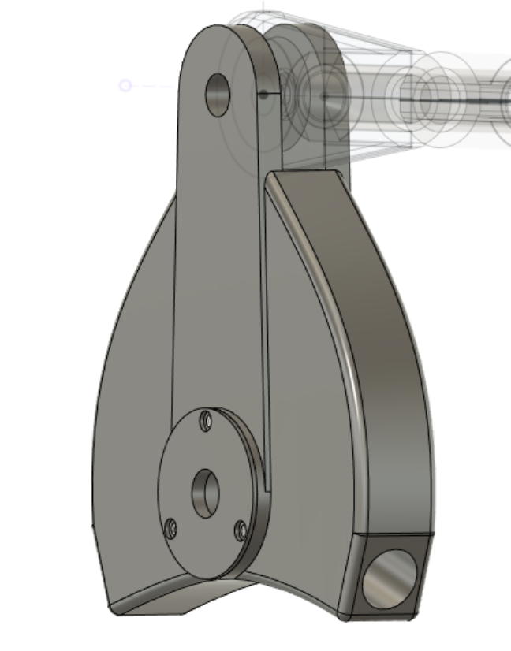
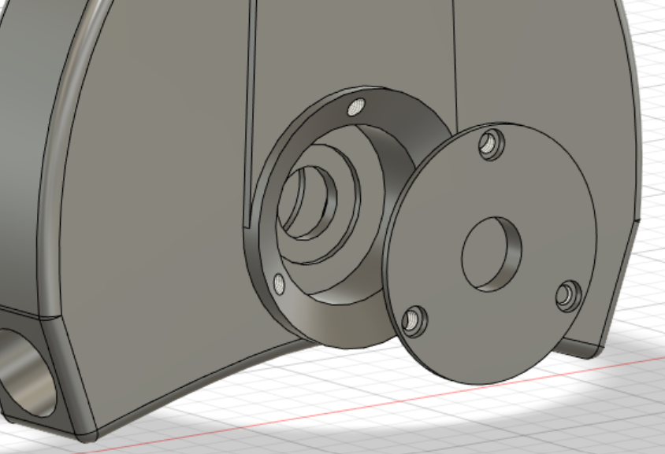
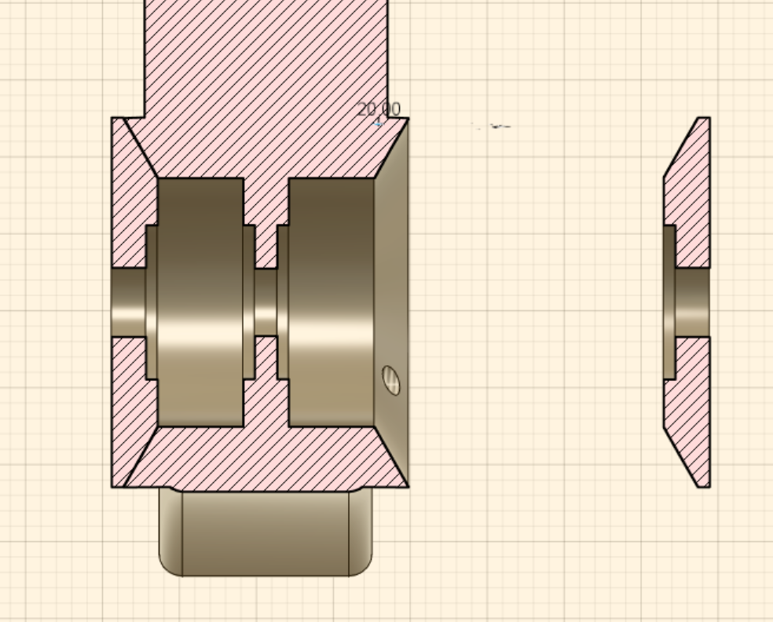

# Session 7

## Differential

During this session I finished the building of the differential.

The new version of the 3d printed joints that will connect to the tubes fit perfectly.

|||
|:---:|:---:|

Additionally, I drilled several holes so that I could add screws and keep the wood layer in place.

I discovered a minor problem: the bearings inside the wood layer are a little loose. So I'll just print new 3D rings a bit wider.

## Main pivot

I continued modeling the main pivot.  

The component will have to withstand significant angular forces coming from the tubes to the vertical axe. So, in order to increase the distribution of the momentum, I modelled a circular shape.

|||
|:---:|:---:|

However, I believe that applying the Trellis approach would help to reduce the mass. I'll investigate that over the weekend.  

Finally, I placed two lids to the piece's sides so that the bearings can be taken out if necessary.  

|||
|:---:|:---:|
