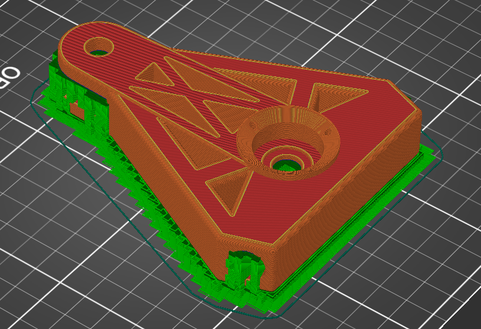
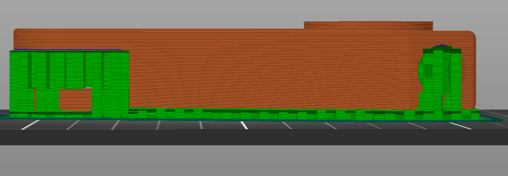
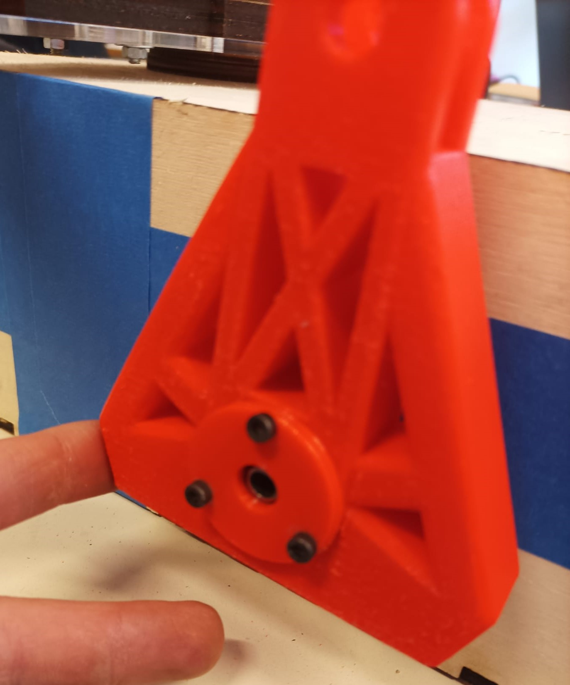
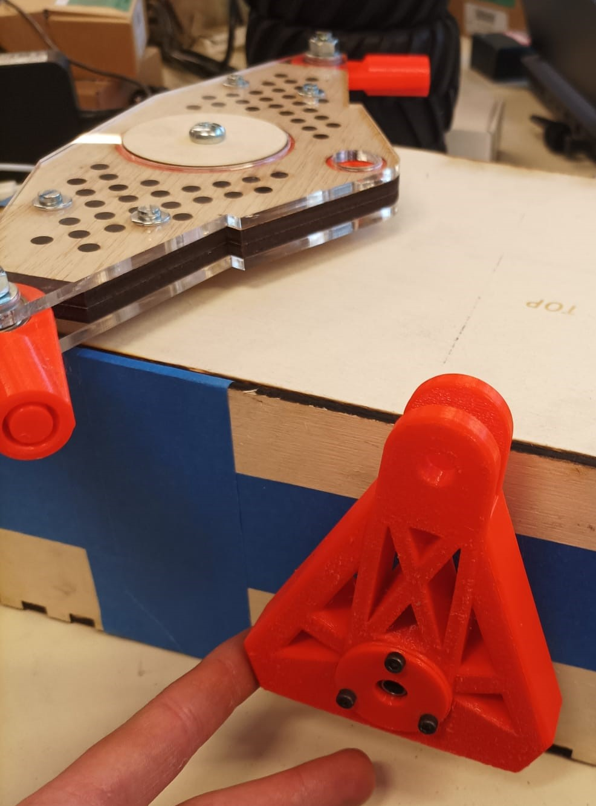
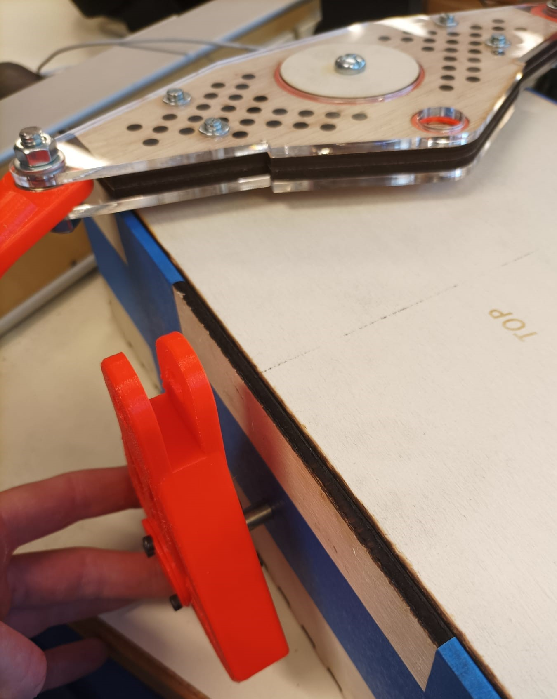
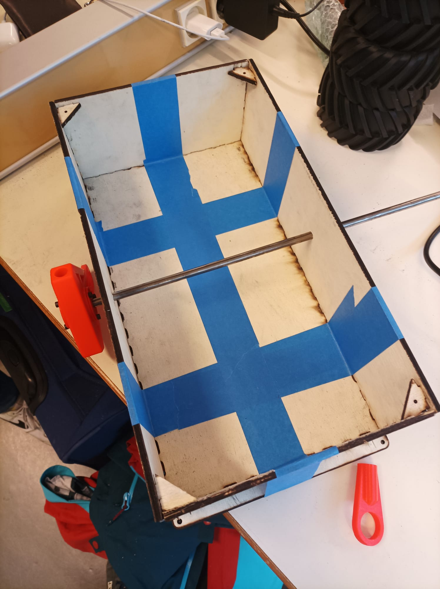

***[<< previous session](Session08.md) | [next session >>](Session10.md)***

# Session 9

I first started this session by taking the finished 3d impression of the main pivot.  
I had to take away all the supports which take a long time.

Then I softened the borders and faces.

I had to make the thread for the screws in order to fix the bearings inside. This was a really slow and focused activity.

Brice assisted me in inserting the tube through the main axe after this was finished and the bearings were secured internally. We used a heavy hammer to smash our way in.

|||
|:---:|:---:|

By the end of the session, I noticed that the tubes connecting the wheels weren't the right size. I therefore had to even them out. They now fit flawlessly.

Brice and I also talked about how to attach the differential to the frame. We made the decision to laser cut the wood into circular shapes to encircle the central bearing. By doing so, we prevent friction.

In order to prevent the frame from collapsing, I additionally applied scotch tape to it.

***[<< previous session](Session08.md) | [next session >>](Session10.md)***
