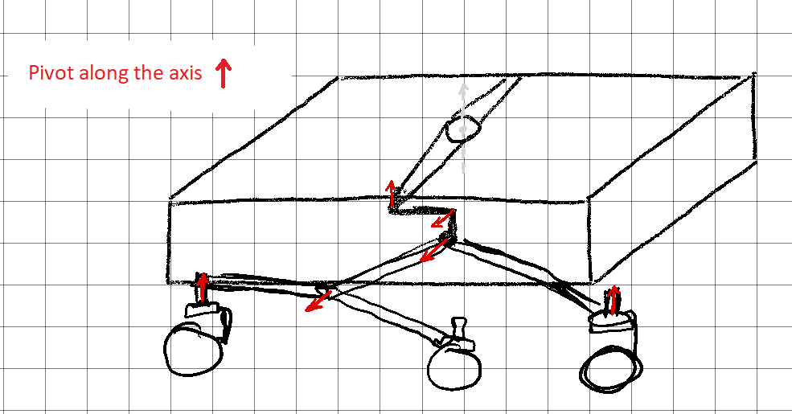
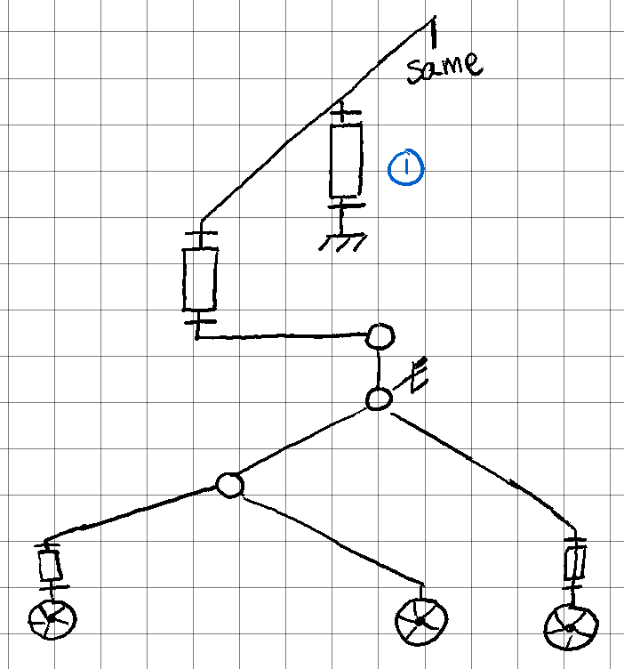
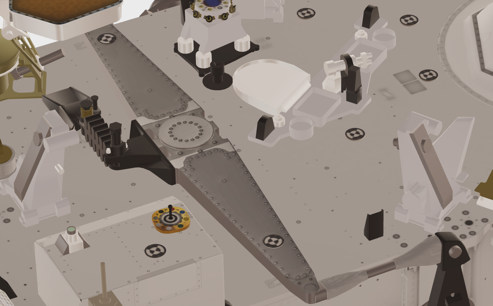

# Session 1

## **Organizing the session**

---
First off, I've set up a Fusion 360 shared folder that we can both access and share as needed for each of our 3D models.

Then, according to the [Gantt diagram](../../Documentation/GanttDiagram.pdf), my first task is to model the suspension as well as the chassis.  
In order to decrease the modeling and production delays, Brice and I decided to split the work.  
I will be focusing on the engineering and design of the suspension and mobility, while he is going to focus on the main structure, which will contain the electronic components and stock tanks.  
  
## **Suspension structure**

---

The robot will be used in all sort of terrains, and so he must be able to face all kind of obstacles. An optimal mobility is therefore required.

As is mentioned in our [research report](../../Documentation/ResearchReport-Bibliography.pdf), the [mars rover](https://mars.nasa.gov/mars2020/spacecraft/rover/) serves as our model of inspiration. Therefore, the majority of my time was spent on figuring out how the mars rover's suspension works.

As you can see on the picture above, the rocker-bogie suspension is composed of three major components *(excluding the wheels)*:  

- the Rocker
- the Bogie
- the Differential.

Here's a scheme summarizing the mechanical connections:

 

## **Differential**

---
Zooming on the differential, this is how it looks like:

 

I eventually realized, after a prolonged discussion with Frédéric Juan, how the differential may operate and what the different components' functions are.  

You can see that the extremities are connected to both rocker-bogie components and will therefore transfer the components' opposing reactions to each other.  
Additionally, there is a resort that will absorb impacts and cushion movement.

## **Sowing**

---

The electronics professor came up to us during the session to discuss some flaws he had noticed in the sowing technique.

- First off, the 3 cm diameter drill requires a CC motor with enough torque, which we haven't chosen. Given that the soil is often hard, this is likely to become a major problem.

- Second, since the soil can be difficult to pull, burying the seed with a shovel might not be the best approach to take. But we came up with an elegant solution: rotating the motor in the other direction. By doing it this way, we could fill the hole without adding a shovel.
