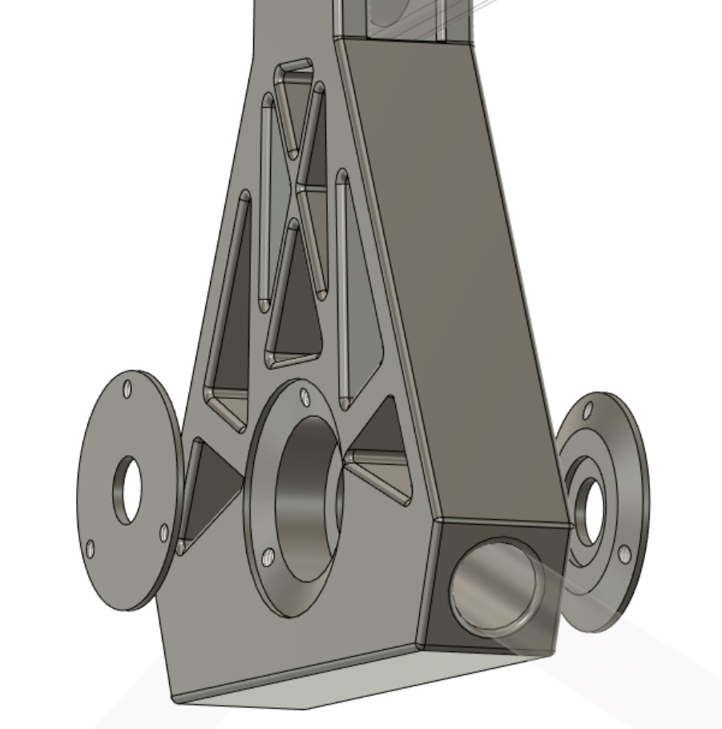

# Session 10

Since the last session, there has been quite improvements.

## Remodeling the main pivot's piece

Since I had to 3D print another pivot, I decided to optimize it.
I aligned all the surfaces to the same level, so no support were built during the printing.
And I reduced the width of the branches since structure is strong enough.

|||
|:---:|:---:|

Also, when assembling the bearing, I realized that the lids were not useful since Brice modified the pivot tube.
Now, thanks to the threaded extremities, the bearings are fixed much easier.

## Rocker-bogie joint

I modeled the rocker-bogie joint, trying to make it the more resistent as possible while maintaining 180º mobility.

|||
|:---:|:---:|

## Assembling

So I printed these two pieces along with the little joints and started to assemble it with Brice.
We had to drill little holes for the tubes and pieces in order to fix them.

|||
|:---:|:---:|

And we wrote the mid-term article about the advancement of the robot.
[Here](../../Documentation/EGAIA-article.pdf)

## Servo motor adapter

Finally, as all the robot takes form, the wheels have also to be added.
However, I have to add servo motor in order to provide rotation to the robot's movement.

That's why I have 3D-modeled this piece, which fits perfectly.
Although I would like to make some modifications in order to make it more solid.

|||
|:---:|:---:|
|||

All these pieces have been printed but I forgot to take some pictures.