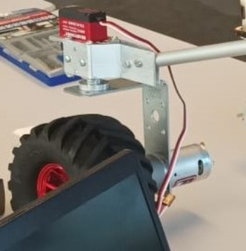
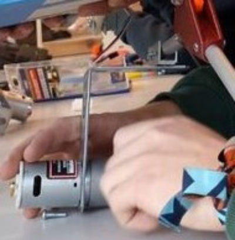
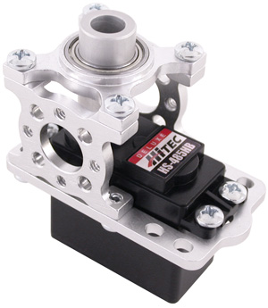
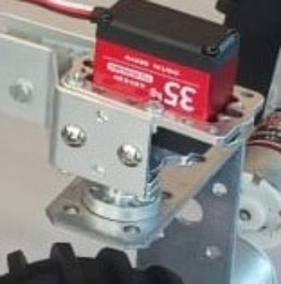
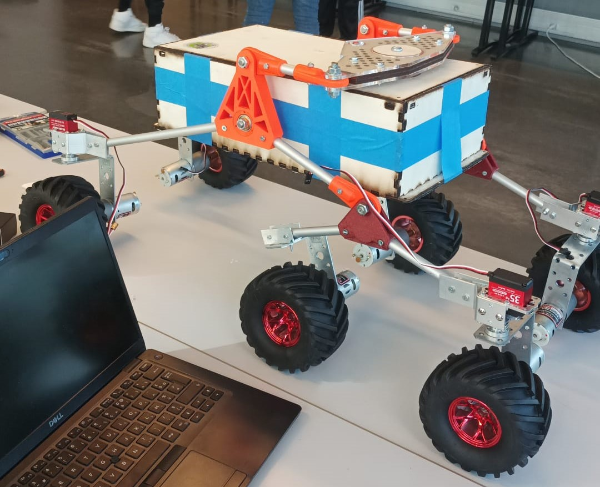
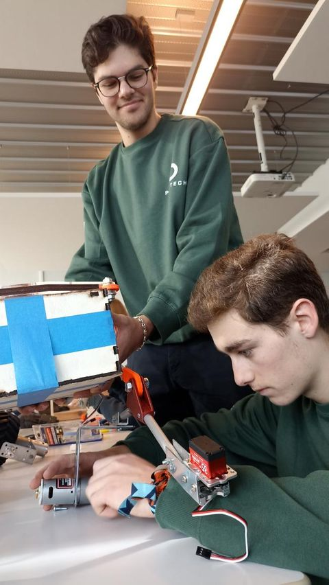

***[<< previous session](session10.md) | [next session >>](session12.md)***

# Session 11

The goal of this session was to finish the movement structure for the university's open day.  
Last session, we finished to install the pivots and the pipes. All there was left is to connect the wheels, CC motors and servo motors.

## Servos and CC motors

In order to connect the servo motors and the CC motors, I used some metal sheets to create the link. I bent and drilled these sheets which I placed in between the CC motor and the reduction gears in order to screw them together.

|||
|:---:|:---:|

This way the servo motors are placed precisely above the wheel, reducing the momentum of the rotation.

## Servo motor

The servo motors are required in order to turn the wheels. So they have to be placed above the 4 corner wheels.  
I used these block shafts which require a specific screw thread (mainly used in Britain), as we can see in the pictures below.

However, these blocks need to be fixed to the tubes, that's why I had to cut, bend and drill some metal sheets and then screw them together (picture on the right). This took me to much time since each hole had to be drilled individually.

|||
|:---:|:---:|

In the end, the pieces resulted to be very solid and stable.

## University's open day

These pieces took me several days to finish and I had to assemble them during the first hour of the university's open day. This is how it looked like:  

I noticed that, because we didn't drill the 3D printed pieces properly, the tubes and therefore the wheels are a bit loose.  
I will print them again after adding some adjustments I have in mind.  

---

so focused :)

***[<< previous session](session10.md) | [next session >>](session12.md)***
