***[<< previous session](session11.md) | [next session >>](session13.md)***

# Session 12

This was the session in which I would finally set up the **CC and servo motors** so that I could test the code I had already written ([here](../../Code/Movement/)).  
However, there weren't enough drivers to control each motor, so I had to wait for them to arrive.

Instead, I decided to dedicate my time to fixing the loose pieces.  
The problem is caused by the drilling of the 3D pieces and tubes. These holes are to imprecise and let a considerable amount of space for movement.  
Solving this issue requires redesigning the 3D printed components and taking into account the difficulty of drilling precise holes in the tubes.

## Rocker pivot

Changes made:

- Remove the lids so there is more space for the bearings *(the lids were already useless since we found an easier method to fix the bearings with nuts)*.  
- Lengthen the width so the bearings are a bit further away.

This two changes will improve **countering the momentum**, and therefore making the piece more stable (as shown in the pictures below).

|Before|After|
|:---:|:---:|
|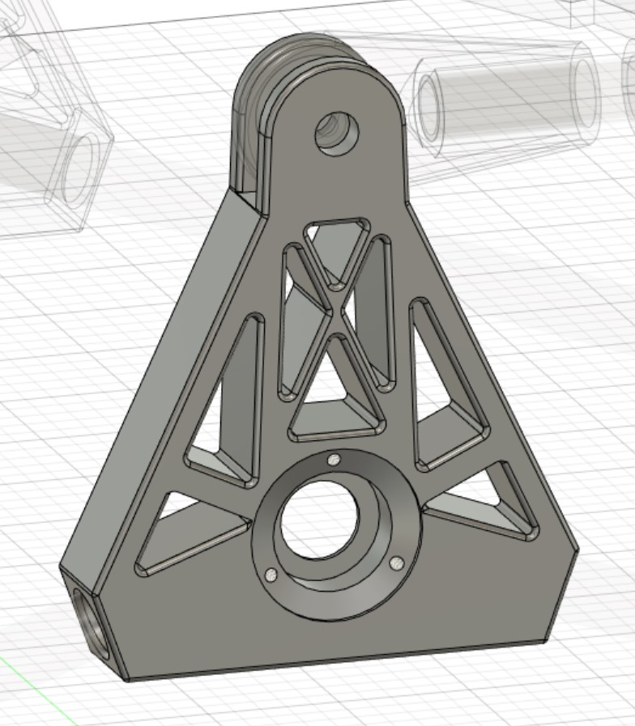|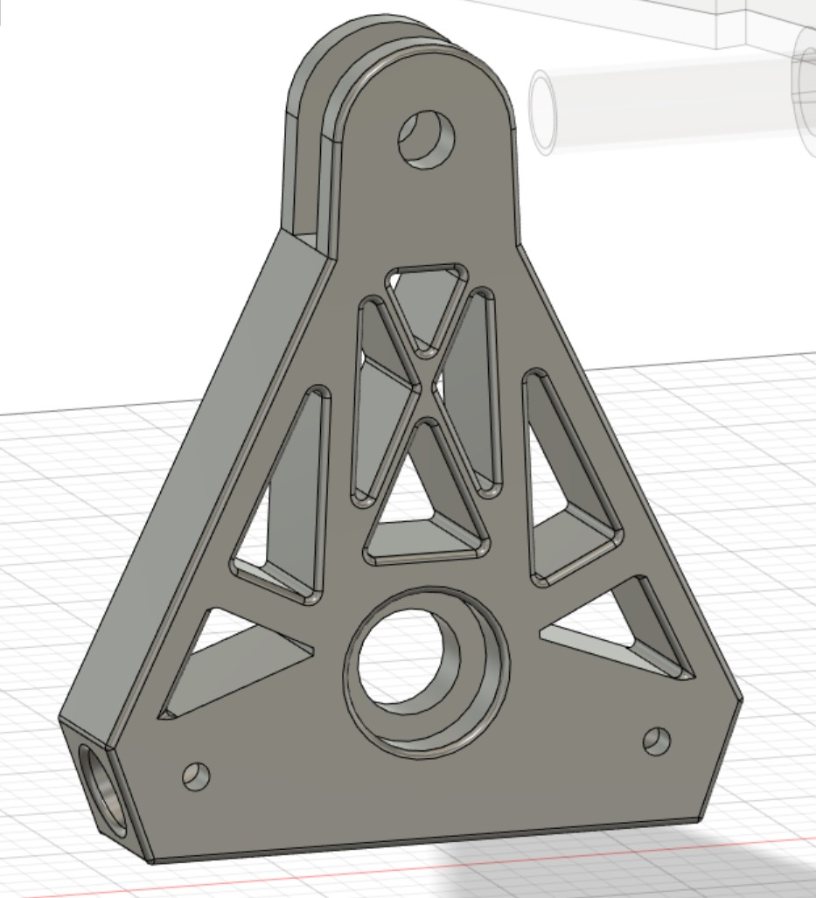|
|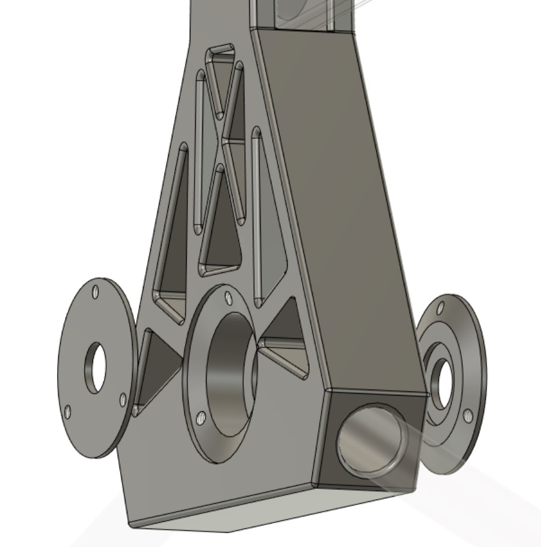|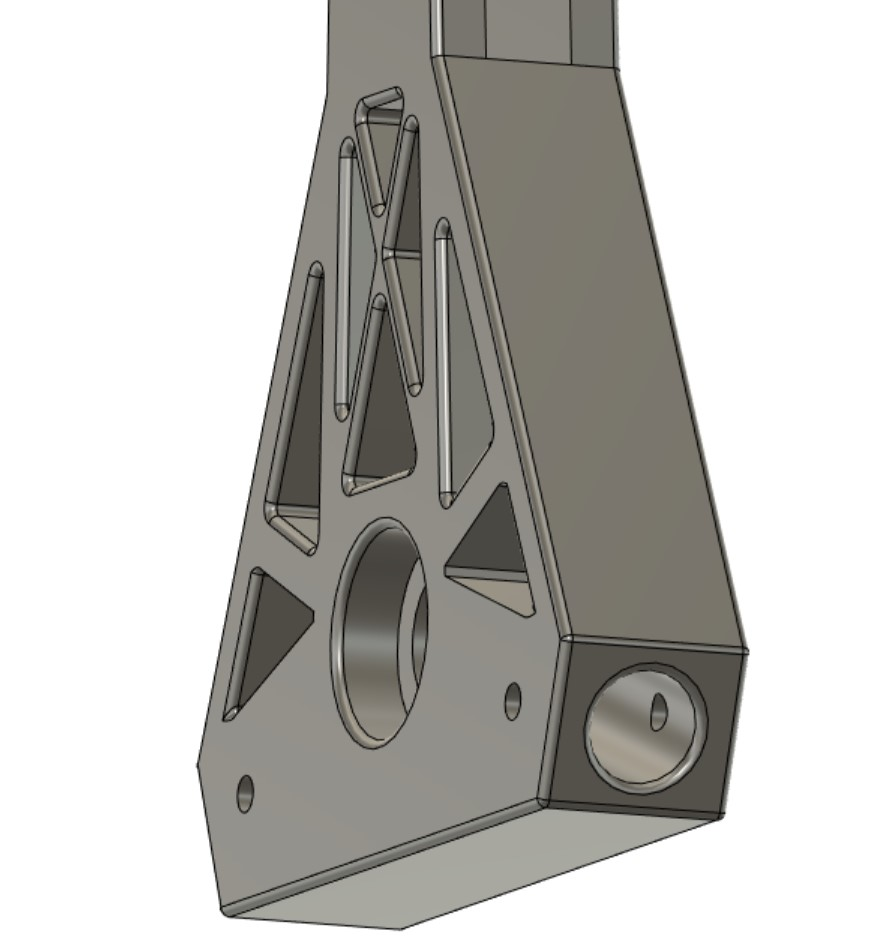|
||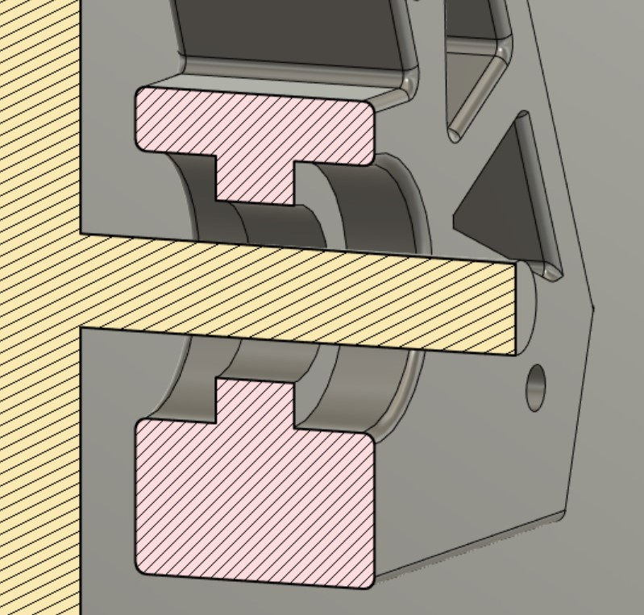|

I also:  

- Added holes for the screws, this way it will be easier to drill the tubes directly inside the piece.
- Added a snot at the end of the tube in order to restrict the movement between the pieces. The slot is vertical so I don't have to add supports when 3D printing.

|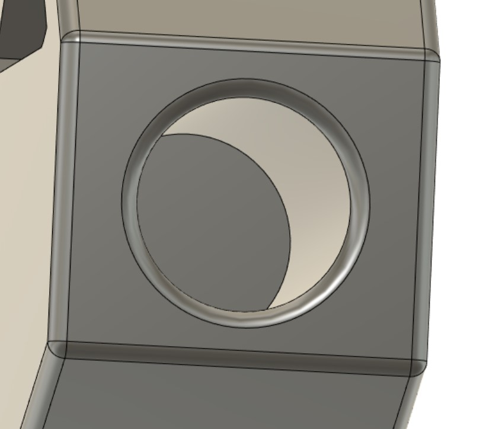|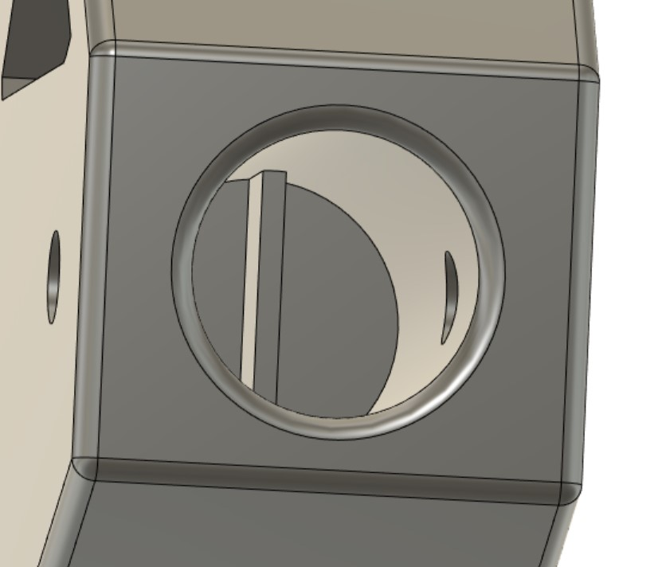|
|:---:|:---:|

## Bogie pivot

Changes:

- Thickened the 'walls' of the piece to reduce torsion.
- Added holes for the screws, this way it will be easier to drill the tubes directly inside the piece.
- Added a snot at the end of the tube.

|Before|After|
|:---:|:---:|
|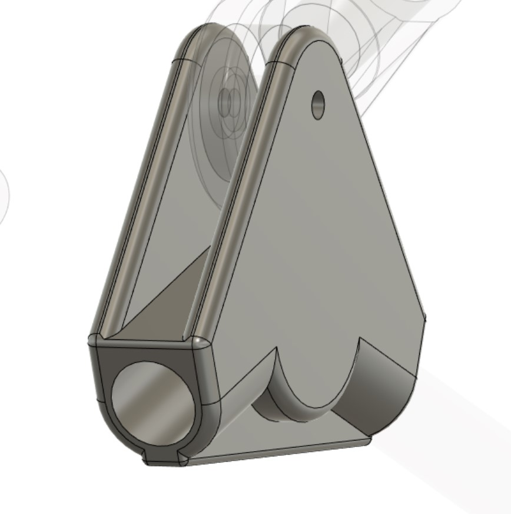|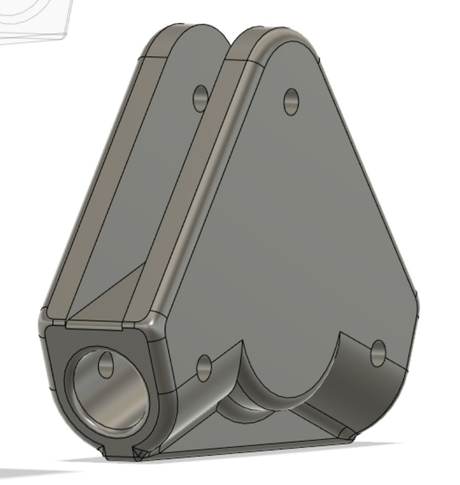|
|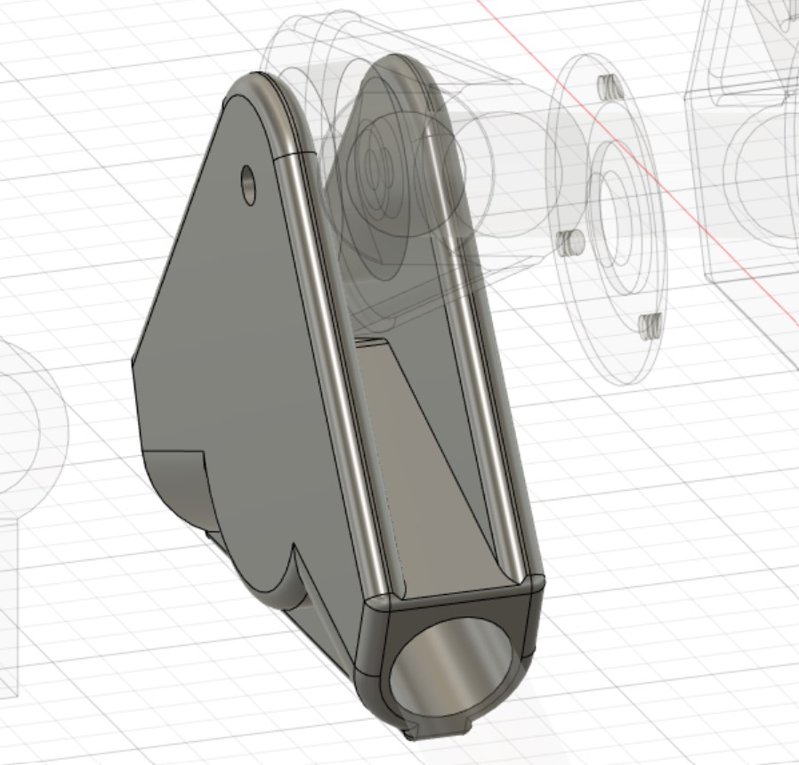|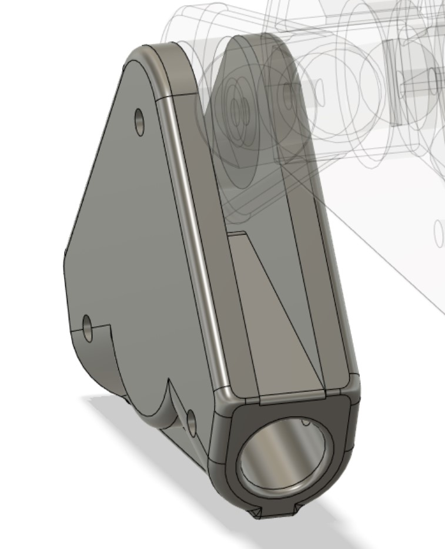|
||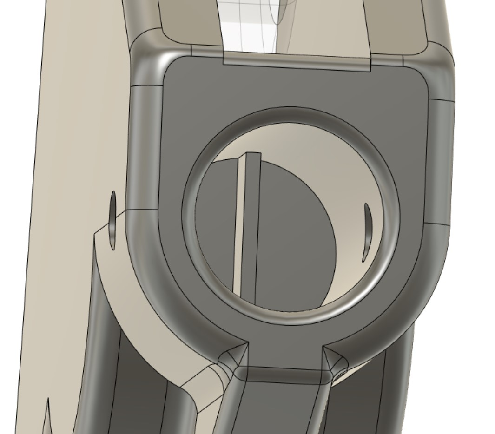|

## Servo motor

I tested a servo motor in order to get an idea of the type of code I have to implement.  

[Test code here](../../Code/Movement/Servo.ino)

I observed that, although it said 270º, the servo motor doesn't turn all the way to 270º, but approximately to 240º.  
This will have to be taken into consideration when writing the code (maybe adding some kind of offset).  

***[<< previous session](session11.md) | [next session >>](session13.md)***
