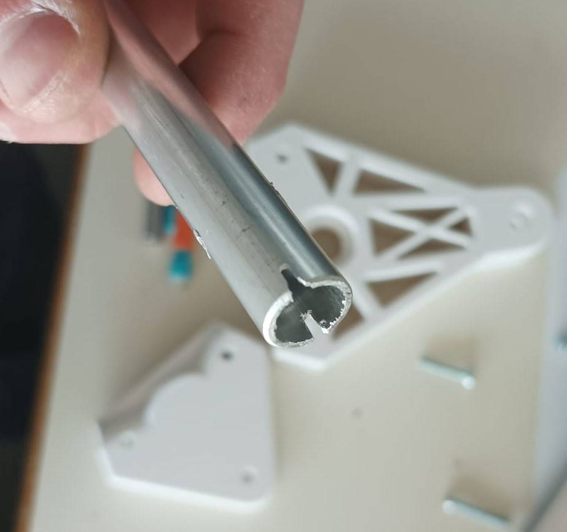

# Session 13

Powering the motors and verifying the `C++` code should be the next steps in the project.
But since the drivers weren't there yet, I carried on enhancing the mechanical structure.

I took the 3D printed parts out of the printer and spent the first hour carefully removing the supports.  

|||
|:---:|:---:|

To make the components fit together in this new design, I must cut a thin stripe.

  

I achieved what I was aiming for by giving the tubes almost no freedom of movement.  
Also, since the 3D printed parts already have holes, drilling the tubes is so much faster and more accurate.

|||
|:---:|:---:|

I prioritized the precision over the speed, so I only had time to finish one side of the structure. Due to the lengthy and slow process, this session report has less information.

Nonetheless, this work should greatly improve fluidity and decrease future crashes.  

  
