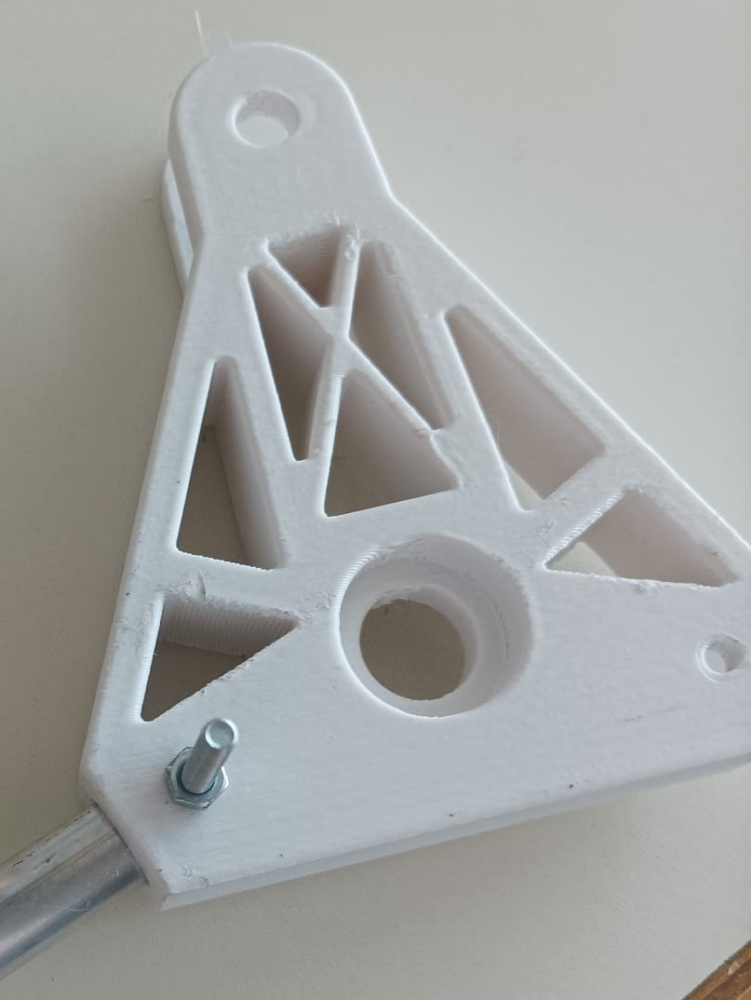
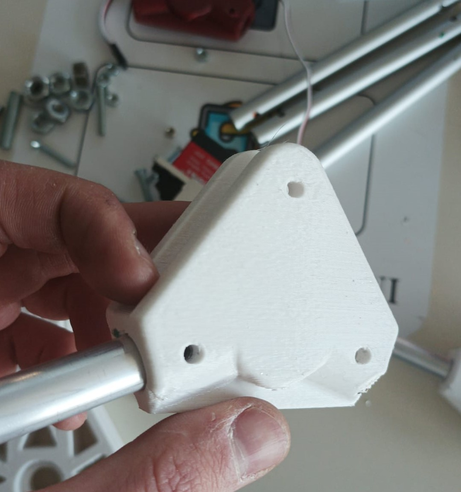
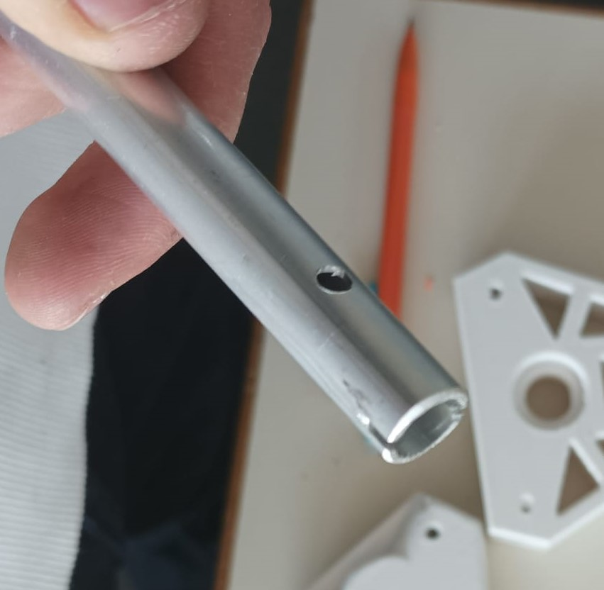

***[<< previous session](session13.md) | [next session >>](session15.md)***

# Session 14

I carried on building the mechanical structure.

I continued drilling precise holes for the screws in order to reduce useless motion.

|||
|:---:|:---:|
|||
|||

Although I've gained a lot experience in manufacturing and my work is way more efficient now, this process is very slow and it takes more than one session a week to finish it.

***[<< previous session](session13.md) | [next session >>](session15.md)***
