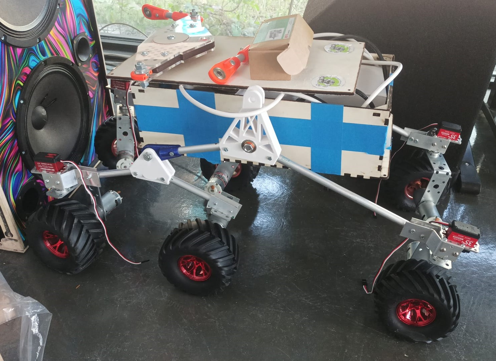

***[<< previous session](session14.md) | [next session >>](session16.md)***

# Session 15

During this session I finished to build and assemble all the last pieces of the suspension structure.

I added screws between the servo motors and the wheel's pivot. This way the wheels won't come out when the robot is lifted from the ground.

|||
|:---:|:---:|

I cut the last tubes and drilled the last holes. I reused the old tubes that weren't correctly built by reversing them and intercalating the old and new holes.

I accidentally broke some two joints. Fortunately, they're easy to replace. So I had them printed again in blue.

||
|:---:|
||

This pieces were broken while I was transporting the robot and, because I was carrying other things, unusual forces applied to this pieces.   This is relatively good news since it means that they got fractured during a action they were not designed to restrain.  

I was very careful to design pieces that wouldn't easily break during the motions. However this makes them quite more fragile to other type of forces.

Here is the final result:

||
|:---:|

## Next steps

We have finally received the control boards for the motors- During the next session I will be able to set up the power station and connect all the DC and servo motors and test [my code](../../Code/tests/Movement/).

***[<< previous session](session14.md) | [next session >>](session16.md)***
