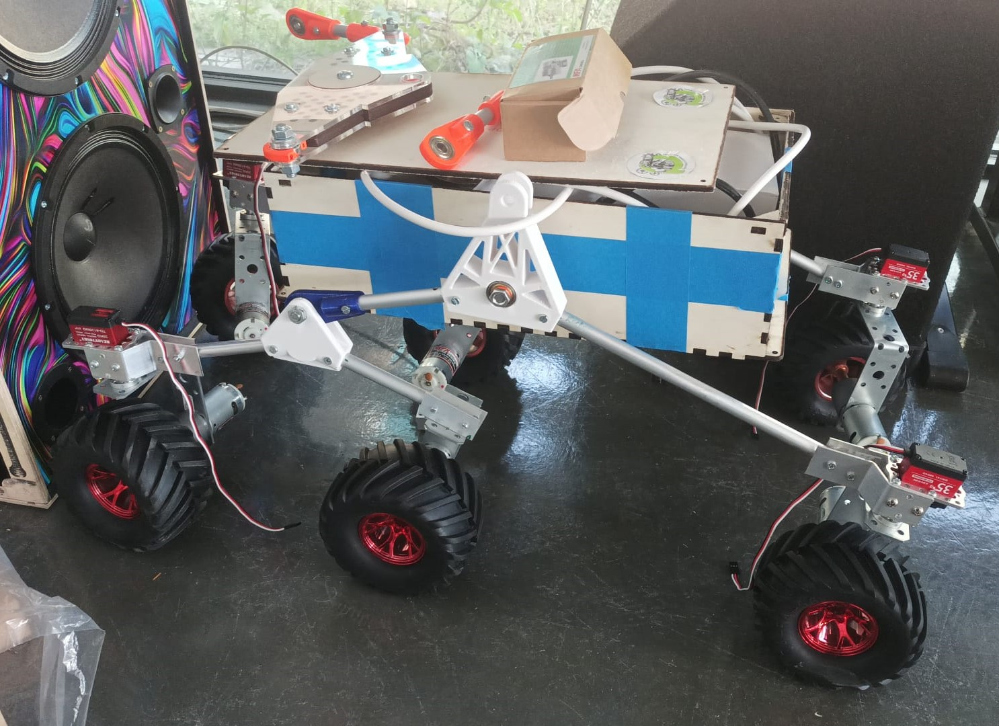
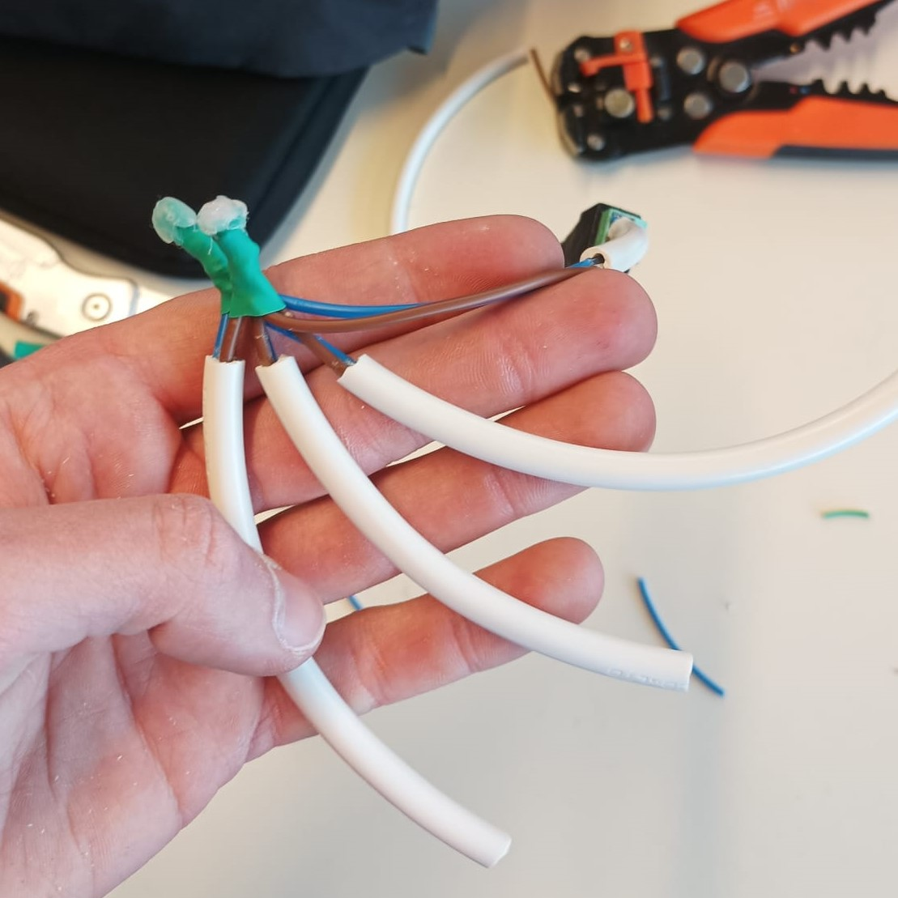
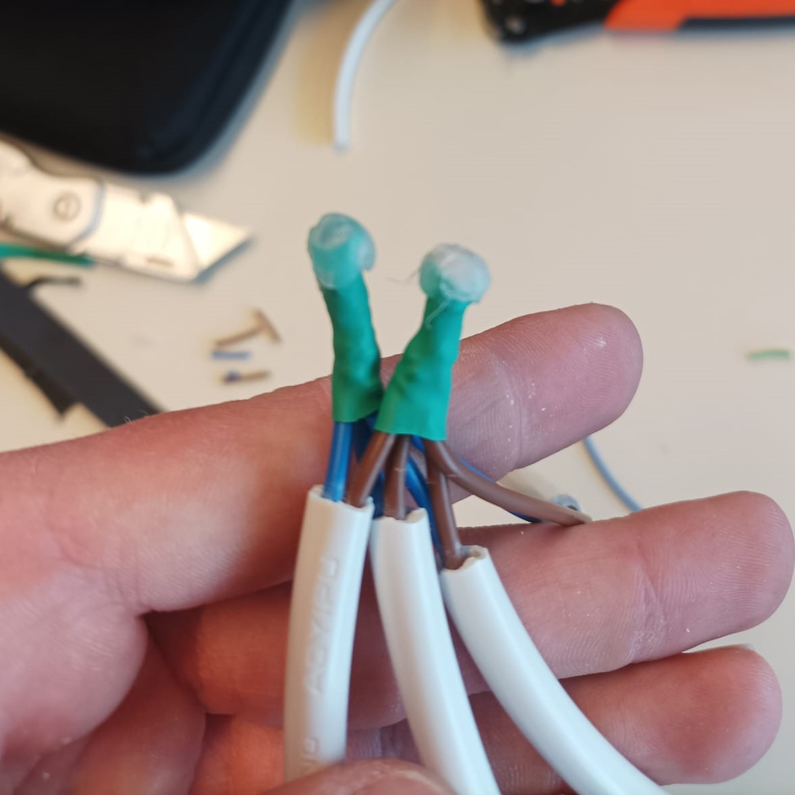
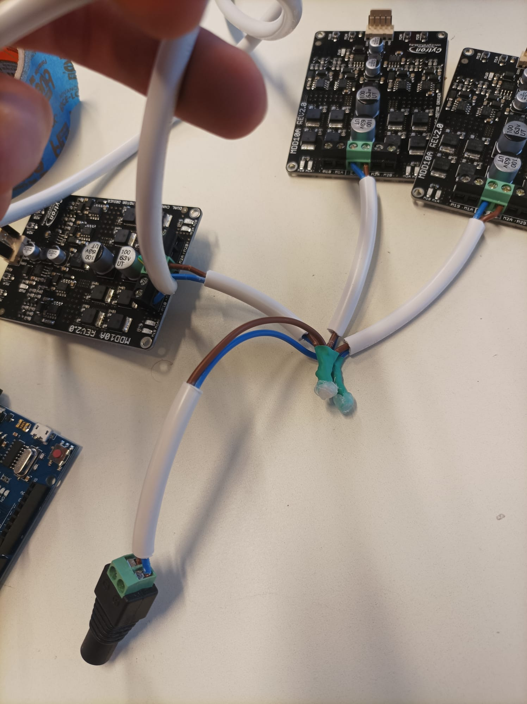
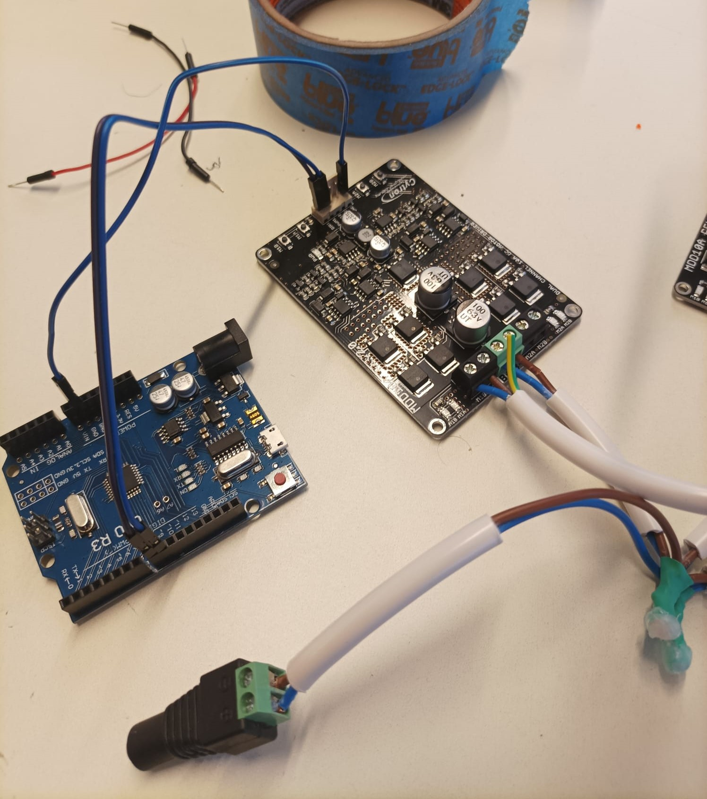

***[<< previous session](Session15.md) | [next session >>](Session17.md)***

# Session 16

||
|:---:|

Now that the suspension is finished, I can follow up with the motors.

So, in order to make the robot move (without rotations), I have to:

1. **connect the power station to the drivers**

We have 6 motors, therefore we need 3 drivers that can control each motor forwards and backwards.

For that, I peeled and joined four slices of wire. I twisted the threads in groups to maximize contact. I also added an electrical insulator to prevent from any contact with other components.

Then I connected 3 of them to each of the drivers being careful not to mix up the positive and negative inputs. I connected the fourth one to a female plug to be connected to the power supply.

|||
|:---:|:---:|

||
|:---:|

2. **connect the drivers to the motors**

The motors have two metal parts at the back where the power is supplied. So I twisted the wires and solder them together so they become permanently fixed.

However I should use some kind of protection in case the motors stumble with something during movement.

3. **connect the arduino to the drivers**

I connected the `GND` of the drivers to the one of the arduino so they have the same ground. And I connected the `DIR` pin (direction) and the `PWD` pin (speed).
Now each motor can be easily controlled through these `DIR` and `PWD` pins.

||
|:---:|

## 1. Connect power station and driver

Now that everything is correctly set up, we only have to connect the male plug of the power station to the female plug which will supply power to the drivers.

And with a simple `INO` script we can test if everything is works fine :

***[<< previous session](Session15.md) | [next session >>](Session17.md)***
