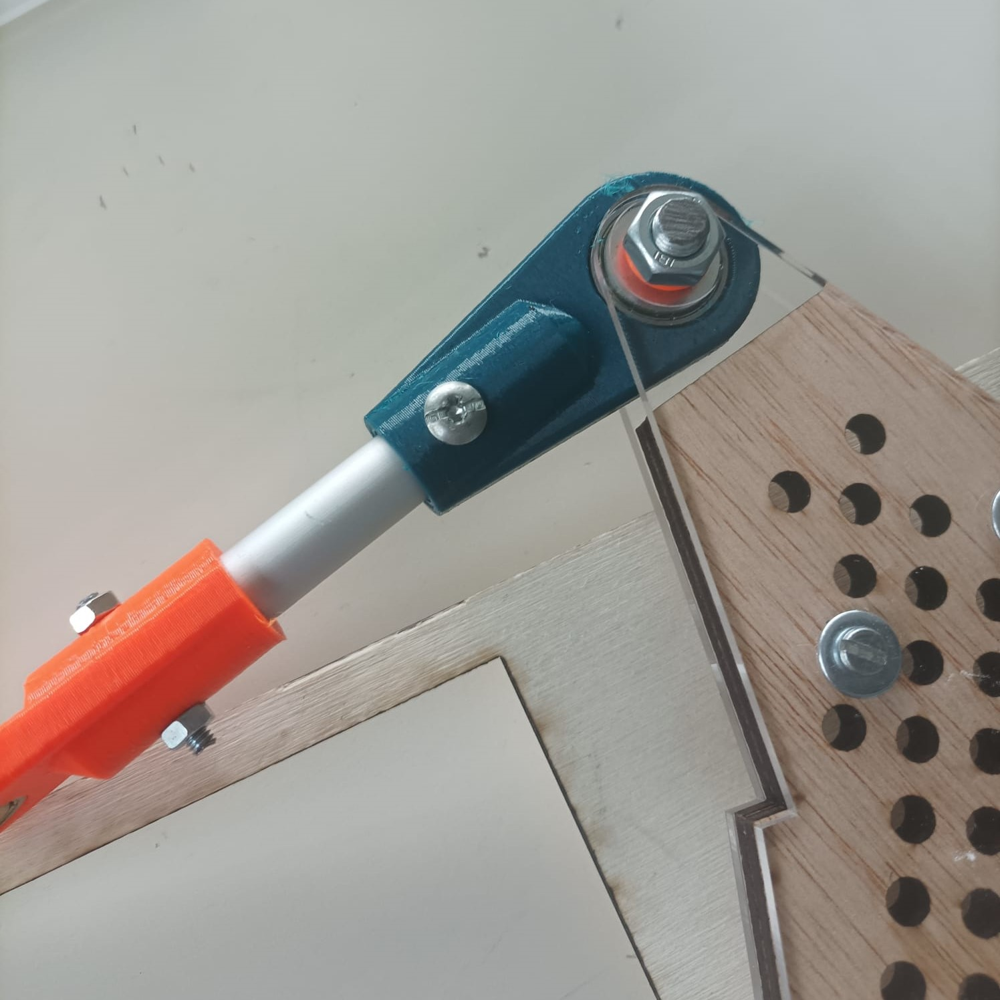

# Session 17

I arrived two hours before class to make the robot move for the video our teacher was going to make.

## Upgrading the frame

1.	First of all, I **printed the broken piece** since all the printers were unused.  
And I printed one more just in case another one breaks.

||
|:---:|

2.	Secondly, I **replaced the pointy screws** that were holding the triangular support brackets.  
These screws weren't meant for this use and therefore the wooden chassis wasn't stable. Plus I got pricked all the time.  

|||
|:---:|:---:|

*Now we can safely work on the robot !* :D

3.	Then, I **drilled a 3cm diameter hole** in the rear of the frame. This hole enables the drivers to connect to the power station without interfering with the differential.

*(I forgot to take pictures)*  

## Connecting the motors

In order to power the motors we first need to set up the wires that will deliver the current.

4.	We **peeled the wires** and selected the blue one for the 12V and the green and yellow for the 0V. 

5.	While my partner welded the wires to the motors, I **placed and fixed the wires** to the structure with plastic bridles and tape.

|||
|:---:|:---:|

||
|:---:|

6.	Finally, I **connected** all the motors **to their respective driver**, and **connected all the driver pins to the arduino**.  
Each driver has two direction and speed pins for two motors, as well as a common ground to connect to the arduino.

|||
|:---:|:---:|

I wanted to finish uploading the code before the end of this session but I didn't have time. Next session will be THE ONE.