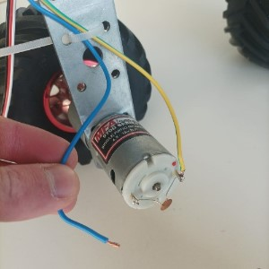
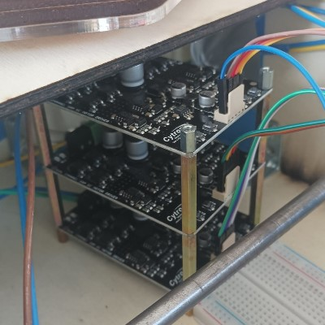
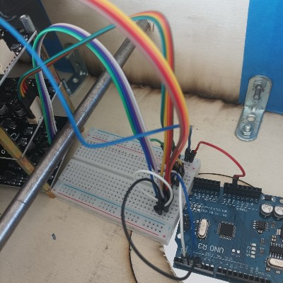
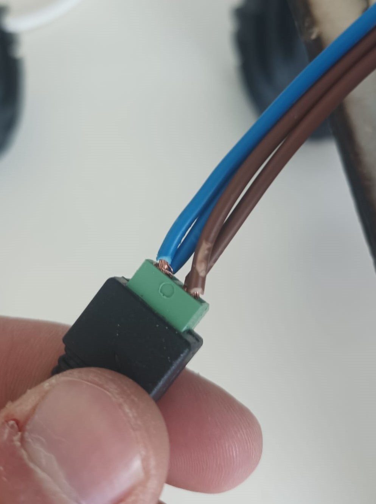
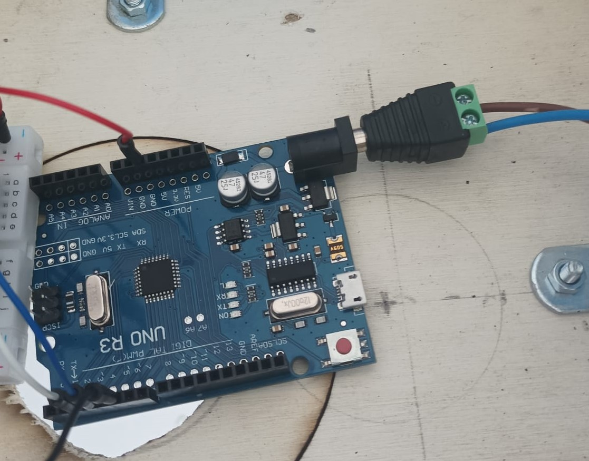
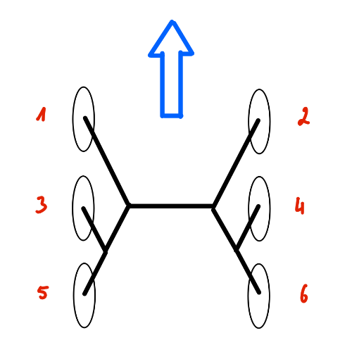
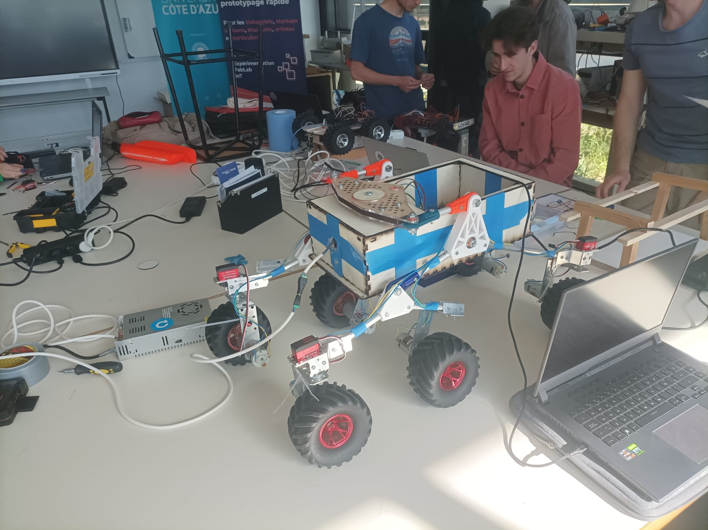

***[<< previous session](session17.md) | [next session >>](session19.md)***

# Session 18

During this session, I was able to make all the DC motors work. As a result the robot could move in a preestablished path.  

Here's the [***demo video***](../../Documentation/Images/session18_4.mp4)  

For this result, I followed these steps:

## 1. Weld one of the motors

One of the motors was not welded correctly during the last session, so I quickly welded the remaining loose wire.



## 2. Tower of drivers

The drivers were free to move around the frame with not much organization. Therefore, I added spacers between the drivers to fix them.



This makes the wiring inside the frame less chaotic and allows us to work more efficiently.

## 3. Arduino's wiring

In order to make the robot move for the first time, I did a test wiring in which pwm speed of each motor is the same. This simplifies a lot the arduino code.



## 4. Code arduino de test

```ino
const int dirPinD = 2;
const int dirPinG = 3;
const int pwdPin = 5;

int speed;
short direction = 0;

short noot(short n) { // imitates the `not` function
  return -n + 1;
}

void changeDirection(short* forward, int dirD, int dirG) {
  digitalWrite(dirD, *forward);
  *forward = noot(*forward);
  digitalWrite(dirG, *forward);
}

void slowToSpeed(int* speed, int newSpeed, int pwdPin) {
  int step = 1;
  if (*speed > newSpeed) step = -1;
  for (int i = *speed; i != newSpeed; i += step) {
    analogWrite(pwdPin, i);
    delay(20);

    if ((i < 0) || (i > 255)) { // if the speed overpasses the limits
      analogWrite(pwdPin, 0); // set speed to 0
      *speed = 0;
      return;
    }
  }
  *speed = newSpeed;
}

void setup() {
  pinMode(dirPinD, OUTPUT);
  pinMode(dirPinG, OUTPUT);
  pinMode(pwdPin, OUTPUT);

  changeDirection(&direction, dirPinD, dirPinG); // set initial direction
}

void loop() {
  slowToSpeed(&speed, 200, pwdPin); // accelerate
  slowToSpeed(&speed, 0, pwdPin); // decelerate
  delay(1000);      // stop for 1 second
  changeDirection(&direction, dirPinD, dirPinG); // change direction
}
```

You can see the code in action [***here***](../../Documentation/Images/session18_4.mp4)  

## 5. Add 12V power for arduino

During the initial tests, the arduino had to be powered via serial communication with the computer, risking a fatal crush :/  
So I connected a 12V power supply to the arduino.

|||
|:---:|:---:|

This way, once the code is uploaded to the arduino, I will be able to disconnect my computer.

## 6. WheelController class

A couple of weeks ago, I wrote a `c++` class that could control the movement of the wheels (**DC motors** and in the near future **servo motors**).  
I decided to update it and add necessary documentation such as :

```cpp
/**
 * @brief Set speed of the specified motors
 *
 * @param motors uint8_t list of the motors which speed will be changed
 * @param pwm_speeds unint_8 list of the speeds in pwm (0 to 255)
 * @param size the size 'motors' and 'pwm_speeds'
 */
void WheelController::setSpeed(uint8_t motors[], int8_t pwm_speeds[], uint8_t size){ /* ... */ }
```

In order to control all of the motors, we must assign a name / id to each wheel. Because the motors will be included in a static array within the code, naming them by index seems the most logical.



## 7. Asynchronous code

The arduino microprocessor does not support asynchronous code, which means it cannot run multiple lines of code simultaneously.  
This is a major issue when we need to use delays within a function.  
Although we can avoid the problem by using `millis()` , this method becomes increasingly complex as the code grows larger.

That is why I have started to write an [`Async`](../../Code\Movement\Async.h) class that would help resolve this issue.
However it's still under development.



***[<< previous session](session17.md) | [next session >>](session19.md)***
