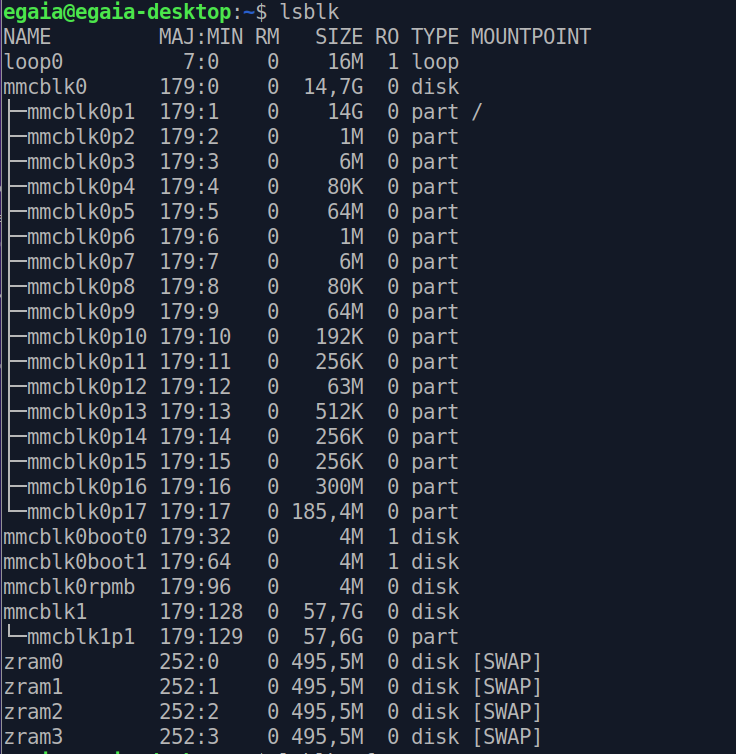
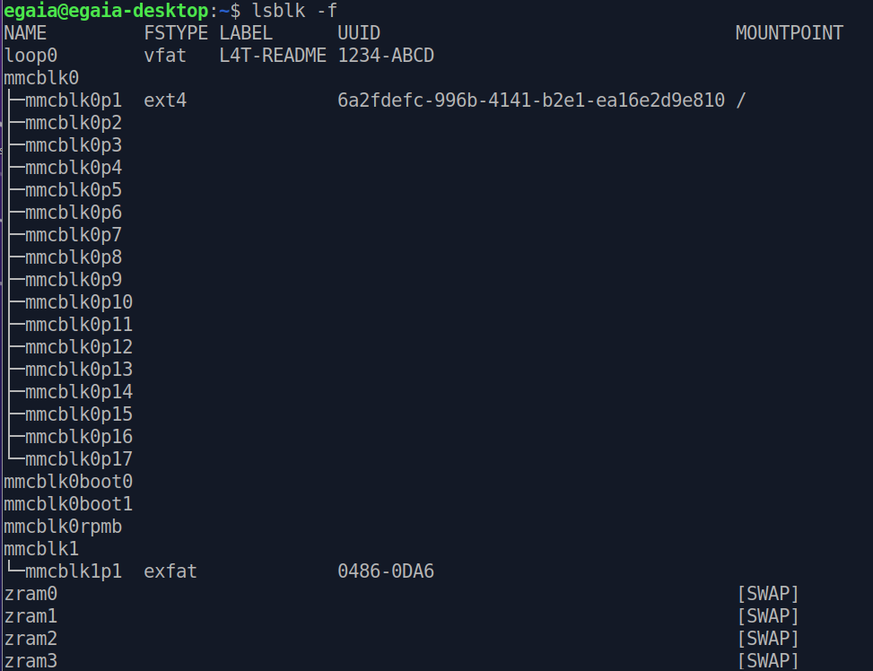
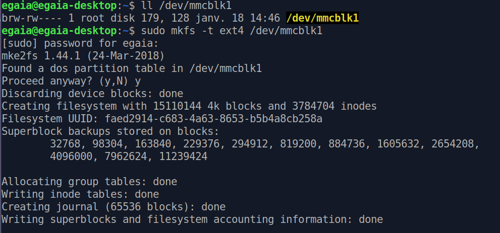
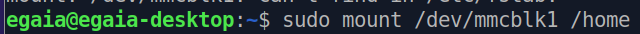
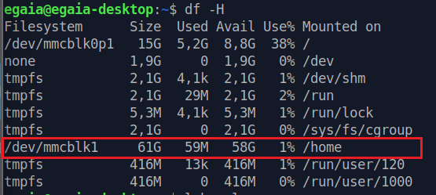
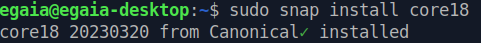

***[<< previous session](session18.md)***
 <!-- | [next session >>](session20.md)*** -->

# Session 19

## Asynchronous code

First of all, I discussed with Sebastien some aspects regarding the [`Async`](../../Code/Movement/Async.h) c++ class. We went through the main characteristics and possible issues that may appear.
He then recommended the `friend` attribute which I didn't know, and that enables sharing private attributes to *friendly* classes.  

Here is an example code:

```cpp
// C++ Program to demonstrate the functioning of a friend class
#include <iostream>
using namespace std;
 
class GFG {
private:
    int private_variable;
 
protected:
    int protected_variable;
 
public:
    GFG()
    {
        private_variable = 10;
        protected_variable = 99;
    }
 
    friend class F;
};

class F {
public:
    void display(GFG& t)
    {
        cout << "The value of Private Variable = "
             << t.private_variable << endl;
        cout << "The value of Protected Variable = "
             << t.protected_variable;
    }
};
 
// Driver code
int main()
{
    GFG g;
    F fri;
    fri.display(g);
    return 0;
}
```

However, we both agreed that I would rather work on the Jetson Nano and continue the `Async` code later on.

## NVIDIA flashing

In order to get started with the Jetson Nano, I tried to **flash the board** by following [this tutorial](https://developer.nvidia.com/embedded/learn/get-started-jetson-nano-devkit#write)  

However, when talking with [my classmate](https://github.com/Ekter), he explained that the Jetson Nano had already been flashed by our teacher.

## SD card memory allocation

I first followed [this tutorial](https://phoenixnap.com/kb/linux-format-disk) in order to format the disk partitions.

By using `lsblk`, we can identify the SD card partition named `mmcblk1` with `57,7G` of space.

> 

When adding `-f` we can see that the format is `exfat` and not `ext4`

> 

I formatted the SD card with the following command

```bash
sudo mkfs -t ext4 /dev/mmcblk1
```

> 

## Move home folder to second drive

I then moved the home folder to the SD card following [this thread](https://askubuntu.com/questions/21321/move-home-folder-to-second-drive)  

### Temporarily mount the new partition

```bash
sudo mkdir /mnt/tmp
sudo mount /dev/mmcblk1 /mnt/tmp
```

### Copy HOME to the new location

```bash
sudo rsync -avx /home/ /mnt/tmp
```

Then we can mount the new partition as HOME with :



and delete the old `./home` with

```bash
sudo umount /home
sudo rm -rf /home/*
```

### Make HOME permanent

We need the UUID of the new partition

```bash
sudo blkid
```

Copy and paste the UUID to edit the `fstab` with

```bash
sudo nano /etc/fstab
```

Add the following line at the end

```bash
UUID=<noted number from above>    /home    ext4    defaults   0  2
```

> 

### Install snap

Instead of using `apt` to install programs, I use `snap`. This command command will allocate the programs in the SD card (64G) instead of installing them in the Jetson board (only 8G).

```bash
sudo apt install snapd
```

## Install ROS

Many of my classmates explained to me the reasons to install ROS (navigation, motion planning, path planning, perception, control, manipulation, etc)

I followed this tutorial but didn't have time to finish  
<https://www.youtube.com/watch?v=wfDJAYTMTdk&t=6s>

And it's very important to install `ROS Melodic` and not `ROS Noetic` since the Jetson has **core 18** and not **core 20**

```bash
lscpu   # check the core
```



***[<< previous session](session18.md)***
 <!-- | [next session >>](session20.md)*** -->