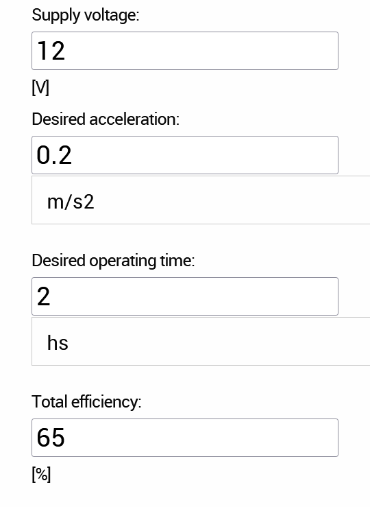
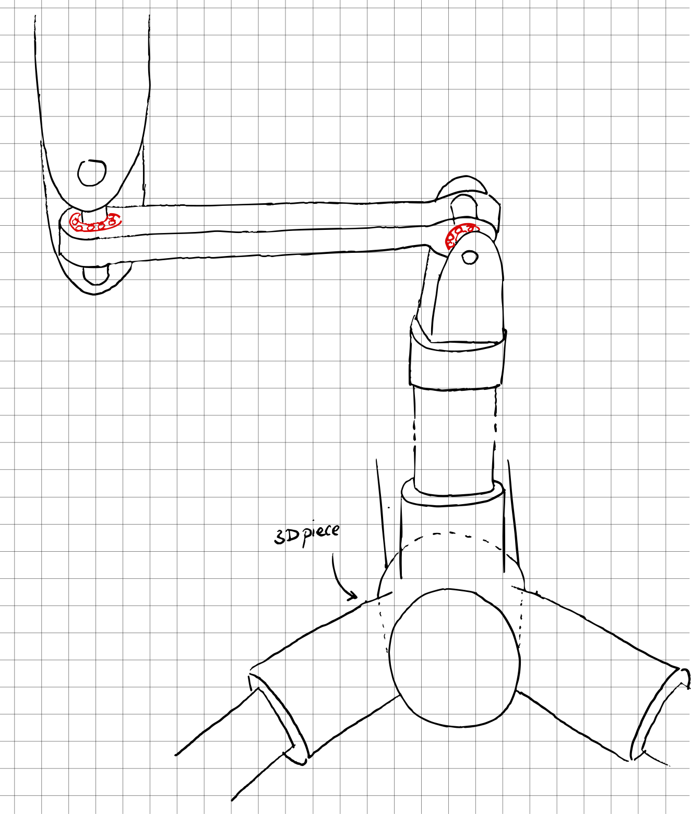
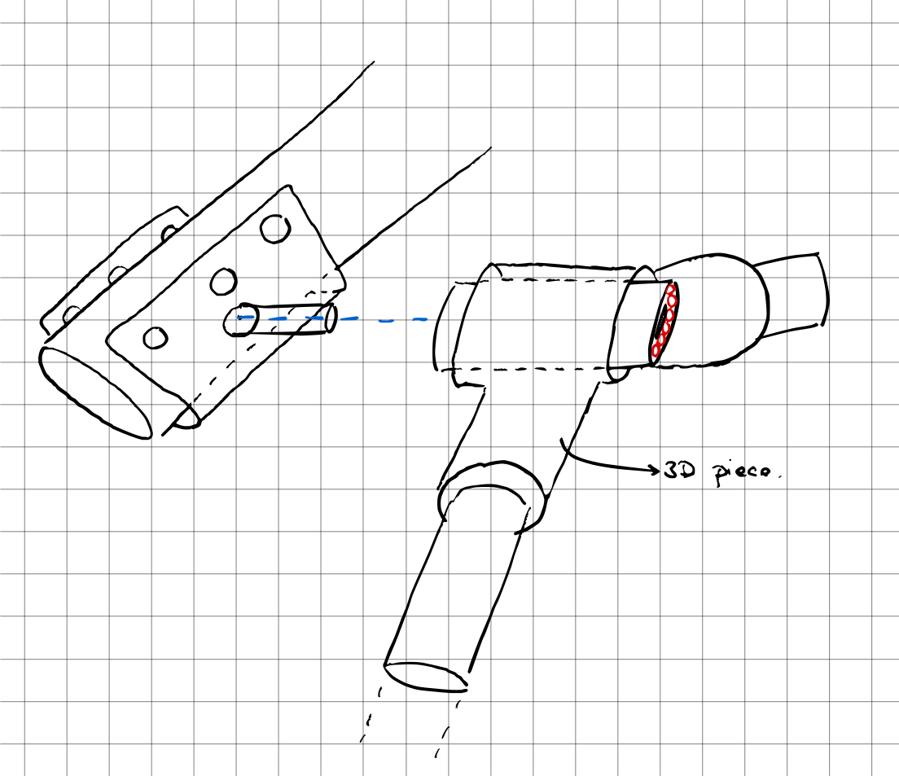

# Session 2

## Components required

We were told to make a definitive decision regarding the components to purchase right at the beginning of this session.
However, we were still unsure of some of them, so we had to verify their suitability:

|Component|Problem to solve|
|:---:|---|
|[Auger](#1-auger)|Diameter to long|
|[Drill motor](#2-drill-motor)|Unreliable website, unclear specifications and not enough torque|
|[Tyres connector](#3-tyres-connector)|Not compatible with our wheels|
|[DC motors](#4-dc-motors)|Unreliable website, unclear specifications and not enough torque|
|[Encoders for motors](#5-encoder-for-motors-speed-control)|Not the best method to control speed|

### 1. Auger

We chose to use a drill to create the hole where the seed would be inserted. And because the seed is relatively little, the auger doesn't require a large diameter.  
However, every auger we could find online was either excessively large or inadequate for its intended function. 

*Solution: 3D print the auger.*   
We will then be able to easily adapt the model to our specifications.

### 2. Drill motor

Since the drill will be facing hard grounds, the torque required will be higher than initially anticipated. That is why torque has been prioritized over speed.

Here's the [MFA 970D28121](https://www.gotronic.fr/art-motoreducteur-mfa-970d28121-12416.htm) DC motor. It's made out of the [RE540/1](https://www.gotronic.fr/art-moteur-mfa-re540-1-11705.htm) motor and gears with a reduction ratio of 2812:1.  
The final torque is 6kg/cm and a speed of 5 rev/min.  
<!-- TODO verificar calculos -->

### 3. Tyres connector

We assumed that the wheels would work with a standard DC motor hub. After verification, they turned out to be incompatible.

Tyre connectors are difficult to find on the web, and another team was seeking for them as well, so we combined our efforts to find them.
We finally found [these](https://fr.aliexpress.com/item/1005004661320406.html?spm=a2g0o.productlist.main.5.11065cef36330b&algo_pvid=0f9fb896-24c9-45f4-86a4-153c89a166a5&algo_exp_id=0f9fb896-24c9-45f4-86a4-153c89a166a5-2&pdp_ext_f=%7B%22sku_id%22%3A%2212000030017689436%22%7D&pdp_npi=2%40dis%21EUR%210.99%210.69%21%21%212.11%21%21%40211be54b16660750030805512d0765%2112000030017689436%21sea&curPageLogUid=TIU5D3s6Li2D) on Aliexpress which are fixed to the tyre thanks to a screw and a hex nut.

### 4. DC motors

We discovered that the robot would be substantially heavier than expected after selecting all the components and modeling the frame.
So I updated the calculations to make sure everything was correct since these motors are crucial to this project.

||||
|:---:|:---:|:---:|

As shown in the pictures above, 4.8 Nm of torque are needed for the motors (way higher than planned). So we have chosen [these motors](https://www.gotronic.fr/art-motoreducteur-mfa-970d7501-12415.htm) with 6 Nm of torque, 1.2 Nm above calculations in case additional weight is added later on.

### 5. Encoder for motors (speed control)

Some motors come with encoders attached in the back which enable us to precisely measure their speed. This would be a suitable method only if the surface on which the robot will move on is flat. Unfortunately, this is not the case and because all 6 wheels have different range of motion, several calculations would be necessary in order to determine a precise position.  

M. Masson, however,  came up with a clever solution: employing an **optical mouse sensor**. This is a low-resolution camera which shoots around 1500 to 6000 pictures per second of the surface beneath it, and by analyzing these images, it calculate the position, speed and movement of the mouse.

## Suspension ideation

I finished ideating the key components of the rocker bogie structure, continuing [the work from the previous session](session1.md/#suspension-structure). The purpose of this section is to understand each piece's requirements and constraints.

|||
|:--:|:--:|

## 3D model of differential

We've decided to start manufacturing the frame the next week. I have therefore begun to sketch every component of the suspension structure, starting with the differential.

All the distances are saved in variables so we can easily modify them if needed.

Finally, I've discussed with Xavier Lebreton about how to make this pieces and it should be pretty easy to make them.

