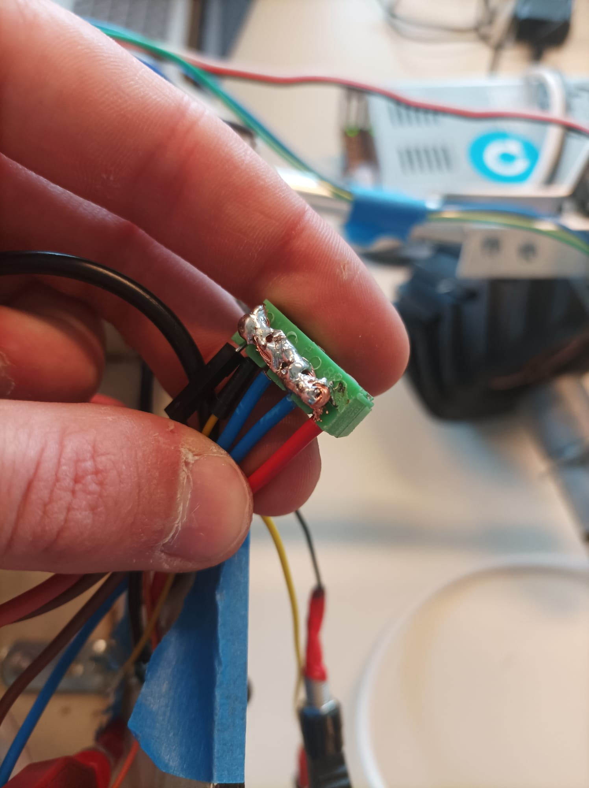
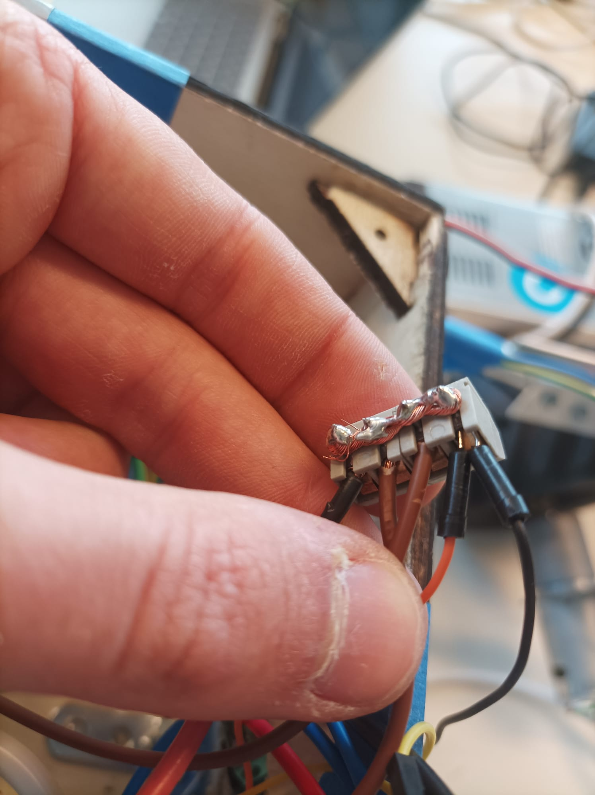

***[<< previous session](session19.md)***
 <!-- | [next session >>](session21.md)*** -->

# Session 20

During this session I tried to install ROS in the Jetson board.  
The wifi being so slow, I only managed to upgrade the apt packages (it took almost 2 hours).  
So I didn't even try to download ROS, I'll do it during my free time with a good internet connection.  

## Snap

I tried to install the ROS requirements with `snap` instead of `apt` so it would be allocated in the SD card.

I tried to do it with this post :  
<https://unix.stackexchange.com/questions/546698/how-to-install-apt-packages-to-sd-card>
*( which didn't work )*

And purged the useless packages :
<https://unix.stackexchange.com/questions/40442/which-installed-software-packages-use-the-most-disk-space-on-debian>

## Electronics

I ultimately decided to help my partner while the packages were being upgraded.  

I created "potential poles" to insert the wires.  

|||
|:---:|:---:|
|||

***[<< previous session](session19.md)***
 <!-- | [next session >>](session21.md)*** -->