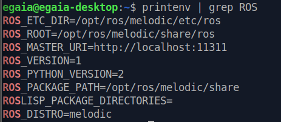
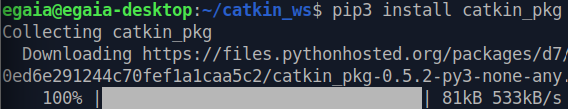

<http://wiki.ros.org/melodic/Installation/Ubuntu>

<http://wiki.ros.org/ROS/Tutorials>

<http://wiki.ros.org/ROS/Tutorials/InstallingandConfiguringROSEnvironment>

probleme avec ça:

<https://stackoverflow.com/questions/43024337/why-this-error-when-i-try-to-create-workspaces-in-ros>

j'ai skip le probleme

tuto 2:
<http://wiki.ros.org/ROS/Tutorials/NavigatingTheFilesystem>

problem with catkin
<https://answers.ros.org/question/329877/i-have-followed-all-the-command-to-install-ros-melodic-in-ubuntu-bionic-but-stucked-at-setting-up-environment-variables/>

faire double ssh

problème: il manquait un 3
