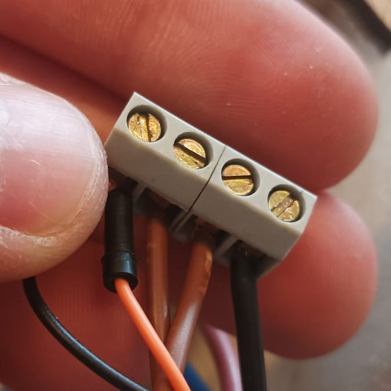
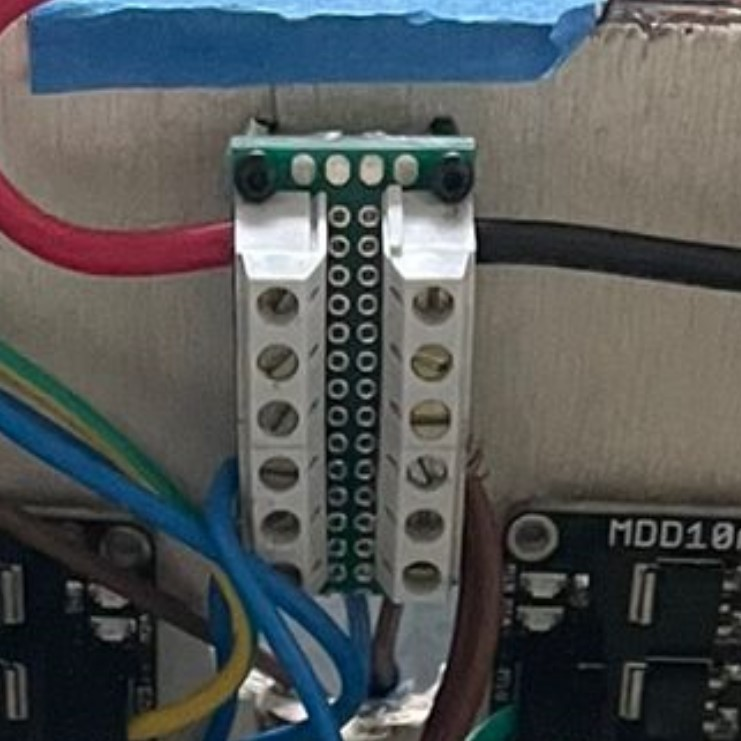
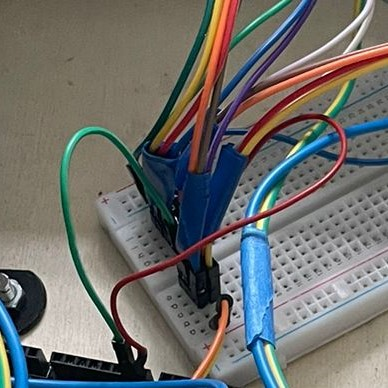
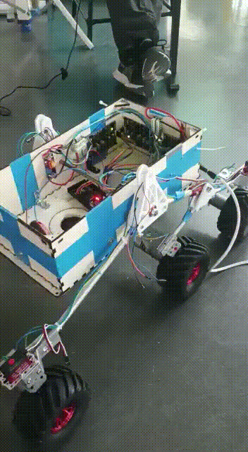

***[<< previous session](session20.md)***
 <!-- | [next session >>](session22.md)*** -->

# Session 21

A lot has been done since the previous report, especially during free time.

## Before the session

During my [last session](./session20.md/#electronics), I created some "potential poles", but I was unhappy with them since the number of wires I could connect was very limited and it could only be small ones.  

o solve this issue, I built two larger poles, which allowed me to place them in different spots and make the wires shorter.

|Before|After|
|:---:|:---:|
|||

## During the session

I continued the installation of **ROS Melodic** on the Jetson Nano Board by following the [official ROS guide](http://wiki.ros.org/melodic/Installation/Ubuntu).
I then started doing the [basic tutorials](http://wiki.ros.org/ROS/Tutorials) to learn how to use it.


>It's worth noting that ROS uses `python.2.7` instead of the latest version `python.3.8` because ROS1 is deprecated after the new ROS2 release.  

During the installation, there was an optional step that theoretically allowed me to use `python.3.8`.  
However, after an hour battling against the computer, I resigned and skipped it.  
*(Although this might have been the cause for all the problems I've had later on)*

While everything seemed to work correctly, I ran into an issue during the [second tutorial](http://wiki.ros.org/ROS/Tutorials/InstallingandConfiguringROSEnvironment) that consumed to much of my time.  

The problem was related to the `python` version that didn't recognize the `catkin` package even though it was installed.


I tried several solutions, including those from [Stack Overflow](https://stackoverflow.com/questions/43024337/why-this-error-when-i-try-to-create-workspaces-in-ros) and the [ROS answers website](https://answers.ros.org/question/329877/i-have-followed-all-the-command-to-install-ros-melodic-in-ubuntu-bionic-but-stucked-at-setting-up-environment-variables/).

With the help of my teacher Axel Fauvel, we tried to understand the source of the problem.  
Ultimately, we saw that within the ROS source code, the python version imported was this one:

```python
import python
```

So we avoided the problem by adding a `3`:

```python
import python3
```

This worked for some time until the same problems began to appear over and over again.

However, one of my classmates who's also learning how to use ROS, didn't experience this kind of problems at all. So when I have some free time I'll try to uninstall `ROS` and `python.3.8` and have a clean start using `python.2.7`.  

## VirtualBox  

> During my first sessions I came across an issue that didn't let me connect `Windows` and the `Jetson Nano` via *`ssh`*. *(explained [here](https://unix.stackexchange.com/questions/602518/ssh-connection-client-loop-send-disconnect-broken-pipe-or-connection-reset))*  
> This is due to the fact that `Windows` recurrently sends `keepalive` messages through the serial port to the server to check if it's still there.  
> However, this is a deprecated functionality, and Ubuntu doesn't do this anymore, causing the ssh connection to break.

To overcome this issue, I have been using an Ubuntu virtual environment to connect through `ssh`. However, it's a bit problematic because I can't copy-paste bits of code, and using Git is harder.

So my teacher showed me a helpful tip : connecting through ssh my `Windows` to the Ubuntu virtual environment and then connecting again to the `Jetson Nano`. A double `ssh` connection, just like **Inception** !

## After the session

Since the final presentation is around the corner, I have to focus on making the robot move.  
Here's what I did a couple of days after the session:  

1. I started by rearranging the wires using two zip-ties in the corners so that we have more space.


2. Since my partner placed all the drivers on the wall to make more space, I had to connect all the wires to the drivers and Arduino again.  

Plus, I grouped the ones who should have the same signal:

- the right wheels's direction (forwards or backwards)
- the left wheels's direction (forwards or backwards)
- the right wheels's speed
- the left wheels's speed



3. I debugged the [`Movement`](../../Code/Movement/WheelController.h) code I made some months ago. This is a great c++ class that will allow us to control the robot very easily.



## Things to do before the presentation

Before the presentation, I still have some tasks to complete:

- Calibrate the offset of each servo motors
- Incorporate Servo rotations in the code  
***( important : don't rotate if the robot isn't moving )***
- Pray that the frame supports the drill !


***[<< previous session](session20.md)***
 <!-- | [next session >>](session22.md)*** -->