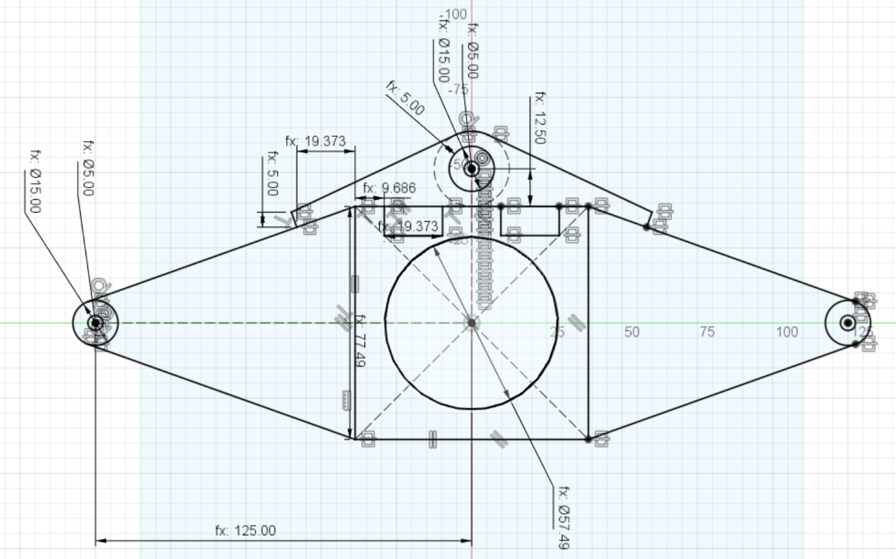
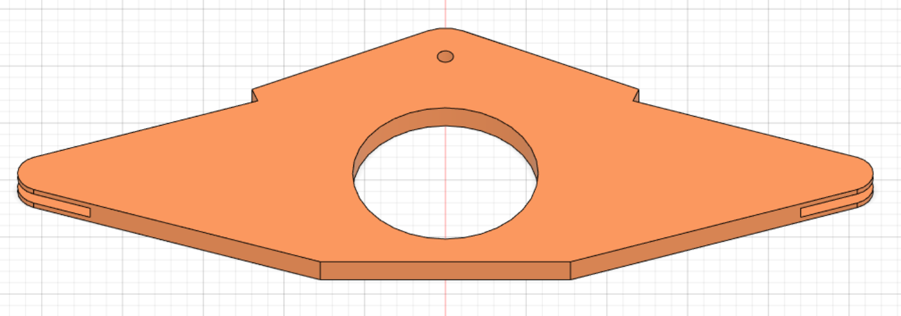
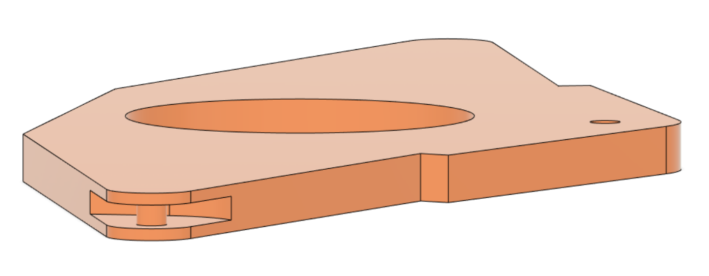
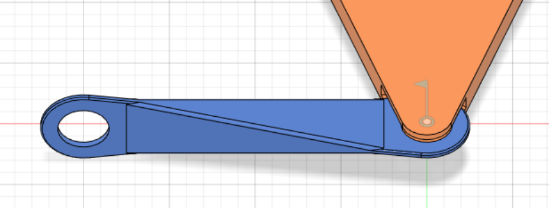
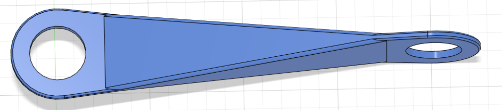
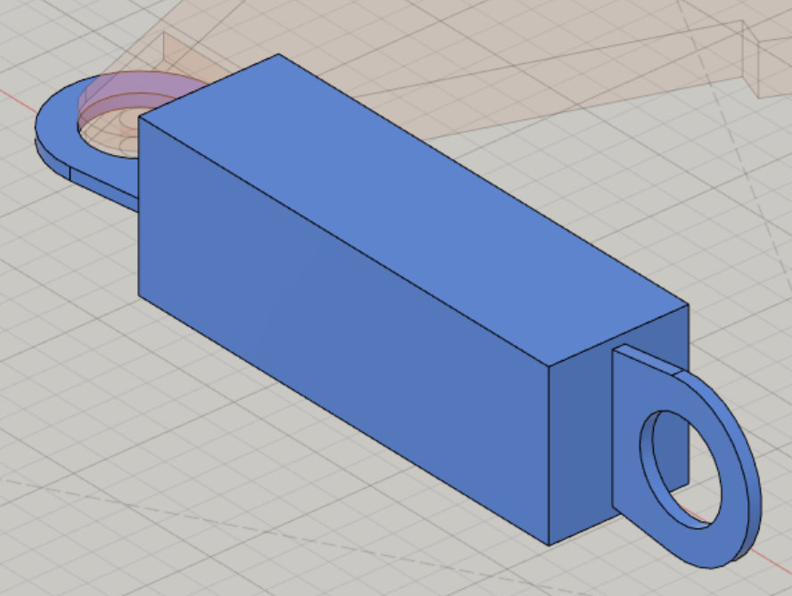
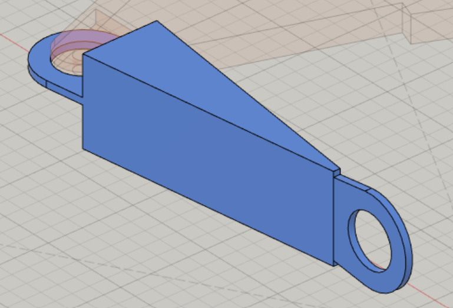
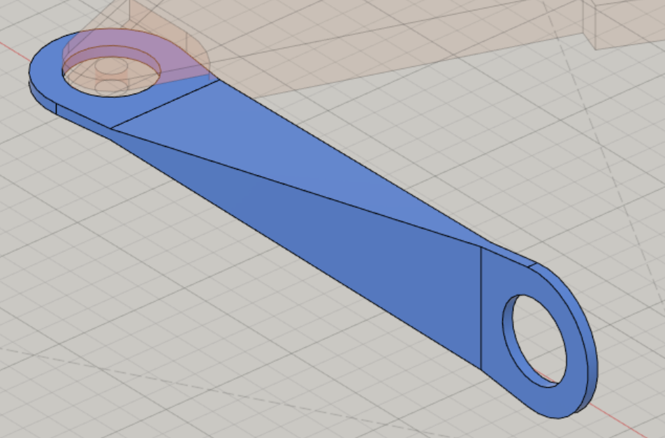
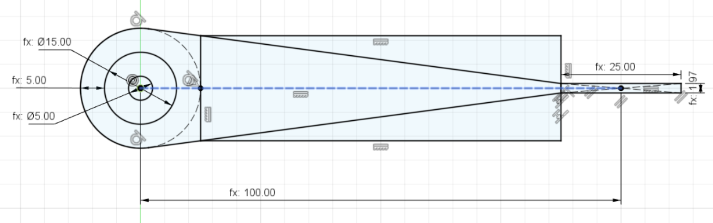

# Session 3

This session was dedicated to the modeling of the suspension pieces. My intention was to complete two or three, but it took longer than expected.

Since the wide bearing was delivered, I adjusted some measurements in Fusion360.
This one will be placed in the center of the differential.  
However, we are currently awaiting the delivery of the remaining bearings so that I can precisely measure them.
Then I'll 3D print these parts.

## Piece S1 (Suspension 1) - The differential

Here's how the differential currently looks like :

||
|:---:|
||
||

## Piece S2 (Suspension 2)

The branch linking the differential to the primary pivot is the next component to model. It will be named S2. As you can see, this is how it would look like :

|||
|:---:|:---:|
|||

### Modeling

I initially tried modeling this component exclusively with extrusions. However, due to its peculiar geometry, it proved to be an inadequate solution.  

But after asking for advice, it ocurred to me that I could cut triangular shapes off the sides of a extruded rectangle.

||||
|:---:|:---:|:---:|

||
|:---:|
