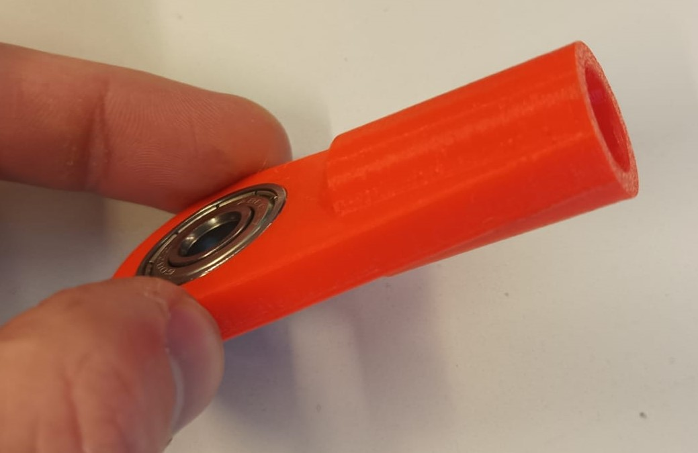
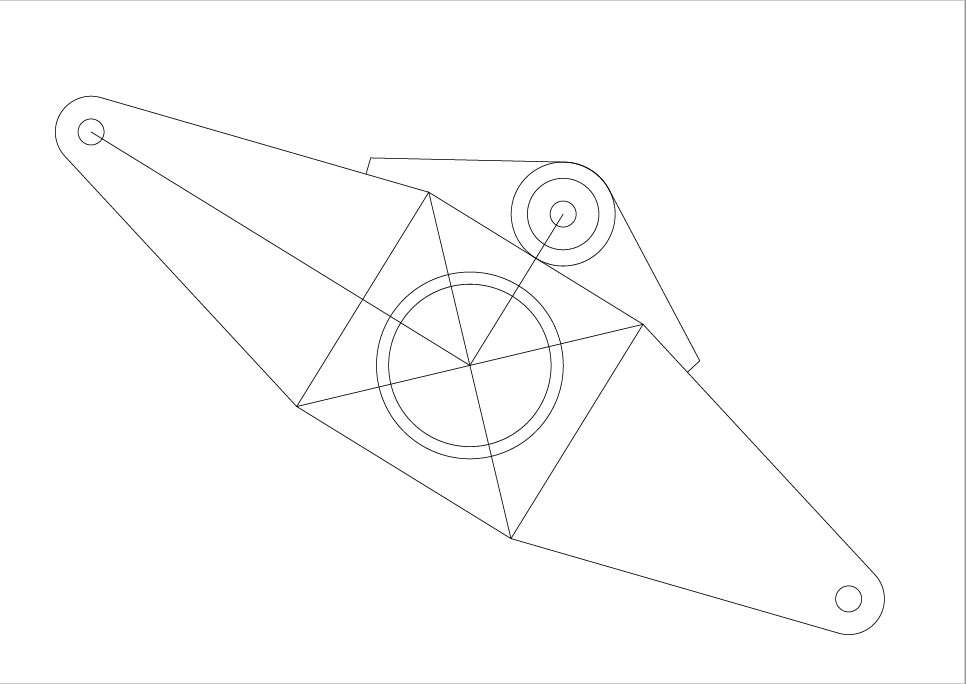
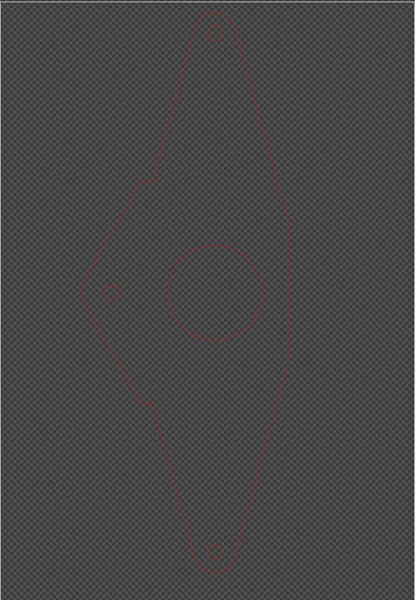
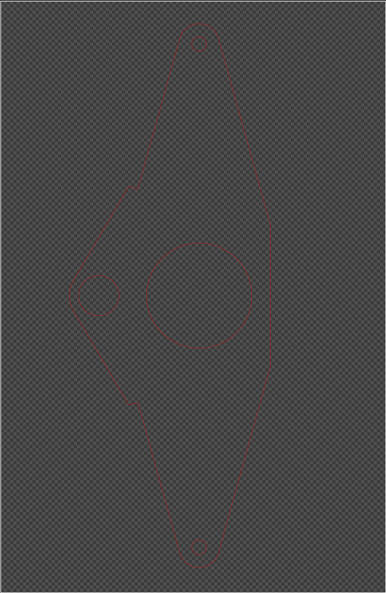
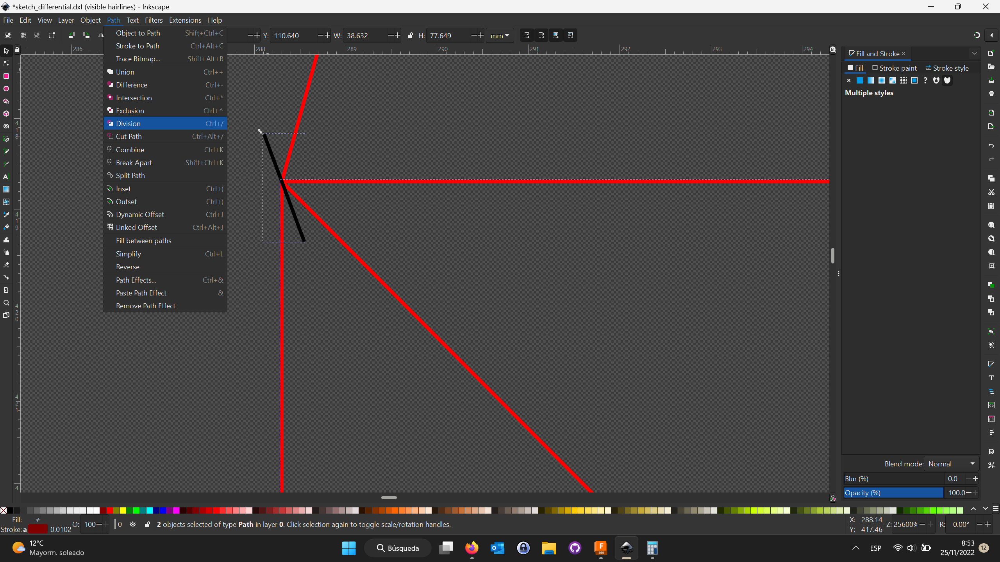
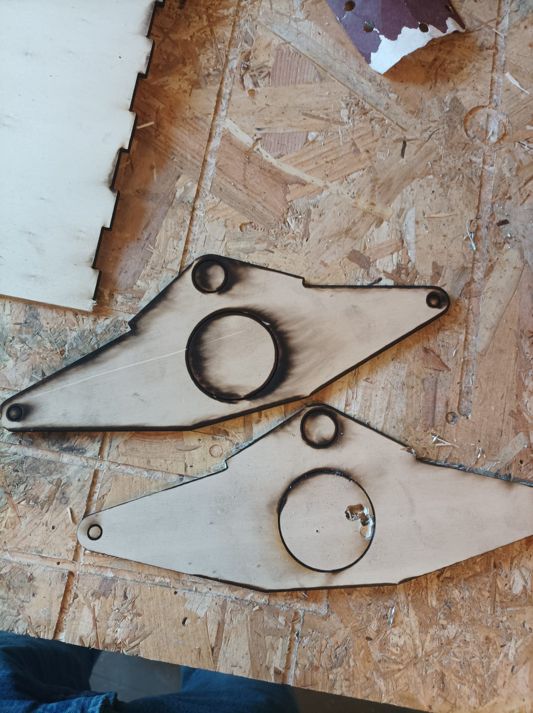
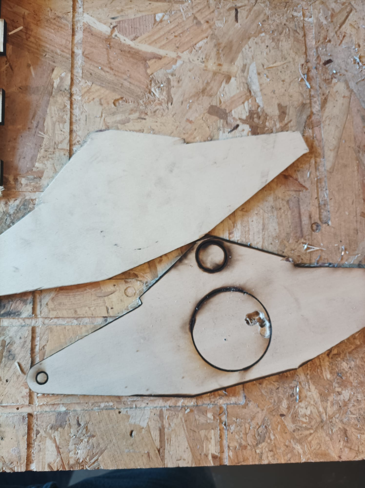
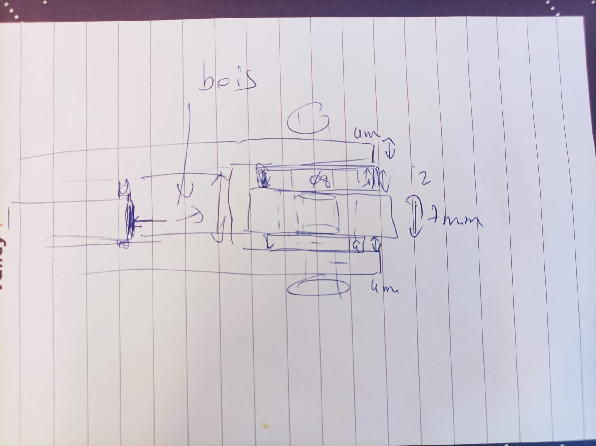

# Session 5

This was quite a chaotic session but I managed develop some good ideas.

## 3D-impression of the Pipe Joint

I started by slicing and 3D printing a single pipe joint (S2) in order to test it.

|||
|:--:|:--:|

As shown in the pictures, the bearing fit perfectly.  
However the hole for the pipe was to narrow, so I've already adjusted the parameters of the 3D model so I can print another test version on monday (no more 3D printers available).

## Differential

I finally was able to start with the differential fabrication. The idea was to laser-cut all the different layers and then glue them all together.  

So I exported the `dxf` sketch:

And so I created the `svg` files for the top layer and the bottom layer to be cut:

|||
|:---:|:---:|

I had overcome some issues caused by the `dxf` file. Some lines were detected as combined figures and I took me some time to discover how to cut them.

**However a big problem ocurred !** The laser cutter was out of order because of a fire accident. But M.Masson made me build the differential out of wood anyway :) , so I had to make without the laser cutter.  

Hopefully it started working again. But it didn't work as well as before, the laser had lost in power and couldn't cut a 5mm board even with 8mm board parameters. So the circles in the middle weren't cut and I couldn't do any precise correction after that.

Here are the results:

|||
|:---:|:---:|

In conclusion, it was completely chaotic.

The good news is that I had the opportunity to discuss with Frédéric Juan better ways to build the differential.

## New differential design

The new differential will be made out of three layers: plexiglass, wood and plexiglass. This way it will be rigid and will have some amortization thanks to the wood.  
Plus the bearing will be supported by the own differential.  

I will try to work on this last point during the weekend so I can print some pieces on monday.
