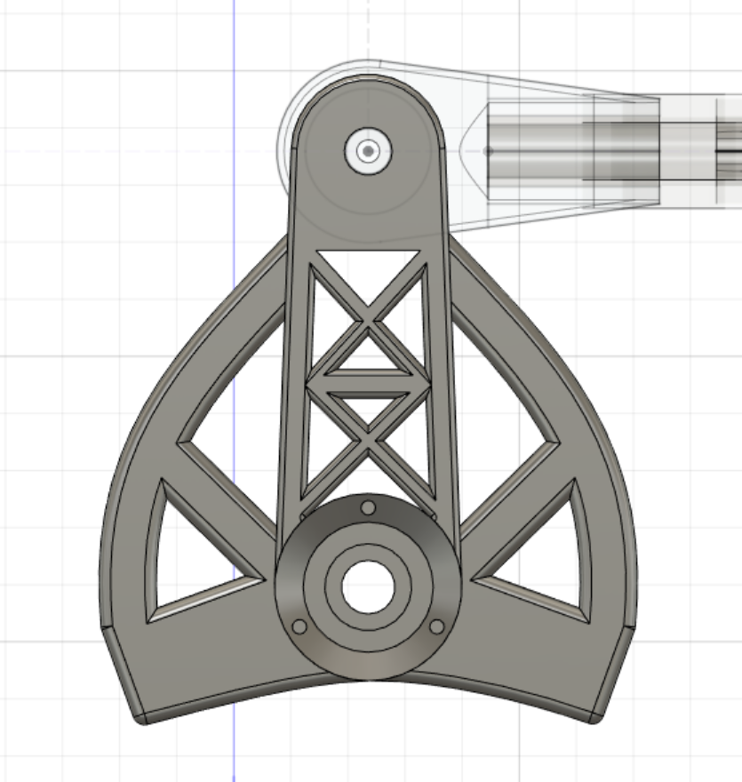
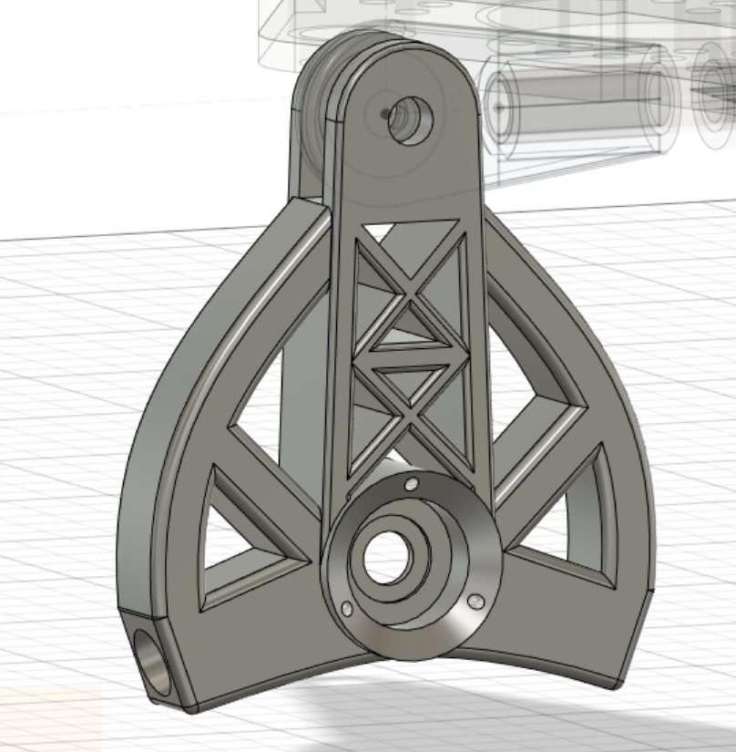
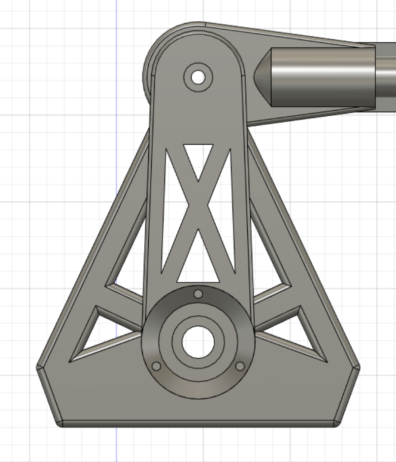
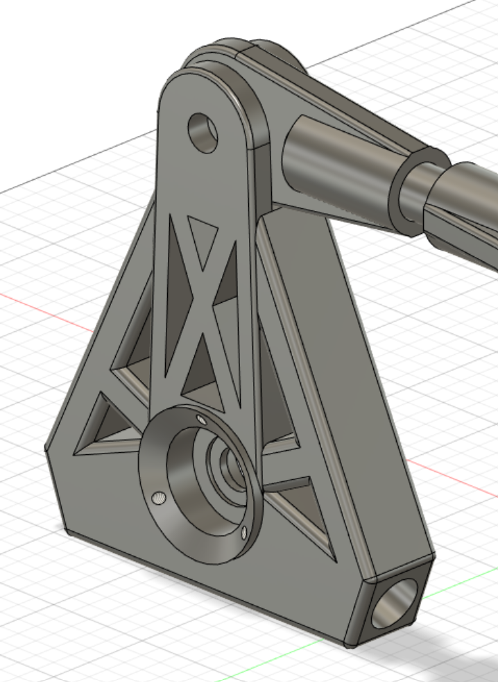

# Session 8

This session's activity was to redesign the main pivot's piece.  

I wished to use the Trellis method to remove useless material.
By doing this, impression time and weight will be decreased while maintaining the same resistance to forces.  

|||
|:---:|:---:|

During the weekend, I sent an email to our mechanics teacher to ask for advice. He came to see me during the session and we discussed some aspects to improve:  

- First, although the curved area is stylish, it doesn't brings any benefices for handling the moments of forces.
- Second, the line connecting the exterior ones should be aimed to the center of the axis.
- Finally, the two central crosses can be changed by a single cross. This type of structure is enough for the type of forces applied in the piece.

|||
|:---:|:---:|

The final result of the piece:

|||
|:---:|:---:|

At the end of the session I started the 3d impression of the piece.
